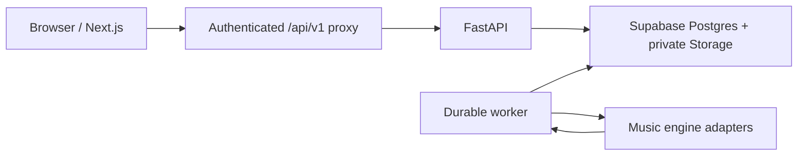

# Listen Closer · Music Understanding Workspace

Listen Closer turns an imported recording into a persistent musical **Work** with synchronized representations, playback, and evidence-backed analysis. Long-running processing runs on a durable worker; the browser renders persisted results rather than fabricating demo data.

## Start here

Repository documentation has explicit ownership. Read [`docs/README.md`](docs/README.md) before treating prose as authoritative.

The short version:

- [`AGENTS.md`](AGENTS.md) — engineering and autonomous-agent execution rules.
- [`docs/ARCHITECTURE.md`](docs/ARCHITECTURE.md) — current shipped runtime architecture.
- [`docs/MASTER_SPEC.md`](docs/MASTER_SPEC.md) — target product/architecture direction, not a claim that every described capability ships today.
- `backend/config/capabilities.json` — machine-readable authority for analysis capability maturity and product exposure.
- [`docs/OPS.md`](docs/OPS.md) — deployment and operational procedures.
- ADRs under `docs/adr/` — durable architectural decisions.

Runtime code, migrations, deployment configuration, and the deployed release SHA win over stale prose for statements about what is actually running.

## Product model

The product is organized around one persistent Work:

- **Import** private audio through a backend-authorized signed upload flow.
- **Process** with durable queued jobs and replaceable music-engine adapters.
- **Represent** the same Work as Waveform, Piano Roll, Score, Spectrogram, and other supported views.
- **Listen** to available sources independently from the visible representation.
- **Understand** through localized evidence, derived observations, and grounded explanations.
- **Persist** immutable artifact/version lineage, provenance, jobs, entities, insights, and alignments.

Unknown or insufficient evidence is a valid product state. Analysis exposure is gated by the capability registry rather than by whether an engine happens to return output.

## Runtime topology



The browser does not receive Oracle service credentials or call the VM directly. See `docs/ARCHITECTURE.md` for the current runtime contract.

## Local development

The repository expects Node 22.x, npm 10.x, and uv 0.12.6. npm enforces the Node/npm contract before install/run commands, while the backend project pins uv and Python 3.11.

From a fresh clone, first inspect the local prerequisites:

```bash
npm run doctor
```

Then install the locked frontend and backend environments with the canonical bootstrap:

```bash
npm run bootstrap
```

`bootstrap` uses `npm ci` and `uv sync --project backend --locked`; it does not create a second dependency authority. After setup:

```bash
npm run dev
```

Common checks:

```bash
npm run check:fast
npm run check:frontend
npm run check:backend
npm run check:e2e
```

Browser E2E additionally needs Playwright Chromium (`npx playwright install chromium`). Database/real-stack tiers additionally need Docker and the Supabase CLI. The checked-in devcontainer already supplies the common system dependencies for the containerized development path.

Use the verification ladder in root `AGENTS.md`; do not run heavyweight real-stack or model evaluation merely because a text-only change exists.

## Repository structure

```text
app/                    Next.js App Router, workspace, authenticated proxy routes
components/             React UI components
lib/                    client/state/generated API contracts and shared utilities
backend/                FastAPI API, durable worker, domain logic, engine adapters
backend/evaluation/     evaluation harnesses and benchmark adapters
supabase/               database/storage migrations and local stack configuration
tests/                  browser E2E and product verification
docs/                   architecture, operations, ADRs, research and historical docs
scripts/                repository-owned development/verification helpers
```

## Current stack

| Layer | Technology |
|---|---|
| Frontend | Next.js 16, React 19, TypeScript |
| Styling | Tailwind CSS v4 + CSS custom properties |
| Backend | FastAPI, Python 3.11 |
| Database/Auth/Storage | Supabase |
| Processing | durable Postgres-backed worker + replaceable music-engine adapters |
| API contracts | FastAPI OpenAPI → generated TypeScript types |
| Observability | OpenTelemetry/Grafana + Sentry exception reporting |
| Verification | Vitest, pytest, Playwright, real-stack E2E, GitHub Actions |

Exact dependency versions belong to `package.json`, `backend/pyproject.toml`, and lockfiles rather than this README.
