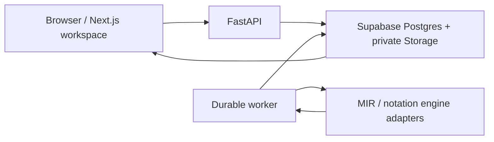

# Listen Closer

Listen Closer is a music-understanding workspace for moving from **a recording** to **inspectable musical evidence** without losing your place in the music.

Import audio once. Listen Closer keeps it as a persistent **Work**, processes it asynchronously, and brings the resulting views and evidence back into one synchronized workspace. You can move between the recording, detected notes, notation, spectral detail, Breakdown findings, and Ask while keeping playback and musical context aligned.

## From recording to understanding

The core product pipeline is intentionally durable rather than request/response-only:

```text
audio import
    ↓
persistent Work + immutable source Version
    ↓
durable queued processing
    ↓
derived artifact Versions + musical evidence
    ↓
synchronized workspace
    ├─ Waveform
    ├─ Piano Roll
    ├─ Score
    └─ Spectrogram
    ↓
evidence-backed Breakdown + Ask
```

A Work is the stable product object. Processing can continue after the browser request that started it, and derived outputs keep lineage back to their source instead of replacing it in place. The workspace renders persisted results as they become available.

Evidence is treated similarly: measured or derived observations can support product explanations, while unknown or insufficient evidence remains an explicit state. Listen Closer does not need to invent a chord, confidence, section, or explanation simply to fill UI.

## What you can do today

- **Import a recording** through a backend-authorized private upload flow and reopen it later as the same Work.
- **Listen independently from the visible view**, switching among available playback sources without making the representation itself the transport authority.
- **Inspect synchronized representations** including Waveform, Piano Roll, Score, and Spectrogram as their source artifacts become available.
- **Select and revisit musical passages** across the shared workspace instead of treating every representation as an isolated viewer.
- **Inspect supported findings in Breakdown** with provenance/evidence rather than a free-form generated summary.
- **Ask questions about the recording or a selected passage** using the evidence available for that Work, with typed references/actions that the user explicitly triggers.

Analysis capabilities are not all equally mature or universally exposed. `backend/config/capabilities.json` is the machine-readable authority for which analysis capabilities may appear in the product. [`docs/product/PRODUCT.md`](docs/product/PRODUCT.md) owns durable product identity and principles; [`docs/product/ROADMAP.md`](docs/product/ROADMAP.md) owns current product portfolio posture and sequencing. Neither should be read as a claim that every future capability already ships.

## System shape



The browser talks to authenticated application/API boundaries; it does not receive worker-service credentials or call the processing VM directly. The API owns durable workflow intent and persistence, while the worker claims queued work, runs replaceable music-analysis/notation engines, and publishes versioned artifacts and evidence.

For the maintained runtime/deployment contract, read [`docs/ARCHITECTURE.md`](docs/ARCHITECTURE.md).

## Local development

From a fresh clone, first check prerequisites:

```bash
npm run doctor
```

Install the locked frontend and backend environments:

```bash
npm run bootstrap
```

Start the normal local development path:

```bash
npm run dev
```

Useful verification commands:

```bash
npm run check:fast
npm run check:frontend
npm run check:backend
npm run check:database
npm run check:e2e
```

Browser E2E also needs Playwright Chromium. Database verification additionally needs a running Docker daemon, Supabase CLI 2.113.0, tbls 1.95.0, and ffmpeg. `check:database` builds its disposable stack from tracked Supabase files under a temporary project ID, so stopped local database data is not reused or deleted; it also refuses to start while the normal local stack is active. Real-stack verification additionally needs Docker and the Supabase CLI. Use the verification ladder in [`AGENTS.md`](AGENTS.md) rather than running heavyweight model/real-stack checks for every small change.

Dependency versions and environment ownership live in `package.json`, `backend/pyproject.toml`, and their lockfiles rather than in this README.

## Repository map

The top-level tree follows **ownership and lifecycle**, not a requirement to put every artifact type in its own package:

```text
app/                Next.js routes, application shell and route-owned frontend code
components/         workspace UI plus genuinely shared React primitives/providers
lib/                shared frontend contracts, state and cross-feature libraries
backend/            API, durable worker, domain code and engine adapters
supabase/           database/storage migrations and local Supabase configuration
tests/              cross-product/browser/system verification
evaluation/         durable evaluation evidence and result artifacts
docs/               maintained architecture, operations, decisions and methodology
scripts/            repository-owned development and verification automation
openapi/            generated API contract artifacts
observability/      repository-owned observability configuration
```

Feature-private code should stay with its owner; global `components/` and `lib/` are for responsibilities that are actually shared. See [`docs/ARCHITECTURE.md`](docs/ARCHITECTURE.md) and the generated architecture views for current boundaries.

## Where to go next

Repository documentation has explicit authority rather than one giant source-of-truth document:

- [`AGENTS.md`](AGENTS.md) — engineering rules, verification expectations, and autonomous-agent workflow.
- [`docs/README.md`](docs/README.md) — documentation map and precedence rules.
- [`docs/product/PRODUCT.md`](docs/product/PRODUCT.md) — durable product identity, user progress, strategic arena, mental model, and principles.
- [`docs/product/ROADMAP.md`](docs/product/ROADMAP.md) — current product portfolio posture, gates, and decision-relevant sequencing.
- [`docs/ARCHITECTURE.md`](docs/ARCHITECTURE.md) — current shipped runtime architecture.
- [`docs/EVALUATION_METHODOLOGY.md`](docs/EVALUATION_METHODOLOGY.md) — how production/evaluation decisions should be tested.
- [`docs/EVALUATION_DECISIONS.md`](docs/EVALUATION_DECISIONS.md) — current cross-track evaluation conclusions.
- [`docs/OPS.md`](docs/OPS.md) and [`docs/RECOVERY.md`](docs/RECOVERY.md) — production operation and recovery.
- [`docs/adr/`](docs/adr/) — durable architectural decisions and revisit conditions.

For statements about what is actually running, executable code/configuration, migrations, and the deployed release identity take precedence over stale prose.
