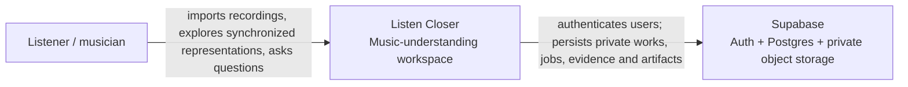
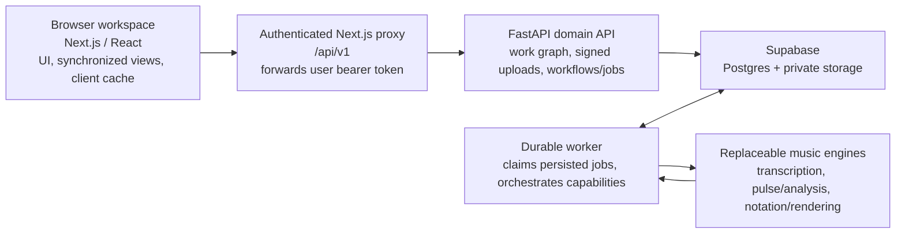
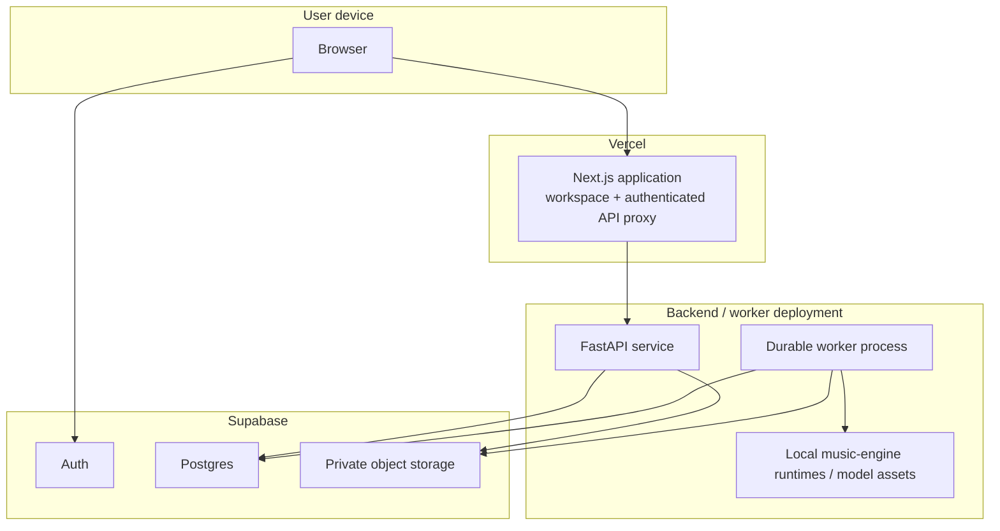
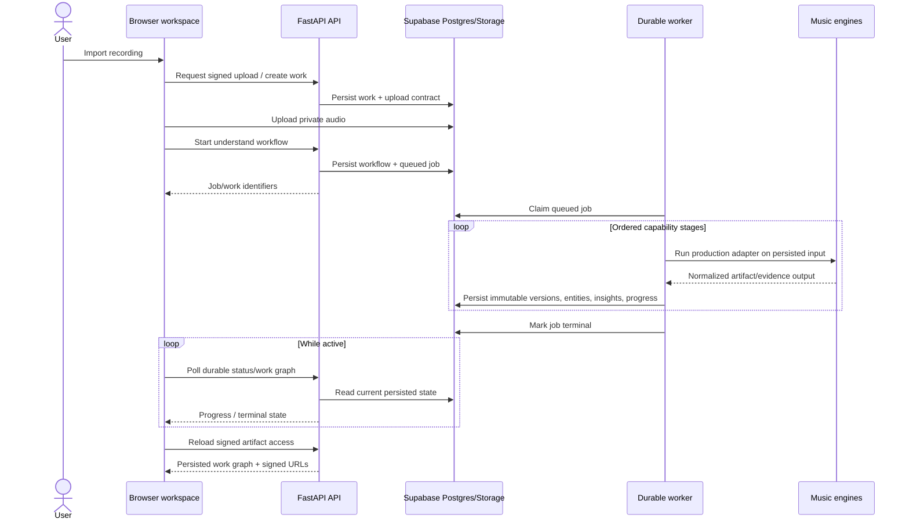
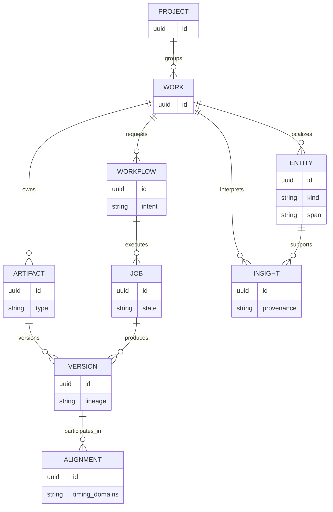

> **Authority note:** This file describes the currently shipped runtime architecture. `MASTER_SPEC.md` is authoritative for product direction, target analysis architecture, representation strategy, future evidence graph, research program, and migration triggers. Where this file describes current deployment/runtime behavior, code and this file should remain consistent; where it conflicts with future direction in the master spec, the master spec wins.

# Architecture

This is the runtime contract for the shipped application.

Architecture views use **C4 vocabulary** so one diagram does not mix user context, logical services, deployment hosts, and code-level detail. Mermaid is the source format for human-authored diagrams. See [`adr/0012-architecture-docs-as-code.md`](adr/0012-architecture-docs-as-code.md).

The maintained views are intentionally small:

1. system context — who uses the product and which managed systems it depends on;
2. logical containers — the major runtime boundaries and responsibilities;
3. deployment — where those containers execute;
4. the durable `understand` dynamic flow;
5. the conceptual persisted domain model.

Do not add a component/code diagram merely to show every module. Import/schema facts that can be derived mechanically should eventually be generated from code rather than copied into prose.

## User experience

1. Sign in with Supabase Auth.
2. Reopen the most recent work in the current project, or select another work from the persistent library.
3. Import an audio file. The browser uploads it once and starts one durable `understand` job.
4. Leave the page if desired. A backend worker owns the remaining processing. Reopening the work resumes status polling for its active persisted job.
5. Reopen the work to inspect the original waveform, detected notes, rendered transcription playback, MusicXML score, and analysis.
6. Use the inspector to review evidence-backed insights or operate the current work through deterministic commands.

The UI does not invent musical data and does not label unfinished generation, comparison, or correction prototypes as working features.

## System context

At the C4 system-context level, Listen Closer is one software system. Vercel, worker hosting, API modules, and music engines are implementation details shown in later views.

## Logical containers

This view describes runtime responsibilities, not physical hosts.

The browser never receives the worker-host credential and never talks to that host directly. The proxy forwards the user's bearer token. Output objects are exposed through short-lived signed URLs rather than public storage objects.

Exact music engines and capability maturity must be read from current code and `backend/config/capabilities.json`; architecture docs should describe stable responsibilities rather than freeze implementation names that may be replaced.

## Deployment topology

This view separates logical ownership from the infrastructure on which it executes.

Deployment-specific hostnames, credentials, exact image contents, and release procedures belong in deployment configuration and [`OPS.md`](OPS.md), not this logical architecture contract. Backend deploys select an exact Git SHA and expose release identity through readiness/telemetry.

## Durable `understand` workflow

The API creates one workflow and one queued job. `backend/worker.py` claims the job and the composite understand capability runs ordered stages that currently include transcription, analysis, and notation/rendering work.

Users may cancel active jobs and retry failed or cancelled jobs. Worker heartbeats and queue health make capability availability observable without exposing user data. The browser should render persisted results; an in-memory browser state is not the authority for whether processing succeeded.

### Stage contract

| Stage | Input | Persisted output |
| --- | --- | --- |
| Transcribe | original audio version | MIDI version, note entities, rendered audio |
| Analyze | audio and/or MIDI version | localized evidence/insights with spans and provenance |
| Score | MIDI/performance evidence | MusicXML / score-derived version |

The exact ordering and routing are implementation contracts and may evolve. A future stage should not be documented as shipped merely because it appears in `MASTER_SPEC.md` or an evaluation harness.

## Persisted domain model

The persisted model is representation-neutral: waveform, piano roll, score, spectrogram, analysis, and future views are projections over a Work and its evidence/artifact lineage rather than separate top-level product objects.

This diagram is conceptual, not a replacement for migrations. Column-level schema documentation should be generated from the real PostgreSQL schema rather than hand-maintained here.

- A `Project` groups a user's `Work` records.
- A `Work` owns typed `Artifact` records such as original audio, MIDI, rendered audio, and MusicXML.
- Every immutable `Version` points to a private object and records lineage and the producing job.
- `Entity` holds localized machine evidence. `Insight` holds user-facing or derived interpretations with evidence, spans, and provenance.
- `Alignment` maps compatible timing/version domains.
- `Workflow` records intent. `Job` records durable execution and retry state.

The master spec describes a future Evidence Graph direction in which additional typed observations/relations may be added if current Entity/Insight structures become insufficient; do not add schema merely for conceptual cleanliness.

## Dependency architecture

There are two different kinds of architecture evidence and they should not be conflated:

- **human-authored views** in this file describe intended stable boundaries and flows;
- **generated dependency/schema views** should describe the actual code/database state.

A follow-up implementation should generate and enforce the derivable views rather than adding another hand-maintained diagram:

| Surface | Preferred OSS source | Purpose |
| --- | --- | --- |
| TypeScript/JavaScript imports | dependency-cruiser | visualize imports/cycles and enforce forbidden/layer dependencies |
| Python imports | Import Linter + Grimp | enforce layer/independence contracts and inspect actual import graph |
| Python package declarations | deptry | catch unused, missing, misplaced, or transitive dependency reliance |
| PostgreSQL/Supabase schema | tbls | generate schema/ER documentation from a fresh real database |

These tools are not part of the required build until their bounded follow-up lands with lockfile/runtime validation. Generated output must not become a second manually edited source of truth.

## Evaluation architecture

Evaluation is a decision-support system, not a parallel production architecture. Production adapters/config own shipped behavior; evaluation code runs controlled comparisons against those contracts where appropriate; durable result artifacts record measured evidence; [`EVALUATION_DECISIONS.md`](EVALUATION_DECISIONS.md) records the cross-track decision summary.

See [`EVALUATION_METHODOLOGY.md`](EVALUATION_METHODOLOGY.md) for the canonical decision flow, evidence tiers, result contract, and rule that a runnable harness should normally be followed by a result rather than more infrastructure.

## Verification model

- Python domain tests validate schemas, repositories, RLS assumptions, worker leases, capability registration, and composite-workflow orchestration.
- Frontend tests validate utilities, renderers, shared contracts, and interaction state.
- ESLint, TypeScript, Ruff, and production builds catch static/runtime packaging failures.
- Playwright with mocks verifies deterministic browser contracts and UX flows.
- Real-stack / production smoke tests must exercise Vercel → FastAPI → worker → Supabase with a real licensed audio fixture for changes that cross those boundaries. Mocked E2E cannot prove model or infrastructure availability.
- Database integration boots a fresh schema and verifies migrations/RLS against the real database shape.
- Backend deploys select an exact Git SHA and expose release identity from readiness/telemetry.

See `AGENT_EXECUTION_PLAYBOOK.md` for the required test ladder and definition of done.

## Documentation update rule

Update this file when a change materially alters a depicted stable boundary, persistence relationship, deployment responsibility, or durable workflow. Do not update it for ordinary implementation details that remain inside the same architecture boundary.

When code and a diagram disagree about an actual import or database relationship, the code/schema wins and the generated dependency/schema view should expose the mismatch. When code violates an accepted intended boundary, fix the code or explicitly supersede the architectural decision; do not redraw the architecture solely to hide the violation.

## Honest limitations

- Transcription quality varies strongly by instrumentation/domain; routing and evaluation matter more than pretending one AMT model is universal.
- MIDI-to-notation remains a domain-specific transformation, not a universal representation for all music.
- Current analysis is strongest in tonal/harmonic and symbolic evidence. Timbre, arrangement, source-specific groove, semantic retrieval, and general structure need the Analysis V3 research program in `MASTER_SPEC.md`.
- Style/context-aware analysis must be built from evidence and evaluated modules; the system should not force Western tonal analysis onto every work.
- A grounded conversational layer may explain and combine evidence but must not become the sole detector for precise musical facts.