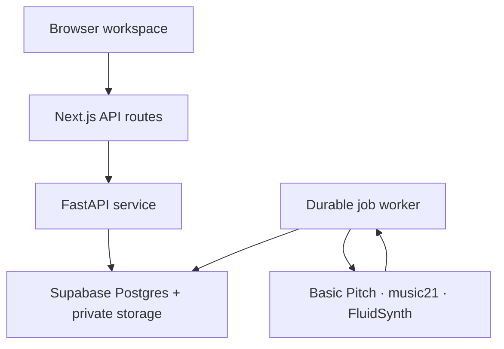

# Architecture

This document describes the runtime that is actually shipped.

## Product path

The first supported vertical slice is:

1. An authenticated user uploads audio.
2. The Vercel route proxies the upload to FastAPI.
3. FastAPI stores an immutable original artifact and queues a transcription job.
4. A separate worker claims the job from Postgres and runs Basic Pitch.
5. The worker persists MIDI, note entities, and a rendered WAV.
6. The browser queues analysis and score jobs for the resulting MIDI.
7. The worker persists music-theory insights and MusicXML.
8. The browser renders the real piano roll, waveform, score, and insights.

No musical result is synthesized in the frontend. Empty, partial, and failed
states are shown as such.

## Runtime topology

The browser never talks directly to the Oracle VM. `app/api/v1/**` proxies
authenticated requests through `lib/backend.ts`. Browser access to signed
Supabase object URLs is limited to individual output files.

## Domain and persistence

- `Project` contains `Work` records.
- A `Work` owns typed `Artifact` records.
- Each immutable `Version` points at one private storage object and records
  lineage and the producing job.
- Note-level facts are `Entity` records. Interpretive claims are `Insight`
  records with confidence and provenance.
- `Workflow` groups intent; `Job` is a durable, retryable capability execution.

The storage bucket is `artifacts`. Object keys begin with the authenticated
owner ID so the migration's RLS policies can enforce ownership.

## Services

`backend/docker-compose.yml` runs two containers from the same image:

- `backend`: FastAPI/uvicorn, responsible for auth, validation, persistence,
  workflow creation, status, and result URLs.
- `worker`: `backend/worker.py`, responsible for claiming and executing queued
  music capabilities. It handles shutdown signals and recovers expired leases.

The deploy script starts and rolls back both services together. Backend health
gates deployment; queue health/metrics remain an operations gap.

## Frontend

The canonical route is `/`. It is an authenticated, representation-oriented
workspace with shared transport and timeline state. The current library panel
only identifies the active project; persistent browsing is intentionally not
represented as complete.

MSW is enabled only when `NEXT_PUBLIC_MOCK_ENABLED=true`. Production and normal
local development otherwise use the real API.

## Current limitations

- Transcription quality depends on source isolation and Basic Pitch; it is not
  genre-independent in quality even though the artifact model is genre-neutral.
- MusicXML is mechanically derived from MIDI and may need quantization/editing.
- Analysis currently covers key, tempo, time signature, chords, Roman numerals,
  and cadences; structure, motifs, timbre, and comparative analysis are next.
- Correction, comparison, and generation handlers exist as early capability
  scaffolding but are not yet presented as production-complete user journeys.
- E2E uses deterministic API mocks. A deployed real-service smoke test is still
  needed to catch infrastructure and model-runtime failures.
