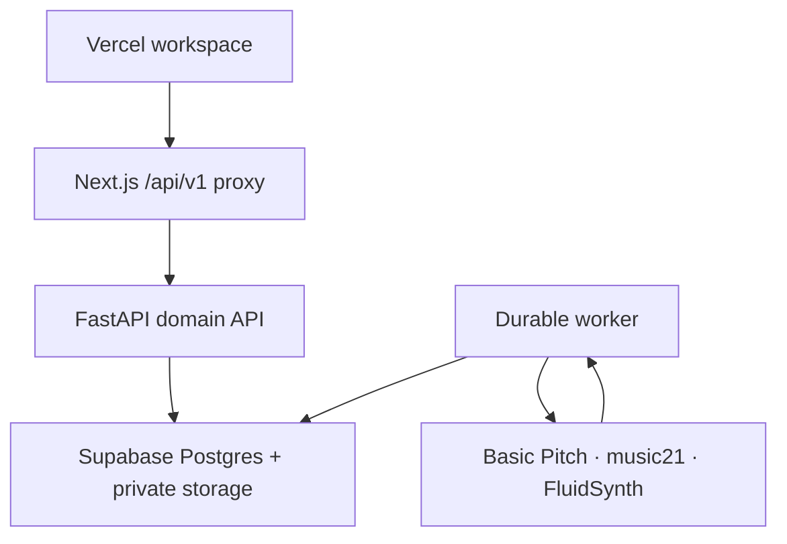

# Architecture

This is the runtime contract for the shipped application.

## User experience

1. Sign in with Supabase Auth.
2. Reopen the most recent work in the current project, or select another work
   from the persistent library.
3. Import an audio file. The browser uploads it once and starts one durable
   `understand` job.
4. Leave the page if desired. A backend worker owns the remaining processing.
   Reopening the work resumes status polling for its active persisted job.
5. Reopen the work to inspect the original waveform, detected notes, rendered
   transcription playback, MusicXML score, and analysis.
6. Use the inspector to review evidence-backed insights or operate the current
   work through deterministic commands.

The UI does not invent musical data and does not label unfinished generation,
comparison, or correction prototypes as working features.

## Runtime topology

The browser never receives the Oracle VM credential and never talks to that VM
directly. The proxy forwards the user's bearer token. Output objects are exposed
through short-lived signed URLs.

## Durable understand workflow

The API creates one workflow and one queued job. `backend/worker.py` claims the
job and the composite `understand:1.0` capability runs three ordered stages:

| Stage | Input | Persisted output |
|---|---|---|
| Transcribe | original audio version | MIDI version, note entities, rendered WAV |
| Analyze | MIDI version | insights with spans, confidence, evidence, provenance |
| Score | MIDI version | MusicXML version |

Progress from the child capabilities is mapped into a single job from 0 to 1.
The browser only polls status and reloads the persisted work graph after success.

## Domain model

- A `Project` groups a user's `Work` records.
- A `Work` owns typed `Artifact` records such as original audio, MIDI, rendered
  audio, and MusicXML.
- Every immutable `Version` points to a private object and records lineage and
  the producing job.
- `Entity` holds note-level facts. `Insight` holds interpretations with evidence,
  confidence, spans, and provenance.
- `Workflow` records intent. `Job` records durable execution and retry state.

This model is representation-neutral: other symbolic formats, visualizations,
specialized analyzers, and generators can be added without changing the user's
source-of-truth work graph.

## Verification model

- Python domain tests validate schemas, repositories, RLS assumptions, worker
  leases, capability registration, and composite-workflow orchestration.
- Vitest validates frontend utilities, renderers, and shared contracts.
- ESLint, TypeScript, Ruff, and production builds catch static/runtime packaging
  failures.
- Playwright with MSW verifies authentication gates, persisted reopening,
  import/job polling, representations, insights, and commands.
- A deployed smoke test must additionally exercise Vercel → FastAPI → worker →
  Supabase with a real licensed audio fixture. Mocked E2E cannot prove model or
  infrastructure availability.

## Honest limitations

- Basic Pitch is strongest on isolated pitched instruments; the contracts are
  genre-neutral, but current transcription quality is not uniform across genres.
- Mechanical MIDI-to-MusicXML needs quantization and editing before it can be
  treated as publication-quality notation.
- Current analysis emphasizes tonal/harmonic material. Structure, motifs,
  texture, timbre, and comparative analysis need evaluated implementations.
- Commands are a thin, deterministic interface to real operations. A grounded
  conversational agent is a future interface, not a currently claimed feature.
