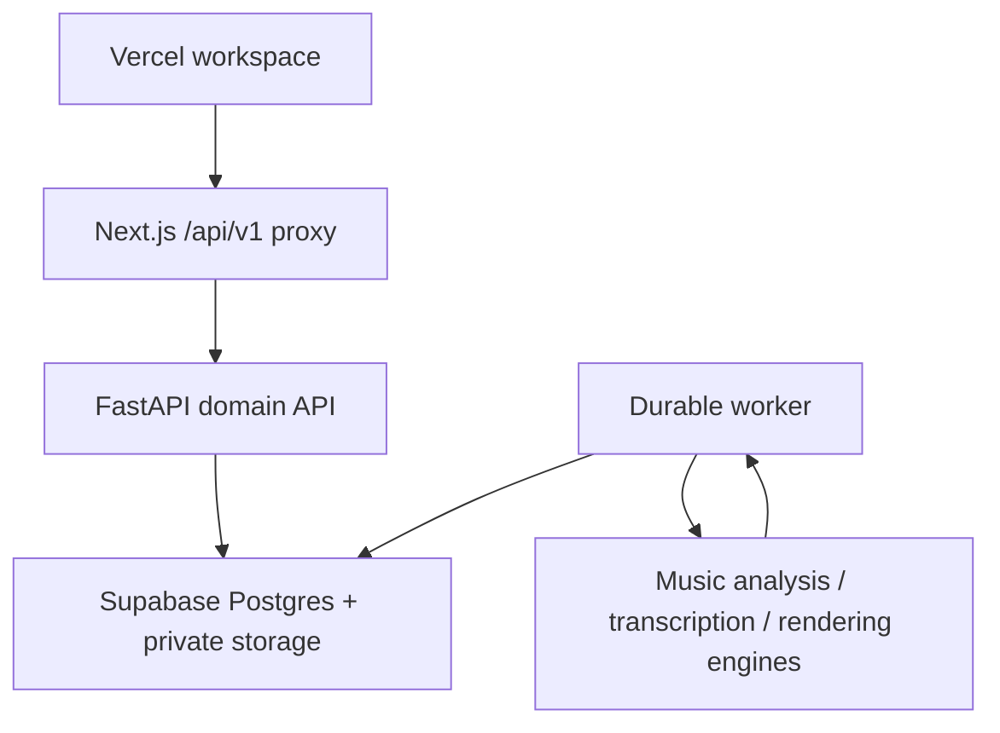

> **Authority note:** This file describes the currently shipped runtime architecture. `MASTER_SPEC.md` is authoritative for product direction, target analysis architecture, representation strategy, future evidence graph, research program, and migration triggers. Where this file describes current deployment/runtime behavior, code and this file should remain consistent; where it conflicts with future direction in the master spec, the master spec wins.

# Architecture

This is the runtime contract for the shipped application.

## User experience

1. Sign in with Supabase Auth.
2. Reopen the most recent work in the current project, or select another work
   from the persistent library.
3. Import an audio file. The browser uploads it once and starts one durable
   `understand` job.
4. Leave the page if desired. A backend worker owns the remaining processing.
   Reopening the work resumes status polling for its active persisted job.
5. Reopen the work to inspect the original waveform, detected notes, rendered
   transcription playback, MusicXML score, and analysis.
6. Use the inspector to review evidence-backed insights or operate the current
   work through deterministic commands.

The UI does not invent musical data and does not label unfinished generation,
comparison, or correction prototypes as working features.

## Runtime topology

The browser never receives the Oracle VM credential and never talks to that VM
directly. The proxy forwards the user's bearer token. Output objects are exposed
through short-lived signed URLs.

## Durable understand workflow

The API creates one workflow and one queued job. `backend/worker.py` claims the
job and the composite understand capability runs ordered stages that currently
include transcription, analysis, and notation/rendering work.

| Stage | Input | Persisted output |
|---|---|---|
| Transcribe | original audio version | MIDI version, note entities, rendered audio |
| Analyze | audio and/or MIDI version | insights with spans, evidence, provenance |
| Score | MIDI version | MusicXML / score-derived version |

Exact engines and capability maturity must be read from current code and
`backend/config/capabilities.json`; this document must not freeze old engine names
as architecture.

Progress from child capabilities is mapped into a durable job. The browser polls
status and reloads the persisted work graph after success. Users may cancel
active jobs and retry failed or cancelled jobs. Worker heartbeats and queue
health make capability availability observable without exposing user data.

## Domain model

- A `Project` groups a user's `Work` records.
- A `Work` owns typed `Artifact` records such as original audio, MIDI, rendered
  audio, and MusicXML.
- Every immutable `Version` points to a private object and records lineage and
  the producing job.
- `Entity` holds localized machine evidence. `Insight` holds user-facing or
  derived interpretations with evidence, spans, and provenance.
- `Alignment` maps compatible timing/version domains.
- `Workflow` records intent. `Job` records durable execution and retry state.

This model is representation-neutral. The master spec describes a future Evidence
Graph direction in which additional typed observations/relations may be added if
current Entity/Insight structures become insufficient; do not add schema merely
for conceptual cleanliness.

## Verification model

- Python domain tests validate schemas, repositories, RLS assumptions, worker
  leases, capability registration, and composite-workflow orchestration.
- Frontend tests validate utilities, renderers, shared contracts, and interaction
  state.
- ESLint, TypeScript, Ruff, and production builds catch static/runtime packaging
  failures.
- Playwright with mocks verifies deterministic browser contracts and UX flows.
- Real-stack / production smoke tests must exercise Vercel → FastAPI → worker →
  Supabase with a real licensed audio fixture for changes that cross those
  boundaries. Mocked E2E cannot prove model or infrastructure availability.
- Database integration boots a fresh schema and verifies migrations/RLS against
  the real database shape.
- Backend deploys select an exact Git SHA and expose release identity from
  readiness/telemetry.

See `AGENT_EXECUTION_PLAYBOOK.md` for the required test ladder and definition of
done.

## Honest limitations

- Transcription quality varies strongly by instrumentation/domain; routing and
  evaluation matter more than pretending one AMT model is universal.
- MIDI-to-notation remains a domain-specific transformation, not a universal
  representation for all music.
- Current analysis is strongest in tonal/harmonic and symbolic evidence. Timbre,
  arrangement, source-specific groove, semantic retrieval, and general structure
  need the Analysis V3 research program in `MASTER_SPEC.md`.
- Style/context-aware analysis must be built from evidence and evaluated modules;
  the system should not force Western tonal analysis onto every work.
- A grounded conversational layer may explain and combine evidence but must not
  become the sole detector for precise musical facts.
