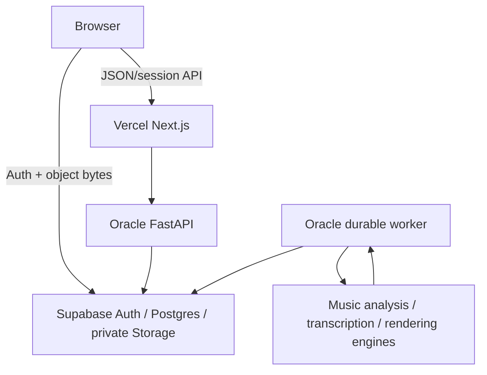

> **Authority note:** This file describes the currently shipped runtime architecture. `MASTER_SPEC.md` is authoritative for product direction, target analysis architecture, representation strategy, future evidence graph, research program, and migration triggers. Where this file describes current deployment/runtime behavior, code and this file should remain consistent; where it conflicts with future direction in the master spec, the master spec wins.

# Architecture

This is the runtime contract for the shipped application.

## User experience

1. Sign in with Supabase Auth.
2. Reopen the most recent work in the current project, or select another work from the persistent library.
3. Import an audio file. FastAPI authorizes an upload intent and chooses the private object key; the browser uploads the bytes directly to Supabase Storage with the short-lived signed upload token, then calls the small finalize API.
4. Start one durable `understand` job. Leave the page if desired; a backend worker owns the remaining processing.
5. Reopening the work resumes status polling for its active persisted job.
6. Inspect the original waveform, detected notes, rendered transcription playback, MusicXML score, and evidence-backed analysis.

The UI does not invent musical data and does not label unfinished generation, comparison, or correction prototypes as working features.

## Runtime topology



The browser never receives the Oracle VM credential and never talks to that VM directly. Normal backend requests pass through authenticated Next.js API routes, which forward the user's bearer token. Large imported audio is the deliberate exception to the byte path: after server authorization, the browser sends the object directly to private Supabase Storage. This avoids buffering the same payload in Vercel and Oracle while keeping object naming/authorization under server control. The finalize call verifies the stored object before durable Artifact/Version metadata is created.

The legacy multipart proxy remains a bounded rollback/compatibility path; it must not become the preferred large-file path again without evidence.

## Durable understand workflow

The API creates one workflow and one queued job in Postgres. `backend/worker.py` claims work through the atomic `claim_next_job` database function. The claim uses row locking / `SKIP LOCKED` so multiple workers do not contend on the same queue head. Execution semantics remain at-least-once with replay-safe/idempotent handlers; a lease is not a claim of exactly-once side effects.

The composite understand capability runs ordered stages that currently include transcription, analysis, and notation/rendering work.

| Stage | Input | Persisted output |
|---|---|---|
| Transcribe | original audio version | MIDI version, note entities, rendered audio |
| Analyze | audio and/or MIDI version | insights with spans, evidence, provenance |
| Score | MIDI version | MusicXML / score-derived version |

Exact engines and capability maturity must be read from current code and `backend/config/capabilities.json`; this document must not freeze old engine names as architecture.

Progress from child capabilities is mapped into a durable job. The browser polls status and reloads the persisted work graph after success. Users may cancel active jobs and retry failed or cancelled jobs. Worker heartbeats and queue health make capability availability observable without exposing user data.

## Domain model

- A `Project` groups a user's `Work` records.
- A `Work` owns typed `Artifact` records such as original audio, MIDI, rendered audio, and MusicXML.
- Every immutable `Version` points to a private object and records lineage and the producing job.
- `Entity` holds localized machine evidence. `Insight` holds user-facing or derived interpretations with evidence, spans, and provenance.
- `Alignment` maps compatible timing/version domains.
- `Workflow` records intent. `Job` records durable execution and retry state.

This model is representation-neutral. The master spec describes a future Evidence Graph direction in which additional typed observations/relations may be added if current Entity/Insight structures become insufficient; do not add schema merely for conceptual cleanliness.

## Build and deployment topology

Backend releases are built **off the Oracle VM**:

```text
GitHub Actions
  -> native amd64 + arm64 Docker builds
  -> GHCR exact-SHA architecture tags
  -> apply pending Supabase migrations
  -> Oracle pulls the exact architecture image/digest
  -> replace API + worker
  -> health/release/queue gates
```

Oracle does not normally build production images. `scripts/deploy.sh` retains a source-build fallback for recovery, but CI-built immutable images are the production path. API and worker use the same release image and expose/verify the deployed release SHA. Deployment concurrency is serialized; migrations complete before a new worker/API image is started.

Because a failed application rollout can revert the image but cannot automatically reverse a production database migration, migrations must be backward-compatible with the currently running release. Destructive/renaming schema changes require an expand/contract sequence rather than a one-step migration.

Frontend releases use Vercel Git integration for `main` only. PR previews are disabled to preserve Hobby-plan build capacity; GitHub Actions owns PR validation. `package.json` is the Node-version source of truth, Vercel installs with `npm ci`, and the protected Build compiles a `.vercelignore`-pruned source tree so CI sees the same deploy boundary as Vercel.

## Verification model

- Python domain tests validate schemas, repositories, RLS assumptions, worker leases, capability registration, and composite-workflow orchestration.
- Frontend tests validate utilities, renderers, shared contracts, and interaction state.
- ESLint, TypeScript, Ruff, generated OpenAPI checks, and production builds catch static/runtime packaging failures.
- Playwright with mocks verifies deterministic browser contracts and UX flows.
- Real-stack tests boot fresh Supabase plus real FastAPI/worker/Next.js and exercise a licensed real-audio happy path for critical cross-boundary changes.
- Database Integration boots a fresh schema and verifies migrations/RLS against the real database shape.
- Native Backend Image CI verifies both production CPU architectures for backend/deploy changes.
- The branch-protected `build` context is an aggregate merge gate: it waits for the independent risk-relevant workflows on the exact PR head before reporting success.
- Every `main` push receives a non-mutating Production Smoke after Vercel reports success for that exact SHA; it checks the production alias plus API/database/storage/queue readiness.
- A deeper production browser verification exists for deliberate end-to-end testing, but it mutates production data and is not the routine release smoke.
- Backend deploys select an exact Git SHA/image digest and expose release identity from readiness/telemetry.

See `AGENT_EXECUTION_PLAYBOOK.md` and root `AGENTS.md` for the required evidence ladder and merge-lane rules.

## Honest limitations

- The repository still contains several large orchestration/facade modules (`domain/capabilities.py`, `domain/api.py`, `domain/repositories.py`, `domain/job_worker.py`, and `analyze.py`). Their seams are test-covered and the engine/repository boundaries are real, but further feature work should prefer extracting cohesive services rather than adding more unrelated behavior to those files.
- The Postgres jobs table remains the production durable queue. pgmq was evaluated and produced useful research evidence, but production currently favors the simpler atomic Postgres claim path; do not add Redis/Celery/SQS merely for conventionality.
- The production backend image is immutable once built, but upstream Docker base tags and Debian package repositories are not yet digest/snapshot pinned. Dependency automation and image CI reduce this risk; stronger hermetic build reproducibility is a future hardening step, not a reason to replace the current deployment path.
- Transcription quality varies strongly by instrumentation/domain; routing and evaluation matter more than pretending one AMT model is universal.
- MIDI-to-notation remains a domain-specific transformation, not a universal representation for all music.
- A grounded conversational layer may explain and combine evidence but must not become the sole detector for precise musical facts.
