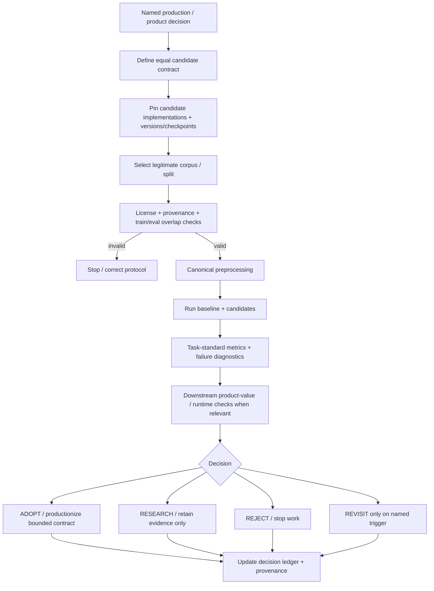
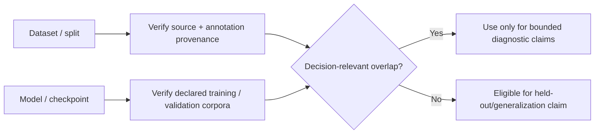
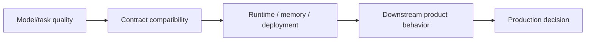
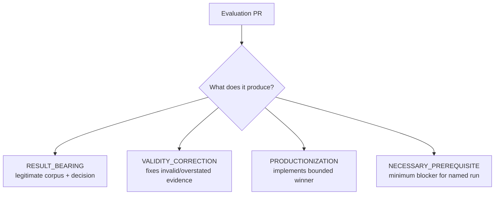
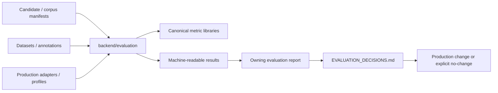

# Evaluation methodology

This document defines the reusable evaluation protocol for choosing, rejecting, or bounding music-analysis implementations. It describes **how a decision should be evaluated**. Concrete results and next decision-changing evidence belong in [`EVALUATION_DECISIONS.md`](EVALUATION_DECISIONS.md) and the owning result/report.

The goal is not to maximize benchmark infrastructure. The goal is to produce trustworthy evidence that changes a production or product decision.

## Decision flow

## 1. Start with the decision, not the model

Every evaluation track must name the question that the result can change. Examples:

- Should Beat This replace the current localized beat/downbeat engine?
- Which production transcription profile should handle solo piano?
- Is an OSS performance-MIDI-to-score engine good enough to replace custom quantization/staffing stages?
- Does source separation improve a specific downstream claim enough to justify its runtime cost?

"This model/library is interesting" is not a sufficient evaluation question.

Before adding another candidate, metric, dataset adapter, or harness abstraction, state what outcome would change the decision.

## 2. Compare an equal production-shaped contract

Candidates should receive equivalent inputs and be scored on equivalent outputs. When production includes meaningful preprocessing, routing, cleanup, or postprocessing, evaluate that real contract rather than a convenient raw model wrapper unless the raw model itself is the subject of the experiment.

Record at minimum:

| Field | Required evidence |
| --- | --- |
| Candidate | package/repository and exact version or commit |
| Model | checkpoint/model identifier and digest when practical |
| Input | source representation and preprocessing |
| Output contract | normalized representation used by the scorer/product |
| Runtime | device/architecture and material execution constraints |
| License | code, weights, and dataset status relevant to production use |

If a candidate cannot satisfy the same contract, report the incompatibility rather than silently weakening the protocol for that candidate.

## 3. Treat corpus validity as a gate

A high metric is not promotion evidence when the evaluation data overlaps model training or validation data in a way that invalidates the claim.

Preserve the distinction between:

- controlled/synthetic correctness fixtures;
- training-overlap diagnostics;
- published validation splits;
- genuinely held-out evaluation evidence;
- real product fixtures without ground truth.

Do not collapse these evidence tiers into one headline score.

## 4. Prefer task-standard tooling and metrics

Use maintained domain tooling where it already exists rather than recreating scorers or dataset semantics locally. Current examples include `mir_eval` for task metrics and `mirdata` where its dataset adapter matches the exact required annotation contract.

A custom metric is justified only when a named product property is not represented by an accepted task metric. Keep canonical metrics and product diagnostics separate so a product-specific diagnostic does not quietly become a benchmark definition.

Always retain per-item/failure distributions where practical. Aggregate means alone hide negative tails that are often operationally important for music systems.

## 5. Separate model quality from product value

Objective quality can be necessary without being sufficient for production adoption.

Examples:

- a separator can improve SI-SDR while failing to improve beat or transcription quality;
- a model can improve an aggregate metric while producing unacceptable negative-tail failures;
- a notation engine can emit valid MusicXML while still producing a less readable score;
- a model can be accurate but too slow for the intended execution topology.

Only evaluate downstream product value that can change the decision. Do not build a universal product-value framework before a concrete decision needs one.

## 6. Result artifact contract

A decision-bearing evaluation should preserve enough information that another contributor can reproduce or invalidate the conclusion without reconstructing a chat/PR history.

The durable result should include:

- decision question;
- baseline and candidate identities;
- dataset/split provenance and licensing notes;
- checkpoint training/validation overlap assessment;
- canonical preprocessing;
- scorer/library + version + metric parameters;
- per-item results and aggregate summary;
- material failures/negative tail;
- runtime/resource measurements when decision-relevant;
- explicit `ADOPT`, `RESEARCH`, `REJECT`, or `REVISIT` implication;
- exact conditions that would justify revisiting the result.

Machine-readable results are preferred when practical. Narrative reports should summarize and interpret them rather than becoming the only copy of measured numbers.

## 7. Allowed evaluation PR shapes

Once a runnable harness exists, the default next change is **RESULT_BEARING**, not another framework extension.

Avoid:

- adding candidates because they are popular rather than decision-relevant;
- adding a second scorer for a task already covered by a standard metric;
- refactoring a harness before it has produced its first legitimate result;
- treating green harness CI as benchmark evidence;
- promoting a model from a tiny qualitative probe or invalid train/eval overlap;
- building deployment infrastructure before the quality/product gate has been crossed.

## 8. Evaluation architecture and ownership

Ownership rules:

- production adapters/config own production behavior;
- evaluation code owns repeatable experimental execution, not product policy;
- result artifacts own measured evidence for an exact protocol;
- `EVALUATION_DECISIONS.md` owns the cross-track decision summary and next allowed decision-changing result;
- GitHub issues own unresolved future work.

## 9. Reproducibility tooling boundary

Do not introduce an experiment platform merely to make the diagram look cleaner.

A DVC pilot is appropriate only on a track that already has a real decision-bearing run and only if DVC replaces meaningful bespoke dataset/provenance/pipeline/result plumbing. The pilot must have an explicit deletion test: if it mostly wraps existing repository machinery, remove it instead of maintaining two systems.

MLflow or another experiment service is not required for the current decision workflow. Revisit only if cross-machine run tracking/model registry needs become a demonstrated operational problem.