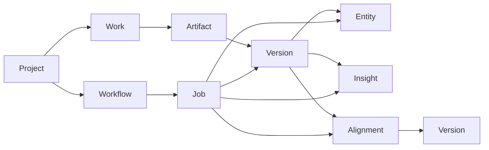
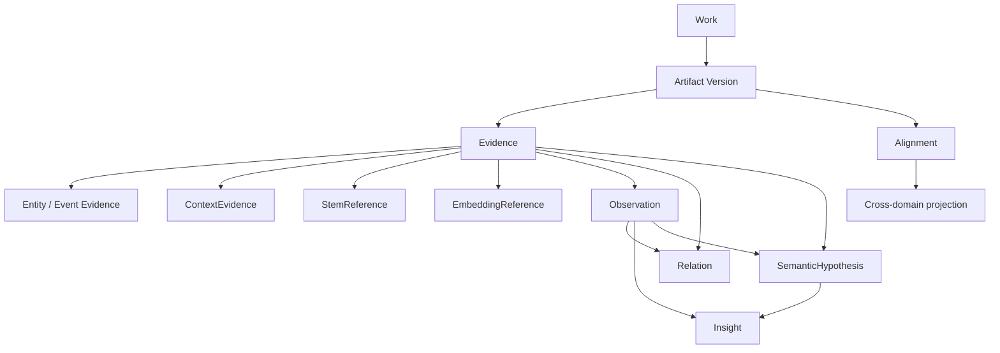

# Evidence Graph V3 — Engineering Design

> **Status:** Proposed architecture for issue #336. Design only; no schema migration or production routing change.
>
> **Depends on:** Analysis V3 bakeoffs #332–#335 and #339, the current domain model, and `MASTER_SPEC.md`.
>
> **Core decision:** Keep the current Project → Work → Artifact → Version → Entity / Insight / Alignment persistence model until a concrete production query or scale requirement justifies an additive table. Define a typed conceptual evidence graph now so new engines stop inventing incompatible payload shapes.

---

## 1. Decision summary

Analysis V3 does **not** need a graph database, a vector database as the domain source of truth, or an immediate rewrite of `entities`, `insights`, and `alignments`.

The current model already provides the important durable anchors:

- **Work** — ownership and user-facing musical identity.
- **Artifact / Version** — immutable representation lineage.
- **Entity** — localized musical primitives such as notes, chords, beats, measures, sections, and motif candidates.
- **Insight** — currently overloaded machine/user-facing interpretation row with evidence and provenance JSON.
- **Alignment** — mapping between representation/time domains.
- **Job** — computation provenance and reproducibility boundary.

The missing piece is primarily a **contract problem**, not yet a storage problem. Analysis V3 needs common semantics for:

1. evidence references;
2. version-local locations and cross-version projections;
3. deterministic/calibrated observations;
4. relations between evidence items;
5. probabilistic context evidence;
6. immutable stem references;
7. embedding references without coupling domain data to vector storage;
8. semantic hypotheses whose prose is explicitly lower-trust than measured MIR evidence;
9. trust, maturity, confidence, and provenance semantics.

The architecture therefore introduces a **conceptual evidence graph** whose first implementation can mostly serialize through existing JSONB/provenance fields. New relational tables are triggered only by concrete product/query requirements described in §12.

---

## 2. Evidence from the Analysis V3 bakeoffs

The design is intentionally constrained by what the evaluation program actually produced.

### #332 foundation representations

The foundation bakeoff proposed an `EmbeddingEvidence` shape containing model identity, modality, artifact version, optional span, dimensionality, normalization, a `vectorRef`, and provenance. It explicitly recommended **not** creating a vector index yet because no candidate has demonstrated enough production value.

Architecture requirement: embeddings must remain addressable evidence tied to an immutable artifact version, while vector storage remains replaceable infrastructure.

### #333 context/style/instrumentation

The context bakeoff proposed `ContextEvidence` with work/segment scope, taxonomy, category, ranked labels, neutral model `score`, optional calibration metadata, model provenance, and capability maturity. It explicitly rejects interpreting a raw score as calibrated confidence or using a genre tag as a hard pipeline router.

Architecture requirement: classifier/context evidence is its own trust class and must preserve taxonomy/calibration semantics.

### #334 source separation

The separation bakeoff proposed `StemEvidence` whose outputs are artifact references for vocals/drums/bass/other. It explicitly rejects invented per-stem confidence values and treats stem audio as a durable representation, not a vector.

Architecture requirement: stem binaries belong in Artifact/Version storage; the evidence graph references them.

### #335 beat/downbeat/tempo/meter

The pulse bakeoff establishes beat/downbeat evidence as precise localized MIR output with engine/checkpoint provenance and task-standard metrics. Beat This is a strong research candidate but broader evaluation is still required before switching defaults.

Architecture requirement: exact localized MIR evidence must not be conflated with semantic/context model output simply because both can produce scores.

### #339 audio-language models

The audio-language stage defines `SemanticHypothesis` and a matched `audio_only` / `evidence_only` / `audio_plus_evidence` evaluation contract. It explicitly requires semantic model prose to remain distinct from measured observations and records support/contradiction references plus verification state.

Architecture requirement: **raw or generated prose must never silently become the same fact class as evaluated MIR evidence.**

---

## 3. Current physical model



### Current strengths

- immutable artifact/version lineage is already the correct durable representation boundary;
- entities and insights are scoped to a concrete version;
- job provenance can identify the computation that produced durable output;
- alignments already prevent the product from assuming that performance time, notation time, and representation versions are identical;
- JSONB fields provide enough flexibility for research-stage evidence without migrations for every engine.

### Current limitations

1. `Insight` is overloaded: it can represent a detected/derived machine statement and a user-facing explanation.
2. evidence references are ad hoc JSON rather than a shared typed contract.
3. `Span` can contain seconds/beats/measures simultaneously without encoding which coordinate is authoritative versus projected.
4. no common trust/maturity semantics distinguish exact MIR, heuristics, context classifiers, and semantic model hypotheses.
5. relations such as `similar_to`, `supports`, `contradicts`, `contains`, or `derived_from` do not have one normalized representation.
6. embedding/vector references have no canonical domain envelope.
7. model-generated prose has no durable type boundary if somebody were to persist it in `Insight` naively.

These are real design gaps, but none alone justifies replacing the schema today.

---

## 4. Target conceptual model



This is a **conceptual graph**. Nodes do not imply one SQL table per box.

### Conceptual responsibilities

| Concept | Meaning | Physical home now |
|---|---|---|
| Evidence | Typed machine-grounded input or durable reference | Entity, Version metadata, Insight.evidence/provenance |
| Observation | Deterministic or calibrated musical statement derived from evidence | Insight row, while low-volume/current schema remains adequate |
| Relation | Typed relationship between evidence/observations | JSON refs initially |
| Insight | User-facing interpretation/summarization | Insight row |
| ContextEvidence | Probabilistic style/instrument/mood/production context | Insight.evidence or analysis-report payload |
| StemReference | Reference to immutable stem artifact versions | Artifact/Version + evidence envelope |
| EmbeddingReference | Reference to an embedding vector owned by replaceable infrastructure | Version metadata / evidence envelope initially |
| SemanticHypothesis | Model-generated semantic statement with explicit support/contradiction state | Ephemeral or analysis-report artifact initially; **not ordinary factual Insight** |
| Alignment | Mapping between version-local coordinate systems | Existing Alignment table |

---

## 5. Canonical reference and location contracts

All graph edges use typed references rather than raw unqualified strings.

```typescript
type EvidenceRef =
  | { type: "artifact_version"; id: string }
  | { type: "entity"; id: string }
  | { type: "observation"; id: string }
  | { type: "insight"; id: string }
  | { type: "alignment"; id: string }
  | { type: "external"; namespace: string; id: string }
```

### 5.1 Version-local location is authoritative

A fact is first located **within the representation/version that produced it**.

```typescript
type EvidenceLocator = {
  versionId: string
  coordinate: {
    unit: "seconds" | "samples" | "ticks" | "beats" | "measures" | "score_position"
    start: number | string
    end?: number | string
  }
  projectionRefs?: EvidenceRef[] // Alignment refs only
}
```

Rules:

1. exactly one coordinate system is authoritative for a locator;
2. other representations are reached through `Alignment`;
3. callers may materialize convenience projections, but must not silently treat independently computed seconds/beats/measures as equal truth;
4. the current `Span` DTO remains supported for compatibility, but writers should record the authoritative coordinate domain in provenance whenever multiple fields are populated;
5. selection UI may use approximate projections, but approximation must remain explicit in provenance/UI state.

### 5.2 Representation-specific defaults

- audio evidence: seconds or samples on an audio artifact version;
- performance MIDI: ticks or version-local seconds, depending on engine authority;
- beat/downbeat evidence: beat-grid version/location with seconds projection where available;
- notation: score position / measure-beat coordinates on the score version;
- cross-representation selection: target locator produced through an Alignment, not copied numerically.

---

## 6. Trust, maturity, confidence, and verification are orthogonal

A recurring failure mode is trying to encode all uncertainty in one number. Do not.

```typescript
type TrustClass =
  | "measured"
  | "calibrated_estimate"
  | "deterministic_derived"
  | "heuristic_candidate"
  | "context_estimate"
  | "semantic_hypothesis"

type Maturity = "evaluation_only" | "experimental" | "production"

type Verification =
  | "not_applicable"
  | "unverified"
  | "evidence_consistent"
  | "evidence_conflicted"
```

### Rules

- `confidence` means a calibrated confidence/probability with documented semantics. Otherwise use `null`.
- model similarity, classifier logits, margins, heuristic scores, ranking scores, and evaluator scores stay named `score` (or a more specific metric name), not `confidence`.
- `trustClass` describes how a claim was obtained.
- `maturity` describes whether listencloser has promoted the capability, not whether one output happens to look plausible.
- `verification` is primarily meaningful for hypotheses or interpretations checked against other evidence.
- a production capability can still emit `confidence=null` when its engine does not provide calibrated confidence.

Suggested user-facing trust ordering for factual answers:

```text
measured / calibrated_estimate
  > deterministic_derived
  > heuristic_candidate
  > context_estimate
  > semantic_hypothesis
```

This is a retrieval/explanation policy, not a universal numeric weighting scheme.

---

## 7. Canonical evidence and observation contracts

### 7.1 Evidence envelope

```typescript
type Evidence<TPayload> = {
  id: string
  kind: string
  trustClass: TrustClass
  maturity: Maturity
  sourceVersionIds: string[]
  locator?: EvidenceLocator
  payload: TPayload
  score?: number
  confidence?: number
  provenance: Provenance
}
```

### 7.2 Provenance

```typescript
type Provenance = {
  producedByJobId?: string
  engine: string
  engineVersion?: string
  model?: string
  modelVersion?: string
  checkpointChecksum?: string
  parameters?: Record<string, unknown>
  profile?: string
  evaluationRefs?: string[]
  codeLicense?: string
  weightLicense?: string
}
```

No new database column is required immediately; this can serialize through existing JSONB provenance/evidence.

### 7.3 Observation

An Observation is a machine statement that is more semantic than a primitive Entity but is still grounded in explicit evidence.

```typescript
type Observation = {
  id: string
  kind: string
  statement: string
  trustClass:
    | "calibrated_estimate"
    | "deterministic_derived"
    | "heuristic_candidate"
  maturity: Maturity
  locator?: EvidenceLocator
  supportRefs: EvidenceRef[]
  contradictionRefs?: EvidenceRef[]
  prerequisiteRefs?: EvidenceRef[]
  confidence?: number
  score?: number
  provenance: Provenance
}
```

Examples:

- `harmonic_rhythm_increased` derived from chord boundaries and beat evidence;
- `possible_modulation` derived from sustained local-key evidence;
- `section_energy_higher_than` derived from loudness/stem/spectral measurements;
- `dembow_candidate` only when an evaluated style-specific detector exists and prerequisites are satisfied.

An Observation is not automatically a user-facing card. Inspector can select, group, or summarize observations into Insights.

---

## 8. Relation contract

```typescript
type Relation = {
  id: string
  kind:
    | "supports"
    | "contradicts"
    | "derived_from"
    | "aligned_with"
    | "contains"
    | "member_of"
    | "similar_to"
    | "follows"
    | "precedes"
    | "higher_than"
    | "lower_than"
    | string
  source: EvidenceRef
  target: EvidenceRef
  directed: boolean
  score?: number
  confidence?: number
  provenance: Provenance
}
```

Initial storage: embed small relation sets in observation/analysis-report JSON.

Create a first-class `relations` table only when reverse lookup, traversal, hierarchical grouping, or cross-work relation queries become product-critical (§12).

---

## 9. Specialized Analysis V3 contracts

### 9.1 ContextEvidence

```typescript
type ContextEvidence = {
  scope: "work" | "segment"
  locator?: EvidenceLocator
  taxonomy: string
  category: "style" | "instrument" | "mood_theme" | "production"
  labels: Array<{ label: string; score: number }>
  calibration?: {
    method: string
    threshold?: number
    evaluationRef?: string
  }
  provenance: Provenance
  maturity: Maturity
}
```

Context evidence changes **salience and explanatory vocabulary**. It must not suppress universal evidence or become a hard genre router.

### 9.2 StemReference

```typescript
type StemReference = {
  sourceVersionId: string
  stems: Array<{
    role: "vocals" | "drums" | "bass" | "other" | string
    artifactVersionId: string
  }>
  provenance: Provenance
  maturity: Maturity
}
```

Stem audio is stored as ordinary immutable Artifact/Version data. No new binary-storage concept is introduced.

### 9.3 EmbeddingReference

```typescript
type EmbeddingReference = {
  sourceVersionId: string
  modality: "audio" | "midi" | "score" | "text"
  locator?: EvidenceLocator
  dimensionality: number
  normalized: boolean
  vectorRef: string
  vectorStore: string
  provenance: Provenance
  maturity: Maturity
}
```

`vectorRef` is intentionally opaque. Core domain semantics must not depend on pgvector, Pinecone, Qdrant, FAISS, or any other implementation.

The vector store may be Postgres/pgvector later, but the **Artifact Version + EmbeddingReference** remains the authorization/provenance source of truth.

### 9.4 SemanticHypothesis

```typescript
type SemanticHypothesis = {
  id: string
  model: string
  modelVersion: string
  scope: "work" | "segment" | "comparison"
  locator?: EvidenceLocator
  promptClass: string
  statement: string
  supportRefs: EvidenceRef[]
  contradictionRefs?: EvidenceRef[]
  verification: "unverified" | "evidence_consistent" | "evidence_conflicted"
  provenance: Provenance
  maturity: Maturity
}
```

Hard rule: `SemanticHypothesis` is **not** a synonym for Observation or factual Insight.

A semantic hypothesis may be quoted/explained to the user only with its verification/evidence boundary preserved. `evidence_conflicted` hypotheses must not be rendered as facts.

---

## 10. Persistence strategy now

### 10.1 Keep existing relational tables

No migration is justified today for:

- beat/downbeat evidence;
- context evidence still in research/evaluation;
- stem artifacts;
- foundation-model embeddings still in research;
- semantic hypotheses before a successful #339 checkpoint/product-value run;
- relation graphs that are not yet queried as first-class product data.

### 10.2 Physical mapping during the compatibility phase

| Concept | Current persistence strategy |
|---|---|
| localized note/chord/beat/section primitive | `entities` |
| machine observation already surfaced by product | `insights` with explicit trust/provenance/evidence payload |
| user-facing explanation | `insights` |
| stem file | `artifacts` + immutable `artifact_versions` |
| stem grouping/provenance | version metadata or analysis-report payload |
| context evidence | `insights.evidence` or analysis-report artifact while evaluation-only |
| embedding reference | version metadata / analysis-report artifact while research-only |
| vector bytes | external/replaceable vector storage, never the authoritative domain row |
| relation | observation/analysis-report JSON while low-volume |
| semantic hypothesis | ephemeral Ask state or analysis-report artifact; do **not** write as ordinary factual Insight |
| timeline mapping | existing `alignments` |

### 10.3 Why not create an `evidence` table immediately?

A generic evidence table today would mostly duplicate `version_id`, `kind`, span/location, provenance, confidence/score, and JSON payload already present across Entity/Insight/Version metadata. It would add migration/RLS/read-path complexity before any production query demonstrates value.

The contract should stabilize first. Physical normalization follows observed access patterns.

---

## 11. Query patterns

### 11.1 Inspector for a selected span

```text
selection on active version
  → fetch overlapping Entities
  → fetch overlapping machine Observations/Insights
  → resolve supportRefs / contradictionRefs
  → use Alignment only when evidence lives on another version
  → rank by capability relevance + trust class + locality
  → render user-facing Insight with evidence drill-down
```

Do not globally rank a semantic hypothesis above localized MIR evidence merely because its prose is more specific.

### 11.2 Ask: “Why does this section feel larger?”

```text
selected section
  → retrieve section Entity
  → gather measured/derived changes:
      loudness ↑
      drum activity ↑
      bass energy ↑
      melodic register ↑
      spectral high-band energy ↑
  → retrieve ContextEvidence only to choose appropriate vocabulary
  → optional SemanticHypothesis may propose synthesis
  → verify its supportRefs / contradictionRefs
  → answer with evidence citations and uncertainty boundary
```

### 11.3 Cross-representation selection

```text
score measure selection
  → authoritative score locator
  → Alignment(score → performance)
  → approximate performance-time projection
  → highlight waveform/piano roll
```

The projected seconds do not replace the score locator as source truth.

### 11.4 Similarity search

```text
query segment
  → find EmbeddingReference
  → vector store nearest-neighbor query
  → receive opaque vectorRef candidates
  → hydrate authorized EmbeddingReferences / Artifact Versions
  → enforce Work ownership/RLS
  → return Work + segment locators + similarity score
```

The vector store is a candidate generator, not an authorization system and not the canonical metadata store.

### 11.5 Similar sections inside one work

For low volume, a structure analysis report may contain `similar_to` relations between section entities. Promote to a `relations` table only when the UI needs efficient reverse traversal, grouping, editing, or multiple engines contributing competing relation sets.

---

## 12. Migration trigger table

The default is **keep current schema**. A migration requires a named product/query requirement plus evidence that JSONB/current rows are becoming the bottleneck.

| Trigger | Decision | Additive change when triggered |
|---|---|---|
| Context/style remains evaluation-only or small-volume | KEEP | JSONB/analysis-report payload |
| Stem separation becomes production | KEEP | Artifact/Version already models stem binaries; standardize metadata contract only |
| Beat/downbeat engine is promoted | KEEP | Entity/Insight + provenance is sufficient |
| Embeddings remain research-only | KEEP | no vector index/table |
| Production cross-work similarity/search needs indexed nearest-neighbor retrieval | ADD | `embedding_references` metadata table and a replaceable vector index/store; keep vector implementation behind adapter |
| One product feature stores a few `similar_to` or support refs | KEEP | JSON relation payload |
| Multiple production capabilities require reverse relation lookup/traversal, overlapping groups, or editable section membership | ADD | generic `relations` table with source/target typed refs and provenance |
| Current `Insight` row cleanly represents a user-facing derived statement | KEEP | explicit trust/evidence conventions in JSON |
| Multiple machine observations must exist independently of UI Insights, be recomputed/fused independently, or queried by prerequisite/support edges | ADD | `observations` table; retain Insights as presentation layer |
| Semantic hypotheses are ephemeral/research-only | KEEP | no factual Insight persistence; retain raw model run in evaluation/analysis-report artifact as needed |
| Production Ask must persist/reuse/audit hypotheses across sessions with support/contradiction traversal | ADD | dedicated `semantic_hypotheses` table or explicitly typed observation-adjacent store; never overload factual Insight semantics |
| Evidence refs in JSON become a measurable query/indexing bottleneck | ADD | normalized evidence-edge/reference table; backfill incrementally |
| A graph query cannot be expressed/served acceptably in Postgres after measured optimization | REVISIT | evaluate specialized graph infrastructure only then |

### Explicit non-trigger

“An ERD would look cleaner” is not a migration trigger.

---

## 13. Backwards-compatible migration plan

If one of the triggers fires, migrations remain additive and staged.

### Phase A — contract stabilization (now)

- publish this design;
- require new Analysis V3 proposals to map to these contracts;
- keep existing API/database behavior unchanged.

### Phase B — typed application adapters

- add Pydantic/TypeScript contract types in a separate implementation PR;
- serializers write existing Entity/Insight/Version JSON shapes;
- readers accept legacy rows without new fields;
- no product behavior change.

### Phase C — additive table

For a triggered concept (for example `embedding_references` or `observations`):

1. add table + indexes + RLS using the same Work ownership chain;
2. dual-write from one evaluated capability;
3. verify fresh-schema, migration, and real-stack tests;
4. backfill only if a product query requires historical rows;
5. switch reads behind a repository adapter;
6. keep old fields readable through at least one compatibility window.

### Phase D — optional cleanup

Only after all readers are migrated and rollback is proven may redundant JSON fields be deprecated. Immutable Artifact/Version lineage is never rewritten.

---

## 14. RLS, privacy, and ownership

Any future table must preserve existing ownership semantics through Work/Project or Artifact Version ownership.

Rules:

- never authorize a vector-search result solely because the vector store returned it;
- external vector stores receive opaque reference IDs, not authority over user access;
- hydrate candidates through the application/database and re-check ownership;
- stem artifact versions inherit existing storage/RLS boundaries;
- semantic hypotheses are private user/work data if persisted;
- cross-work similarity must never leak another user's Work title, metadata, embedding, or segment simply because it is a nearest neighbor.

Prefer Postgres/Supabase primitives until measured scale requires otherwise.

---

## 15. Conflict and alternative interpretation model

Music analysis frequently has multiple legitimate or uncertain interpretations. Do not force one destructive overwrite.

An Observation may:

- cite prerequisites;
- cite supporting evidence;
- cite contradicting evidence;
- coexist with another observation over the same span;
- carry a framework/profile in provenance;
- remain a `heuristic_candidate` without calibrated confidence.

Example:

```text
Observation A: possible tonicization of V
  supports: local key evidence, chord sequence
  trust: heuristic_candidate
  framework: common_practice_tonal

Observation B: no stable modulation
  supports: short duration of local-key run
  trust: deterministic_derived
```

Inspector/Ask can explain the disagreement instead of silently picking whichever engine ran last.

---

## 16. Section/group membership

`EntityKind.section` is sufficient for current section boundaries. Grouping repeated sections can initially use relation payloads:

```text
section_A similar_to section_D
section_A member_of repeated_group_1
section_D member_of repeated_group_1
```

A dedicated group/membership table is justified only when production UX needs hierarchical form editing, overlapping groups, many-to-many membership queries, or stable user corrections.

Semantic labels such as Verse/Chorus remain observations/hypotheses unless separately validated; a detected boundary is not automatically a semantic form label.

---

## 17. API boundary and product presentation

The API should eventually expose **presentation-ready evidence packets**, not raw database topology.

Suggested shape:

```typescript
type InspectorFinding = {
  id: string
  title: string
  explanation: string
  locator?: EvidenceLocator
  trustClass: TrustClass
  maturity: Maturity
  confidence?: number
  support: Array<{
    ref: EvidenceRef
    label: string
  }>
  conflicts?: Array<{
    ref: EvidenceRef
    label: string
  }>
  actions: Array<"seek" | "loop" | "compare" | "inspect_evidence">
}
```

This keeps the UI independent of whether an Observation currently lives in `insights`, a future `observations` table, or an analysis-report artifact.

---

## 18. Invariants for future implementation PRs

1. **Immutable representation lineage** — evidence always points to concrete artifact versions.
2. **One authoritative local coordinate** — cross-domain locations use Alignment.
3. **No fake confidence** — uncalibrated values remain scores or null.
4. **Trust class is explicit** — measured MIR, derived observations, context estimates, and semantic hypotheses are distinguishable.
5. **Maturity is explicit** — evaluation-only output cannot silently become product truth.
6. **Semantic hypotheses remain separate from factual observations.**
7. **Vector infrastructure is replaceable** — domain records store references/provenance, not infrastructure assumptions.
8. **Stem audio remains ordinary immutable artifact data.**
9. **Relations preserve source/target provenance and may conflict.**
10. **RLS is enforced after retrieval** — especially for cross-work similarity.
11. **No one-table-per-engine design.** Engines map into shared contracts.
12. **No graph database without measured Postgres failure.**

---

## 19. Recommended implementation sequence after this design

This document does not itself justify a migration.

1. Finish the remaining Analysis V3 evaluation gates, especially real #339 model inference and broader #335 rhythm validation.
2. Add shared typed contract classes/adapters without changing persistence.
3. Make Inspector/Ask retrieval consume trust/maturity/evidence-reference semantics through a repository/service boundary.
4. Promote a first additive table only when a production feature triggers §12.
5. Most likely first schema candidate: `embedding_references` **if and only if** cross-work similarity is promoted and indexed retrieval is required.
6. Most likely second schema candidate: `observations` if machine reasoning becomes sufficiently rich that overloading user-facing Insights blocks fusion/querying/recomputation.
7. `semantic_hypotheses` should be later than the #339 real-model value gate, not earlier.

---

## 20. Architecture decision

**ADOPT the Evidence Graph as a conceptual/domain contract.**

**KEEP the current physical persistence model for now.**

**REJECT an immediate graph database, vector database as source-of-truth, generic `evidence` table, or schema rewrite.**

The useful architectural change is to make evidence lineage, localization, trust, relationships, and semantic-hypothesis boundaries explicit. The useful storage change should come later, when a real product query proves that the existing normalized core + JSONB compatibility layer is insufficient.
