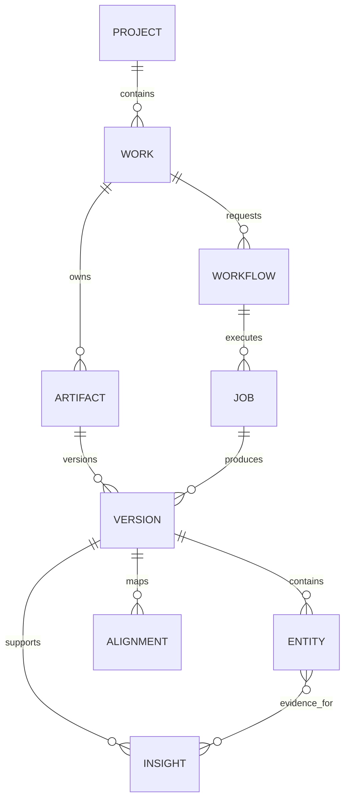

# listencloser Music Understanding Workspace — Master Product & Engineering Spec

> **Status:** Authoritative source of truth for product direction, analysis architecture, engineering principles, roadmap, and agent execution.
>
> **Audience:** Product owner, implementation agents, research agents, reviewers, and future contributors.
>
> **Conflict rule:** If this document conflicts with older product/architecture prose, this document wins unless an ADR explicitly supersedes it. Runtime code, migrations, and `backend/config/capabilities.json` remain authoritative for what is actually shipped today.
>
> **Last major direction reset:** August 2026.

---

## 1. Executive summary

listencloser is not primarily an “audio-to-sheet-music app,” a “piano app,” or a collection of MIR demos. The long-term product is a **general music-understanding workspace** that helps a person answer:

- What am I hearing?
- What is happening musically right now?
- How is this passage related to the rest of the piece?
- Why does this section feel or function differently?
- How is the music organized harmonically, melodically, rhythmically, timbrally, structurally, and performatively?
- Which representation is most useful for this kind of music?
- What music-theory, production, stylistic, historical, or cultural concept explains what is happening?
- How can I compare, learn from, transform, or eventually create from this music?

The product should behave like an **IDE / microscope / annotated score for music**: one persistent musical work, multiple synchronized representations, evidence-backed analysis, and a grounded conversational layer that explains the evidence.

The system must support very different kinds of music. A solo piano recording may benefit from transcription, notation, harmonic analysis, phrasing, and voice-leading. A house track may benefit more from beat/downbeat structure, source stems, groove, arrangement, energy, timbre, repetition, and drop/breakdown navigation. A reggaeton track may require drum-pattern, bass, vocal, and arrangement analysis. Jazz may emphasize harmonic function, extensions, form, swing, improvisational melody, and bass movement. These are **examples of style-aware capability routing, not separate products or hard-coded genres**.

The architecture therefore separates:

1. **Universal evidence** — audio, time, spectral content, beats, notes, stems, embeddings, sections, events.
2. **Specialized inference engines** — chord recognition, transcription, melody extraction, beat/downbeat tracking, source separation, tagging, embeddings, structure, notation.
3. **Musical observations** — deterministic or calibrated interpretations grounded in evidence.
4. **Style/context-aware analysis policies** — choose which analyses are meaningful for a work.
5. **Human-facing explanation** — Inspector, annotations, education, and Ask.

The LLM is **not the primary music detector**. It explains, combines, retrieves, teaches, and operates on structured evidence produced by evaluated music systems.

---

## 2. Product north star

### 2.1 North-star experience

A user imports any piece of music and can immediately move through a coherent loop:

```text
IMPORT
  ↓
HEAR
  ↓
SEE / NAVIGATE
  ↓
UNDERSTAND
  ↓
ASK / LEARN / COMPARE
  ↓
TRANSFORM / CREATE (later)
```

The product succeeds when a musician or curious listener can move from “I like this” to “I understand what is happening here” without needing to know our backend architecture, file formats, MIR vocabulary, or model names.

### 2.2 The product is organized around a Work

A **Work** is the persistent musical object. Representations, analyses, selections, derived artifacts, and future transformations belong to it.

The user should not think in terms of jobs, artifacts, database rows, or model outputs.

### 2.3 Representations and playback sources are independent

A representation answers **what am I looking at?**

A playback source answers **what am I hearing?**

Examples:

- View Score while listening to Original.
- View Spectrogram while listening to Transcription.
- View Piano Roll while listening to Score rendition.

Changing a representation should not unexpectedly reset transport or change playback source.

### 2.4 The Inspector answers “what is happening?”

Analysis is not a disconnected dashboard. It is contextual to the active work and, when applicable, to the selected time span.

The primary interaction is:

```text
finding in Inspector
  → temporal / symbolic evidence
  → synchronized highlight in representation
  → hear / loop / compare passage
```

### 2.5 Ask answers “what does this mean?”

Ask should combine evidence with explanation. It may answer questions such as:

- “Why is this chord called a French augmented-sixth chord?”
- “What makes this passage harmonically unusual?”
- “What changed at the drop?”
- “Where does this rhythmic pattern return?”
- “Why does the chorus feel larger than the verse?”
- “Show me another place with a similar melody.”

Answers must distinguish detected facts, derived observations, style/context inference, and broader educational interpretation.

---

## 3. Product principles

### 3.1 Evidence before explanation

Every factual musical claim should trace to evidence and provenance.

Preferred chain:

```text
engine / symbolic computation
  → structured evidence
  → deterministic/calibrated observation
  → human-readable explanation
```

Avoid:

```text
audio or MIDI
  → LLM
  → plausible musical story
```

### 3.2 Truthfulness beats completeness

“No confident melody available” is better than a bad melody line.

“Section boundaries are experimental” is better than fabricated Verse/Chorus labels.

Unknown is a valid product state.

### 3.3 Representation follows musical usefulness

Sheet music is a powerful representation for some domains and nearly irrelevant for others.

The system must support different representational lenses without implying a universal hierarchy.

### 3.4 Universal core, style-aware interpretation

Do not create one product for classical, one for house, one for reggaeton, etc. Instead:

```text
universal work + evidence model
         ↓
style / instrumentation / context evidence
         ↓
capability routing and emphasis
```

### 3.5 OSS / research first for hard MIR problems

For difficult inference tasks, prefer evaluated OSS/research engines over bespoke heuristics.

Own the product-specific layers:

- routing,
- normalization,
- provenance,
- persistence,
- evaluation,
- evidence fusion,
- time mapping,
- UX,
- corrections,
- capability maturity,
- explanation.

### 3.6 Small deterministic logic is acceptable after hard inference

Using LStoM to identify melody and then computing interval statistics is appropriate.

Replacing LStoM with a custom “highest note wins” heuristic is not.

### 3.7 Human interpretability is a product requirement

Raw descriptors such as spectral centroid, onset density, embedding coordinates, or classifier logits are not analysis by themselves.

The UI should convert evidence into musically meaningful relationships while preserving access to details.

### 3.8 Cultural and theoretical context is plural

Western tonal harmony is one useful framework, not the ontology of all music.

Theory explanations should identify their framework and cultural scope. Genre/style-aware modules may use different concepts: clave, swing, dembow, raga, tala, maqam, son clave, harmonic function, four-on-the-floor, etc., only when appropriate and supported.

---

## 4. The musical understanding model

The product should organize analysis along **orthogonal musical questions**, not arbitrary engine outputs.

### 4.1 Time and meter — “where are we?”

Questions:

- What is the tempo?
- Where are beats and downbeats?
- What is the meter / bar phase?
- Is tempo stable or expressive?
- How do events align to the beat?

Evidence:

- beat/downbeat timelines,
- tempo curve,
- time signature / meter evidence,
- onset phase relative to beats.

Potential engines / frameworks:

- current Beat This path,
- BeatNet for joint beat/downbeat/tempo/meter comparison,
- Essentia rhythm extraction as an evaluation reference.

This axis is foundational because structure, groove, rhythmic analysis, notation, and synchronization depend on it.

### 4.2 Harmony and tonality — “what pitch organization is active?”

Questions:

- What key / tonal center is active?
- What chords occur and when?
- How do chords function relative to the key?
- Is harmony static or rapidly changing?
- Are chords diatonic, borrowed, chromatic, altered, extended, tonicizing, or cadential?
- Are there modulations or local key regions?

Current production foundation:

- audio-native chord timeline via `lv-chordia`,
- symbolic global key via music21,
- Roman numeral + harmonic-function interpretation gated on trusted chord + key.

Current withheld / research capabilities:

- cadences,
- reliable key regions/modulation,
- voice leading,
- richer chromatic-function classification.

Theory education should be framework-aware. Example: a **French augmented-sixth chord** is a chromatically altered predominant/subdominant sonority in common-practice tonal theory, conventionally containing lowered scale degree 6 and raised scale degree 4 around the dominant, with two additional tones; it typically intensifies motion toward V. MIT Harmony & Counterpoint II explicitly covers augmented-sixth chords and chromatic modulation, while Open Music Theory provides a modern accessible treatment. This is the kind of concept Ask should explain when detected — including its historical/common-practice context rather than presenting it as a universal musical law.

### 4.3 Melody and voice — “what line is perceptually or structurally prominent?”

Questions:

- What is the predominant melody?
- What is its range, register, contour, and interval vocabulary?
- Where are local peaks/troughs?
- Which melodic patterns recur?
- How does melody interact with harmony?
- Are multiple voices present?

Current foundation:

- LStoM symbolic melody extraction, strongly validated on POP909 versus the legacy skyline heuristic.

Supporting / future OSS:

- Piano_SVSep for symbolic piano staff/voice separation; this is engraving/voice structure, not melody identity.
- Partitura for symbolic score handling.

Important separation of tasks:

```text
voice/staff separation ≠ melody extraction ≠ phrase segmentation ≠ motif analysis
```

### 4.4 Rhythm and groove — “how are events organized in time?”

Questions:

- How dense is rhythmic activity?
- How do note attacks align to beats and subdivisions?
- Where are rests / gaps?
- Are rhythmic patterns repeated?
- What metrical accents dominate?
- Is there syncopation according to an established metric?
- How do drum/bass patterns create groove?

Current production evidence:

- note/onset density,
- temporal activity,
- rests/onset gaps,
- beat-relative onset distribution.

Do not label beat-phase distribution “syncopation” without a validated syncopation model.

Style-aware future analysis may include:

- four-on-the-floor and offbeat hi-hat patterns,
- dembow-like drum relationships,
- clave-like patterns,
- swing ratio,
- rhythmic-cell recurrence.

These should rely on beat/downbeat evidence and, when useful, separated drum/bass stems.

### 4.5 Timbre, instrumentation, and production — “what sound sources and sonic qualities define the passage?”

Questions:

- Which instruments / source roles are present?
- Which sources enter or leave?
- How does spectral brightness or low-frequency energy change?
- Is the arrangement sparse/dense?
- Which production layers distinguish sections?

This is currently underdeveloped and is essential for general music support.

Promising directions:

- source separation (BS-RoFormer / Mel-Band RoFormer family evaluation),
- Essentia pretrained instrument/genre/style models,
- music foundation embeddings,
- audio-text models for low-trust semantic descriptions.

### 4.6 Structure and form — “how is the piece organized over time?”

Questions:

- Where are major boundaries?
- Which sections repeat or resemble one another?
- How does orchestration / harmony / groove change at boundaries?
- Are semantic labels such as verse/chorus justified?

Current state:

- evaluation-only librosa CENS/recurrence/novelty baseline,
- no product exposure until benchmark evidence exists.

Important decomposition:

```text
boundary detection
≠ repeated-section grouping
≠ semantic form labeling
```

Generic section boundaries are useful even when Verse/Chorus labels are not trustworthy.

### 4.7 Dynamics, energy, and arrangement — “how does intensity evolve?”

Questions:

- Where does loudness change?
- Which sources enter/exit?
- Where is arrangement density highest?
- Does high-frequency / low-frequency energy change?
- How do dynamics align with structure?

This axis is especially important for electronic, pop, rock, Latin, hip-hop, and production-centric music, where score-centric analysis misses much of the musical experience.

### 4.8 Performance and expression — “how is the music performed?”

Questions:

- rubato / local tempo deviation,
- timing deviations relative to score/beat,
- articulation,
- dynamics / velocity,
- pedaling,
- expressive phrasing,
- performance difficulty / comparison.

This is a future major axis for piano/classical and educational use.

### 4.9 Similarity and retrieval — “where else is something like this?”

Questions:

- similar section in this song,
- similar melody elsewhere,
- similar groove elsewhere,
- similar timbre / instrumentation,
- similar work in a personal library,
- text-to-music retrieval.

This is where music foundation embeddings can unlock product capabilities that handcrafted feature sets cannot easily provide.

### 4.10 Style, genre, and cultural context — “what musical vocabulary may be relevant?”

Genre/style should be treated as multi-label context, not a rigid single classifier.

Potential evidence:

- Essentia Discogs-EffNet style classifiers / embeddings,
- MuQ / MuQ-MuLan,
- CLAP-like audio-text embeddings,
- MTG-Jamendo-trained models,
- foundation-model linear probes.

The output should influence **which analyses are emphasized**, not force an ontology onto the music.

---

## 5. Representation model

The product must distinguish raw data, derived representation, playback source, and analysis overlay.

### 5.1 Core representation families

| Representation | Best for | Notes |
|---|---|---|
| Waveform | time, loudness, editing, section navigation | universal |
| Spectrogram | frequency/timbre, production changes, pitch energy | universal audio |
| Piano Roll | notes, timing, polyphony, transcription inspection | symbolic/pitched |
| Score / notation | notation-literate domains, performance/engraving | domain-specific |
| Beat/bar grid | groove, arrangement, editing | general rhythmic music |
| Harmony lane | chord timeline / functions | tonal/harmonic music |
| Structure timeline | sections / repetition | general once validated |
| Stem mixer | drums/bass/vocals/etc. | mixed-production music |
| Embedding/similarity view | search / clustering / comparison | future |
| Relative-theory view | scale degrees / Roman numerals | tonal education |

No representation should be treated as the universal “final form.”

### 5.2 Hooktheory is a useful product reference

Hooktheory TheoryTab demonstrates an important principle: traditional score/tab is optimized for performance, while relative notation can be optimized for **understanding relationships**. TheoryTab shows synchronized chord/melody timelines, Roman numerals, relative scale-based melody, and section structure. listencloser should learn from this separation of “performing notation” versus “understanding notation,” while generating its own evidence rather than relying on crowd transcription.

### 5.3 Sonic Visualiser is a useful interaction reference

Sonic Visualiser demonstrates the value of aligned waveform/spectrogram/MIDI layers, annotations, multiple time resolutions, analysis plugins, and synchronized playback. listencloser should provide a more opinionated, consumer-friendly, persistent, explanatory experience built on similar synchronization principles.

---

## 6. Style-aware analysis without hard-coded products

The product should not contain a giant `if genre == house` UI branch. Instead, capabilities have prerequisites and contextual relevance.

### 6.1 Universal evidence layer

Always attempt / derive when technically supported:

- duration,
- waveform,
- spectrogram,
- loudness/energy,
- embeddings,
- beat/downbeat candidates,
- source/stem candidates,
- broad style/instrument evidence.

### 6.2 Contextual capability layer

Examples — not exhaustive product taxonomies:

#### Classical / solo piano

Emphasize:

- transcription,
- score,
- key/harmony,
- melody/voices,
- phrasing,
- expression/rubato,
- form,
- theory education.

#### House / electronic dance

Emphasize:

- beat/downbeat/bar grid,
- drum/bass stems,
- four-on-the-floor evidence,
- groove/onset phase,
- arrangement/energy,
- repeated loops,
- drops/breakdowns,
- timbre/production,
- harmonic loop where meaningful.

#### Reggaeton / Latin urban

Emphasize:

- drum stem,
- dembow-like pattern evidence,
- bass/drum interaction,
- vocal melody/phrasing,
- arrangement,
- repeated loops,
- harmony where relevant,
- cultural/contextual explanation that does not collapse Latin music into one rhythm label.

#### Jazz

Emphasize:

- extended harmony,
- local tonicization,
- harmonic rhythm,
- form / chorus repetition,
- swing / beat subdivision,
- bass movement,
- improvisational melodic contour.

#### Pop / rock

Emphasize:

- section structure,
- melody + chords,
- bass/drum arrangement,
- energy changes,
- production layers,
- repeated progressions / hooks.

These examples exist to test the architecture. Future styles should be addable by capability configuration and evaluated modules rather than workspace redesign.

---

## 7. Analysis architecture: Evidence Graph

The long-term analysis model should evolve from “a list of Insight rows” toward a typed evidence graph while preserving backward compatibility.

### 7.1 Evidence primitives

Useful concepts:

```text
Entity       note / beat / chord / event / stem / section / motif candidate
Span         temporal or notation-localized region
Observation  deterministic/calibrated statement derived from entities/spans
Relation     links between entities/observations
Insight      user-facing interpretation/summarization
Alignment    mapping between time domains / versions
```

### 7.2 Example graph

```text
Section B [0:42–1:05]
├── chord sequence: Fm → Db → Ab → Eb
├── harmonic-rhythm rate: increased
├── drum activity: increased
├── bass stem energy: +28%
├── melodic register: higher
├── spectral high-band energy: increased
└── similar-to: Section D
```

Now Ask can ground a response such as:

> “The section feels larger because several independently measured changes coincide: drums and bass become more active, upper-spectrum energy increases, and the melody moves into a higher register.”

The explanation is useful because it is relational, not because an LLM guessed “bigger chorus.”

### 7.3 Confidence and uncertainty

Use `confidence=null` when there is no calibrated confidence.

Do not convert heuristic scores into fake probabilities.

Record:

- engine,
- engine version,
- model checksum where applicable,
- input version,
- profile/domain,
- parameters,
- evaluation provenance where appropriate.

---

## 8. Foundation-model layer

Modern MIR increasingly uses universal/pretrained representation models. ISMIR 2025 explicitly treated self-supervised learning as foundational for MIR, and ISMIR 2026 includes dedicated tutorials on LLMs x Music and evaluating music foundation models.

listencloser should evaluate foundation models as an **augmentation layer**, not immediately replace reliable specialized engines.

### 8.1 Candidates to benchmark

| Candidate | Role | Why interesting | Initial recommendation |
|---|---|---|---|
| MERT | music audio embeddings | strong transfer across many MIR tasks | benchmark |
| MuQ | SSL music representation | modern music-specific SSL; broad MIR focus | benchmark first |
| MuQ-MuLan | audio-text embeddings | zero-shot tagging / semantic retrieval | benchmark first |
| MusicFM | music foundation representation | explicitly designed for music informatics | benchmark |
| CLaMP3 | audio + MIDI + score + multilingual text alignment | unusually aligned with our multi-representation product | high-priority research |
| CLAP family | generic audio-text | practical semantic retrieval/tagging | comparison baseline |
| LLark / music audio-LLM systems | instruction-following music understanding | useful model of future Ask architecture | research/reference |

MARBLE should be treated as a key evaluation framework / reference for representation-model comparison rather than choosing a model from hype or one demo.

### 8.2 What embeddings can unlock

- similarity search,
- section clustering,
- text-to-music queries,
- broad genre/style/instrument tagging,
- cross-song comparison,
- “find another passage like this,”
- feature inputs for lightweight downstream classifiers.

### 8.3 What embeddings should not replace automatically

- exact beat/downbeat timing,
- exact chord timelines,
- symbolic transcription,
- notation,
- calibrated event localization,
- trusted theory claims.

Specialized systems remain valuable when precision/localization matters.

---

## 9. Source separation layer

Source separation is a strategic capability for generic music understanding.

### 9.1 Why it matters

A mixed track hides instrument-specific behavior. Separating stems allows analysis such as:

```text
whole mix → drums → groove / onset / pattern
whole mix → bass → bass rhythm / pitch / harmony interaction
whole mix → vocals → vocal melody / phrasing
whole mix → keys/guitar → harmonic support
```

### 9.2 Candidates

Evaluate modern open pipelines such as BS-RoFormer / Mel-Band RoFormer families and maintained training/inference wrappers. Demucs remains a useful historical baseline but should not be treated as the final state by default.

Commercially, AudioShake demonstrates the production value of specialized stems including vocals, lead/backing vocals, drums, bass, guitar, piano, keys, and strings. We should use commercial systems as product/quality benchmarks even if we remain OSS-first.

### 9.3 Product representation

If stems become available, add a stem mixer / source-lane representation rather than exposing model internals.

---

## 10. Symbolic music layer

### 10.1 Current purpose

Symbolic representations are crucial for exact pitch/rhythm/harmony/notation reasoning when transcription is reliable.

### 10.2 OSS ecosystem

- `music21`: computational musicology and theory analysis.
- `partitura`: modern symbolic notation / MusicXML / MIDI / MEI handling.
- `symusic`: fast modern symbolic MIDI/ABC processing.
- `MusPy`: dataset/representation/evaluation toolkit for symbolic generation.
- `miditoolkit` / `pretty_midi`: practical MIDI manipulation.
- `Piano_SVSep`: piano voice/staff assignment for engraving.
- LStoM: symbolic melody extraction; currently production-default after internal POP909 validation.

Avoid new dependency layers when existing infrastructure already covers the use case.

### 10.3 Score is domain-specific

Score is a high-value representation for notation-centric music, education, and performance — but must never become the universal product ontology.

---

## 11. Human-readable theory and education layer

The product should connect detected music to **explanatory concepts**.

### 11.1 Explanation contract

For a detected concept, Ask/Inspector may explain:

1. **What** — definition.
2. **Where** — exact location in the user’s work.
3. **How** — note/chord/rhythm evidence.
4. **Function** — what it commonly does within the relevant theory framework.
5. **Context** — repertoire/style/historical/cultural scope.
6. **Compare** — related passages or concepts.
7. **Listen** — loop the evidence.

### 11.2 Example: French augmented-sixth chord

A good response should not merely say “Fr+6.” It should explain that this is a common-practice chromatic predominant sonority, identify the characteristic augmented-sixth interval resolving outward toward the dominant, show the actual notes in the selected passage, and mention the historical/theoretical tradition in which the label is conventional.

### 11.3 Learning references for product/research agents

Core MIR / computational music:

- Meinard Müller, *Fundamentals of Music Processing* (especially representation, synchronization, structure, chord recognition, beat tracking, retrieval, decomposition).
- FMP Python/Jupyter notebooks / second edition.
- Xavier Serra + Julius O. Smith, *Audio Signal Processing for Music Applications*.
- Stanford CCRMA curriculum: computational music, audio DSP, psychophysics/music cognition, computational music theory & analysis.

Western tonal theory / analysis:

- MIT OCW Harmony and Counterpoint I & II.
- MIT OCW Musical Analysis.
- Aldwell & Schachter, *Harmony and Voice Leading* (used in MIT curriculum).
- Open Music Theory as an accessible reference.

Broader study must also include ethnomusicology, popular-music studies, rhythm/groove scholarship, production studies, and style-specific literature when implementing culturally specific concepts.

---

## 12. Product UX architecture

### 12.1 Library

Purpose: persistent works and lifecycle.

A work communicates:

- title,
- processing / ready / failure state,
- whether analysis exists,
- primary Open action,
- secondary actions such as Analyze/Delete.

No artifact IDs, engine names, or internal workflow vocabulary in normal UI.

### 12.2 Workspace

Top: representation / analysis mode.

Center: primary musical canvas.

Right: Inspector / Ask context.

Bottom: global transport.

### 12.3 Representations

Current / near-term:

- Waveform,
- Piano Roll,
- Score,
- Spectrogram,
- Compare.

Future capability-driven views:

- beat/bar grid,
- structure,
- stems,
- harmony/theory-relative view,
- similarity/retrieval.

### 12.4 Global transport

One `TransportClock`:

```text
currentTime
 duration
 playing
 rate
 loop
```

Playback source is explicit:

- Original,
- Transcription,
- Score.

### 12.5 Selection

Shared selection is a first-class primitive:

```text
Selection
  timeRange { start, end, domain }
  noteIds
  measureRange
```

Representations map into the same selection rather than owning private selection state.

### 12.6 Inspector hierarchy

Default:

```text
Overview
Harmony
Melody
Rhythm
Structure (only if validated)
Timbre / Arrangement (future)
Findings
Details
```

Selected passage:

```text
Selection 0:20–0:28
relevant evidence only
```

### 12.7 Explanation over data dumping

A compact progression is better than twenty independent chord chips.

A few meaningful findings are better than every window-level metric.

---

## 13. Ask / agent architecture

### 13.1 LLM responsibilities

Allowed:

- explain evidence,
- compare evidence,
- answer educational questions,
- retrieve relevant concepts/examples,
- suggest deterministic actions,
- orchestrate specialized analysis tools,
- summarize uncertainty.

Not trusted as sole source for:

- chords,
- beats,
- exact melody,
- score notes,
- structure boundaries,
- calibrated genre labels,
- exact instrumentation.

### 13.2 Grounding bundle

Ask context should include:

- active work/version,
- current time/selection,
- active representation,
- active playback source,
- visible trusted insights,
- relevant entities/relations,
- capability maturity/provenance,
- optional retrieved theory/cultural references.

### 13.3 Actions

LLM returns proposed actions; deterministic product code executes them after user intent is clear.

Examples:

- seek,
- loop selection,
- show representation,
- compare sources,
- reveal theory explanation,
- find similar passage.

---

## 14. Current and target engine architecture

### 14.1 Current specialized engines

Current production should be verified from code, but the intended baseline includes:

- transcription: Basic Pitch + Transkun routing,
- melody: LStoM,
- chords: lv-chordia,
- theory/key: music21 + gated theory layer,
- beat/tempo: current Beat This / audio beat path,
- notation: current quantization/MusicXML pipeline,
- rendering: FluidSynth / notation renderer,
- structure: evaluation-only librosa baseline.

### 14.2 Target engine families

```text
Audio ingestion
  ↓
Preprocessing / normalization
  ↓
┌───────────────────────────────────────────┐
│ Specialized event engines                │
│ beats · chords · notes · melody · stems │
└───────────────────────────────────────────┘
  ↓
┌───────────────────────────────────────────┐
│ Foundation representations               │
│ MuQ / MERT / MusicFM / CLaMP3 candidates │
└───────────────────────────────────────────┘
  ↓
Evidence Graph
  ↓
Style/context-aware analyzers
  ↓
Deterministic/calibrated observations
  ↓
Inspector / annotations / Ask
```

---

## 15. Capability maturity model

`backend/config/capabilities.json` is the machine-readable product gate.

Conceptual maturity:

- `production`: evaluated enough for ordinary product claims in defined domain.
- `experimental`: user-visible only with explicit qualification and strong reason.
- `evaluation_only`: available to benchmark/develop; not user-visible.
- `withheld`: implementation/evidence exists but quality is known to be insufficient.

A capability is not promoted because a PR exists or a demo looks plausible.

Promotion requires:

- task definition,
- dataset / test fixture,
- metric or correctness criterion,
- baseline,
- result,
- runtime feasibility,
- licensing/dependency review,
- product wording,
- failure behavior,
- regression test.

---

## 16. Evaluation strategy

### 16.1 Separate inference quality from product quality

Algorithm evaluation asks “is the evidence correct?”

Product evaluation asks “can a user understand and use it?”

Both are required.

### 16.2 Task-specific benchmarks

Maintain established datasets where appropriate:

- transcription: MAESTRO / domain-specific AMT datasets,
- chords: GuitarSet plus piano/pop/classical symbolic/audio datasets as available,
- melody: POP909 for current LStoM domain; seek additional domains,
- notation: reference symbolic → notation plus audio → transcription → notation separately,
- structure: SALAMI/Harmonix/etc. when legally usable audio+labels are available,
- tagging/style/instrument: MTG-Jamendo,
- foundation embeddings: MARBLE tasks,
- separation: MUSDB18 / relevant open stem datasets,
- beats/downbeats: Ballroom / GiantSteps / relevant beat datasets.

### 16.3 Evaluation output contract

Every benchmark should record:

```text
commit SHA
engine + version
model checksum
input profile
dataset + version
sample IDs / split
metrics
runtime
memory where relevant
failure count
machine-readable JSON
```

### 16.4 Oracle vs end-to-end

Do not call theory mapping “99.9% accurate end-to-end” when the evaluation feeds ground-truth chords/key.

Always label oracle evaluations explicitly.

### 16.5 Golden product flow

At least one real licensed audio fixture must verify:

```text
upload
→ durable processing
→ original playback
→ transcription
→ piano roll
→ score
→ spectrogram
→ analysis
→ annotations
→ selection
→ Ask
→ reload
→ delete
```

Mocked E2E does not prove model, worker, storage, deployment, or network availability.

---

## 17. Engineering architecture

### 17.1 Current topology

```text
Browser / Next.js on Vercel
          ↓
Next.js authenticated proxy
          ↓
FastAPI on Oracle VM
          ↓
Supabase Postgres + Auth + private Storage
          ↑
Durable worker on Oracle VM
          ↓
Music engines
```

This topology is an implementation choice, not a product principle.

### 17.2 Why keep it for now

It remains appropriate while:

- traffic is small,
- one VM can run workloads,
- free/low-cost operation matters,
- operational complexity would outweigh scaling benefits.

### 17.3 Triggers to revisit

Re-evaluate compute/deployment if we need:

- multiple workers/machines,
- GPU inference,
- autoscaling,
- high availability,
- expensive background jobs,
- geographically distributed latency,
- stronger isolation between workloads.

Prefer managed container platforms before jumping directly to Kubernetes.

### 17.4 Do not add scale infrastructure without scale problems

Not currently justified by default:

- Kubernetes,
- service mesh,
- Kafka,
- Backstage,
- self-hosted Grafana,
- Jenkins alongside GitHub Actions,
- heavyweight feature-flag SaaS.

### 17.5 CI/CD

GitHub Actions is the canonical CI/CD system.

Conceptual gates:

```text
FAST
lint / type / unit

INTEGRATION
backend / DB / contracts

E2E
browser / mocked deterministic flows

REAL STACK
DB + API + worker + frontend + real fixture

SECURITY
CodeQL / Gitleaks / dependency review / Semgrep

DEPLOY
exact tested SHA
```

### 17.6 Observability

OpenTelemetry → Grafana Cloud for traces/metrics where configured.

Sentry remains appropriate for exception-focused debugging.

Useful spans/metrics:

- API request,
- queue age,
- job claim/execute,
- transcription,
- beats,
- harmony,
- melody,
- notation,
- persistence,
- engine failure/fallback,
- golden-path success.

### 17.7 Feature flags

Use a lightweight configuration/rollout mechanism if we need experimental engine routing or user cohorts. Do not build a giant custom platform and do not adopt LaunchDarkly until percentage rollout, targeting, audit, or experimentation requirements justify it.

### 17.8 Dependency management

Move toward reproducible lockfile-based Python environments and explicit runtime/dev/evaluation groups. Model/artifact versions must be independently pinned/checksummed.

---

## 18. Domain / data model

Current durable concepts remain valuable:

```text
Project
  └── Work
       ├── Artifact
       │    └── Version
       ├── Entity
       ├── Insight / Observation
       ├── Alignment
       ├── Workflow
       └── Job
```

Target evolution may add explicit Observation/Relation types if the Evidence Graph becomes difficult to express with current `Insight`/`Entity` structures.

Do not create a new schema merely because the concept is cleaner on paper. First prove current JSONB/typed domain model cannot express the needed evidence relationships safely.

### 18.1 ERD direction



Future relation/evidence graph types should preserve immutable lineage.

---

## 19. Product roadmap / milestones

### Milestone A — Reliable universal workspace

Goal: any supported audio can be imported, played, navigated, persisted, and analyzed without stale-state or lifecycle bugs.

Includes:

- Library lifecycle,
- global transport,
- Waveform/Piano Roll/Score/Spectrogram,
- durable processing,
- capability gating,
- real-stack verification.

Most of this is now substantially implemented.

### Milestone B — Trustworthy core musical evidence

Goal: strongest specialized engines for key primitives.

Tracks:

- transcription routing,
- beat/downbeat benchmark,
- chord/harmony,
- melody,
- notation,
- structure benchmark.

### Milestone C — General music understanding foundation

Goal: stop treating symbolic piano analysis as the universal product.

Deliverables:

1. Foundation-model bakeoff: MuQ, MERT, MusicFM, CLaMP3 / audio-text candidates.
2. Genre/style/instrument tagging bakeoff.
3. Source-separation bakeoff.
4. Beat/downbeat/meter bakeoff across styles.
5. Define evidence schema for stems/embeddings/style context.

### Milestone D — Style-aware analysis

Goal: analysis adapts to musical evidence and context.

Examples:

- arrangement/energy/timbre,
- stem-specific groove,
- harmony/melody for tonal music,
- repeated loops / structure,
- production-oriented observations.

No genre-specific UI fork unless genuine UX needs emerge.

### Milestone E — Human music breakdown

Goal: produce evidence-grounded explanations comparable to a strong educator / music-analysis video.

Capabilities:

- relational observations,
- “what changed here?” explanations,
- theory concept cards,
- cultural/style context,
- similarity / compare,
- educational Ask.

### Milestone F — Compare / retrieval / library intelligence

- similar section,
- similar melody/groove/timbre,
- compare two works,
- library clustering,
- text search over personal music.

### Milestone G — Transform and create

Only after understanding is strong:

- editable corrections,
- transposition / reharmonization,
- stem manipulation,
- arrangement variation,
- continuation/generation,
- DAW/MIDI/MusicXML export.

---

## 20. Research program to run next

Before adding many more handcrafted analysis fields, run these four focused bakeoffs.

### 20.1 Foundation representations

Compare at least:

- MuQ,
- MERT,
- MusicFM,
- CLaMP3 if practical,
- one audio-text model.

Measure:

- install complexity,
- license,
- model size,
- CPU/GPU feasibility,
- latency,
- embedding granularity,
- MARBLE/reference task quality,
- usefulness on our own selected passages.

### 20.2 Style / instrument / semantic tagging

Compare:

- Essentia Discogs-EffNet,
- MTG-Jamendo models,
- MuQ-MuLan / audio-text zero-shot tagging.

Use diverse genres/styles, not only piano/electronic examples.

### 20.3 Source separation

Compare:

- BS-RoFormer / Mel-Band RoFormer practical implementations,
- maintained multi-stem frameworks,
- current baseline if any.

Measure quality, latency, memory, deployment feasibility, license, and downstream analysis value.

### 20.4 Beat/downbeat/meter

Compare current engine with BeatNet and any practical strong OSS alternative across multiple styles.

Do not evaluate only one piano fixture.

---

## 21. UI / design-system direction

The current workspace architecture is broadly correct, but visual/product design may evolve substantially.

### 21.1 Design references

Use Mobbin and 21st.dev as **pattern/reference libraries**, not as automatic design authorities.

Borrow:

- information hierarchy,
- interaction patterns,
- responsive behavior,
- empty/loading/error states,
- component references.

Do not import a random SaaS aesthetic.

### 21.2 Product visual identity

Desired:

- quiet/editorial musician tool,
- neutral workspace,
- expressive but restrained semantic color,
- canvas-first,
- minimal visual chrome,
- typography/spacing over card spam,
- evidence overlays subordinate to the music.

Semantic visual priority:

```text
playhead
> active selection
> focused analysis
> background analysis
```

### 21.3 Design verification

Every meaningful UI PR must include browser evidence at:

- normal desktop,
- laptop/narrow viewport,
- relevant empty/loading/error state,
- representative real work.

---

## 22. Agent operating contract

This repository is intentionally structured so lower-quality agents can execute bounded work safely.

### 22.1 Required reading before implementation

1. This document.
2. `docs/AGENTS.md`.
3. relevant ADR(s).
4. relevant GitHub issue.
5. `backend/config/capabilities.json` for analysis/product exposure.
6. recent PRs touching the subsystem.

### 22.2 Agent role separation

**Reasoning/product/research agent** decides:

- product direction,
- capability semantics,
- OSS candidates,
- evaluation criteria,
- architecture changes,
- priority.

**Implementation agent**:

- reproduces,
- implements,
- tests,
- runs browser/real-stack checks,
- opens/updates PR,
- fixes caused CI failures,
- provides evidence,
- merges routine safe work when authorized.

### 22.3 Every implementation task must specify

- user problem,
- desired behavior,
- non-goals,
- likely files/components,
- capability maturity,
- acceptance tests,
- real-product verification,
- stop/escalation conditions.

### 22.4 Definition of done

A feature is not done when code compiles.

As applicable, done means:

```text
implementation
+ unit/contract tests
+ integration/E2E tests
+ capability policy update
+ real browser verification
+ real-stack verification
+ persisted-output inspection
+ screenshot/trace evidence
+ PR description
+ issue update
+ deployment verification
```

### 22.5 CI failure classification

Every failure should be classified with evidence:

- CAUSED_BY_PR,
- PRE_EXISTING_MAIN,
- INFRA,
- FLAKE,
- EXPECTED_VISUAL_CHANGE,
- REAL_PRODUCT_BUG,
- UNKNOWN.

Do not call something “flaky” because it is inconvenient.

### 22.6 Product verification matrix

For changes to core workspace/analysis, verify at least:

```text
Library
Import
Processing
Reload
Open work
Original playback
Transcription playback
Score playback
Waveform
Spectrogram
Piano Roll
Score
Analysis
Selection
Representation switching
Playback-source switching
Ask where configured
Delete / work switch
```

### 22.7 Music-engine PR requirements

Every new or replaced music engine needs:

- license review,
- model-weight license,
- version,
- install/deployment feasibility,
- benchmark dataset,
- baseline comparison,
- runtime/memory,
- failure behavior,
- canonical output adapter,
- provenance,
- regression test,
- product wording.

---

## 23. Current product assumptions to actively challenge

Do not preserve these assumptions without evidence:

1. “Score is the most important representation.”
2. “Harmony/Melody/Rhythm are sufficient analysis categories.”
3. “One analysis schema should look the same for every style.”
4. “Symbolic MIDI is always the best source for analysis.”
5. “A dedicated handcrafted feature is better than a strong pretrained representation.”
6. “Genre should be one hard label.”
7. “An LLM can infer detailed music theory directly from audio reliably enough to persist as fact.”
8. “If an engine returns data, the UI should show it.”
9. “A single fixture looking plausible is validation.”
10. “More analysis fields means better analysis.”

---

## 24. Competitive / research references

These are references, not dependencies or endorsement.

### MIR research / evaluation

- ISMIR — leading MIR research forum; 2025 SSL tutorial; 2026 tutorials include LLMs x Music, Intro to MIR, and Music Foundation Model evaluation.
- MIREX — task-based shared evaluation tradition.
- MARBLE — universal music representation benchmarking / encoder comparison.
- International Audio Laboratories Erlangen — MIR/audio analysis/synchronization/structure research.
- MTG / Universitat Pompeu Fabra — Essentia, datasets, audio/music understanding.
- C4DM / Queen Mary — MIR, semantic audio, performance education, machine listening.
- NYU MARL — music/audio AI, MIR, cognition, urban sound.
- Stanford CCRMA — DSP, music cognition, computational music theory, interactive music systems.

### Product / interaction references

- Hooktheory TheoryTab — relative harmony/melody understanding and synchronized playback.
- Sonic Visualiser — aligned analysis layers and annotations.
- Moises — stems, practice, tempo/key, musician workflow.
- Cyanite — production music intelligence taxonomy / segment-level classifiers.
- AudioShake — production source separation.
- Spotify Research LLark / Audio & Visual Intelligence — multimodal music understanding direction.

### Core public references

- https://ismir2026.ismir.net/tutorials
- https://ismir2025program.ismir.net/tutorials.html
- https://music-ir.org/mirex/wiki/2025%3AMain_Page
- https://github.com/a43992899/MARBLE
- https://github.com/tencent-ailab/MuQ
- https://github.com/minzwon/musicfm
- https://arxiv.org/abs/2306.00107
- https://essentia.upf.edu/models.html
- https://github.com/mjhydri/BeatNet
- https://github.com/Musik-Hack/RoFormer
- https://github.com/CPJKU/partitura
- https://github.com/CPJKU/piano_svsep
- https://github.com/cuthbertLab/music21
- https://github.com/Yikai-Liao/symusic
- https://github.com/salu133445/muspy
- https://github.com/bytedance/midi_melody_extraction
- https://www.hooktheory.com/theorytab/
- https://sonicvisualiser.org/features.html
- https://api-docs.cyanite.ai/docs/audio-analysis-v6-classifier/
- https://developer.audioshake.ai/separate-stems
- https://www.upf.edu/web/mtg/about
- https://c4dm.eecs.qmul.ac.uk/about/
- https://research.atspotify.com/audio-visual-intelligence
- https://research.atspotify.com/publications/LLARK-a-multimodal-instruction-following-language-model-for-music
- https://link.springer.com/book/10.1007/978-3-030-69808-9
- https://www.coursera.org/learn/audio-signal-processing
- https://ocw.mit.edu/courses/21m-301-harmony-and-counterpoint-i-spring-2005/
- https://ocw.mit.edu/courses/21m-302-harmony-and-counterpoint-ii-spring-2005/
- https://ocw.mit.edu/courses/21m-350-musical-analysis-spring-2008/
- https://openmusictheory.github.io/alteredSubdominants.html

---

## 25. Immediate implementation policy after this rewrite

Until the Analysis V3 research bakeoffs are complete:

- finish already-active, bounded, truthful PRs;
- avoid adding many new bespoke micro-features;
- do not promote Structure without evaluation;
- maintain the current specialized harmony/melody/rhythm stack;
- prioritize foundation-model, tagging, separation, and beat/downbeat bakeoffs;
- use those results to revise engine routing and product emphasis;
- keep UI redesign work parallel and representation-neutral.

The next major architecture decision should be based on benchmark results from the four research tracks in §20, not another incremental heuristic.
