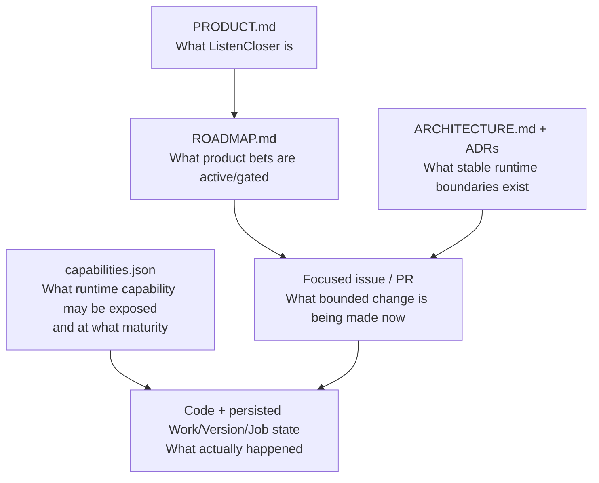
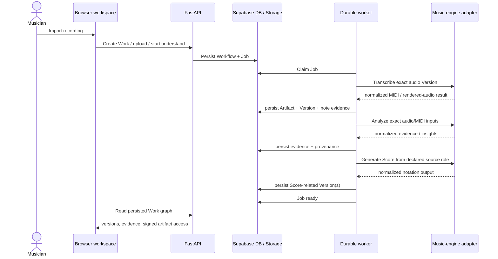
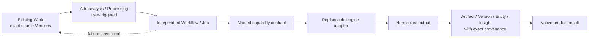
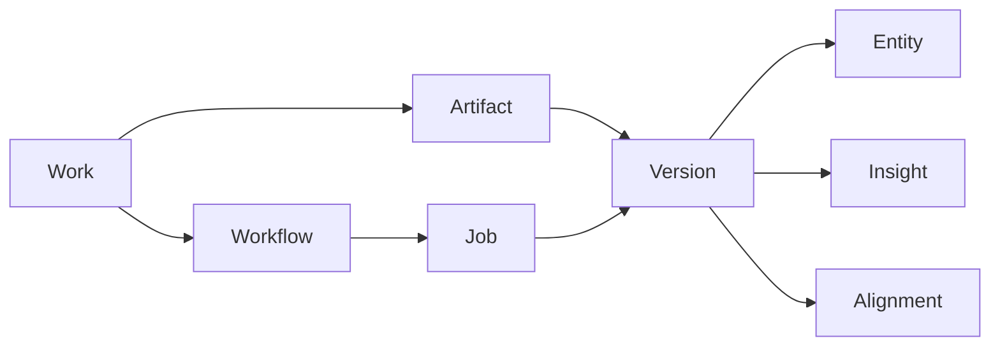
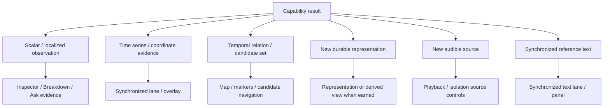
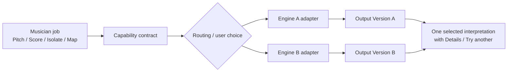
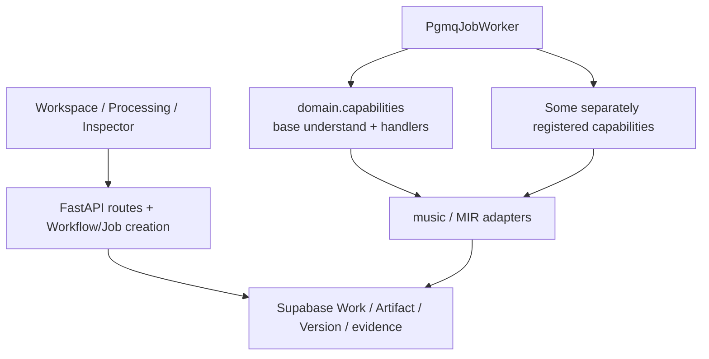
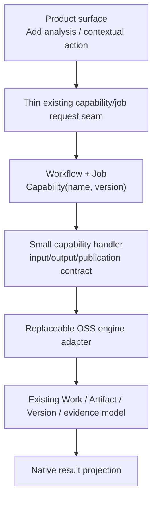
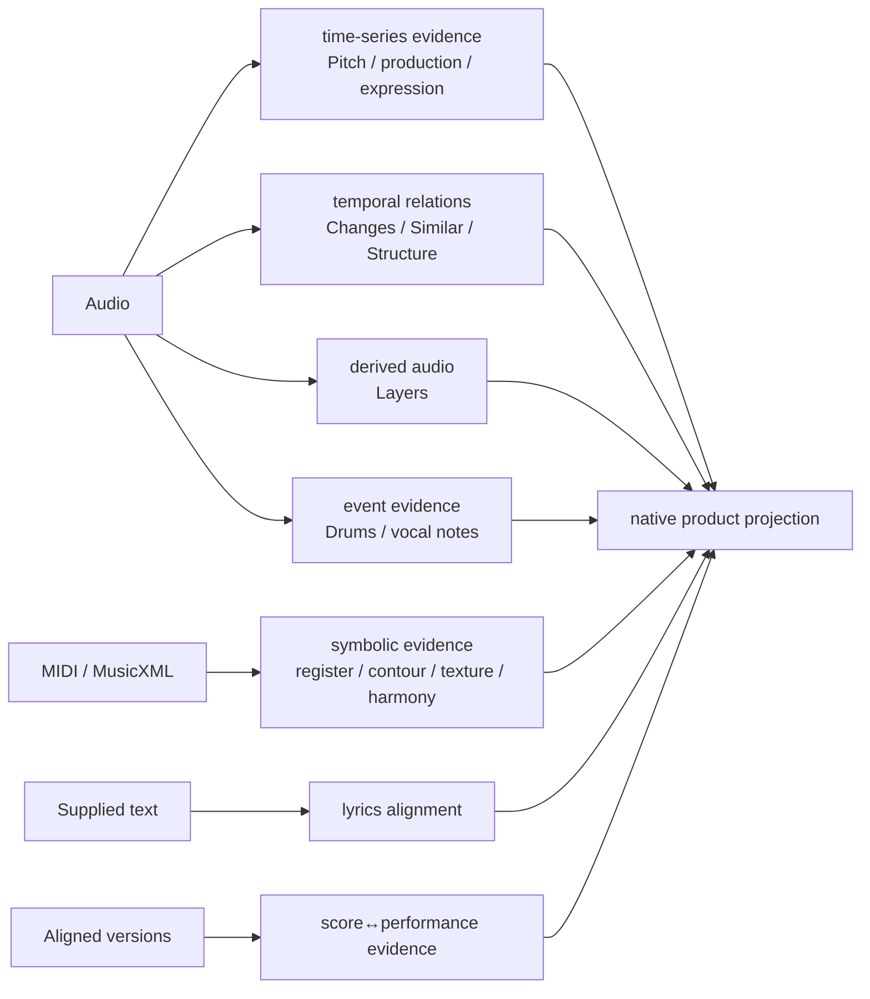

# Music capability architecture — current system and extension field guide

> **Status:** Maintained derived orientation for issue #1186.
>
> **Authority:** This document explains how existing authorities compose; it does not replace them. [`../ARCHITECTURE.md`](../ARCHITECTURE.md) owns shipped runtime boundaries, [`../product/ROADMAP.md`](../product/ROADMAP.md) owns product portfolio posture/sequencing, [`../../backend/config/capabilities.json`](../../backend/config/capabilities.json) owns runtime capability maturity/exposure, accepted [`../adr/`](../adr/) records own durable architecture decisions, and focused GitHub issues/PRs own unresolved/live work.
>
> **Goal:** Make it possible to answer, at a glance: **what musical capability is running, what implementation produced it, what source evidence it used, where its result lives, and how another promising capability should plug in.**

---

## 1. The shortest mental model

ListenCloser should keep these concepts separate:

```text
musician job
→ capability
→ workflow / job
→ engine adapter
→ normalized result
→ persisted evidence / artifact lineage
→ product projection
```

The most important distinction is:

> **capability ≠ engine ≠ persisted output ≠ representation ≠ playback source ≠ user-facing result**

Examples:

- **Pitch Contour** is a capability. pYIN, PESTO, or torchcrepe can be engine choices. The durable result is continuous F0 evidence tied to a source Version. Its natural product projection is a synchronized lane/plot.
- **Layers** is a capability. HTDemucs or a RoFormer separator can be an engine choice. The durable outputs are stem Versions. Their natural product projection is selectable playback sources.
- **Changes** is a capability/relation over persisted perceptual evidence. Its result is a bounded set of candidate times with literal before/after measurements. Its natural product projection is wayfinding/Inspector actions, not another representation tab.
- **Score** is a representation-generation capability. A score engine may consume performance MIDI or another exact source role and produce a distinct notation-oriented Version; looking at Score is still independent from which audio source is playing.

Keeping these concepts independent is what lets ListenCloser replace engines, preserve alternate interpretations, and add new musical jobs without turning every implementation detail into a new product concept.

---

## 2. Authority map: four different questions, four different owners

Do not collapse product priority, runtime maturity, execution state, and evidence strength into one status.



These axes intentionally use different vocabularies:

| Question | Example states | Authority |
| --- | --- | --- |
| Is this product work authorized now? | `ACTIVE`, `NEXT_PROBE`, `GATED`, `REVISIT`, `DONE` | `ROADMAP.md` |
| May this analysis be exposed by the runtime? | `production`, `experimental`, `evaluation_only`, `withheld` | `capabilities.json` |
| Is this particular run usable yet? | queued / processing / ready / failed / unavailable | persisted Workflow/Job/result state |
| How strong is this musical statement? | measured / derived / model-estimated / framework-qualified; calibrated confidence only where valid | capability/evidence contract + provenance |

A roadmap `ACTIVE` capability can still be runtime-`experimental`. A successful Job does not make its output canonical. A model score does not automatically become confidence. A failed optional analysis does not make the Work failed.

---

## 3. Current shipped runtime: one durable base path

The shipped architecture uses the browser only as a client/projection layer. Durable processing belongs to the API/worker/storage system described in [`../ARCHITECTURE.md`](../ARCHITECTURE.md).

At import, the current durable `understand` job is a composite path whose main stages are transcription, analysis, and Score generation.



`backend/worker.py` creates the durable job worker and registers capability handlers. `backend/domain/capabilities.py` currently contains the composite `understand` orchestration plus several production capability adapters. This works, but the large mixed-responsibility capability module is already a known decomposition seam under technical rearchitecture owner #801/#634; future breadth should not make it a larger capability god-module.

### What the base path means

The base path should stay small enough that Import → Play remains reliable.

A capability belongs in the automatic base path only when product value, operational cost, truth, and default-routing evidence justify making it normal Work processing. The rapid-breadth roadmap explicitly says **do not interpret experimental breadth as “run every model on every import.”**

---

## 4. New roadmap path: optional capability execution

Most rapid-breadth capabilities should use a second pattern:



The intended invariant is:

```text
Original Work remains usable
+ optional capability may run independently
+ its output is immutable / attributable where persistence is warranted
+ failure affects that capability only
+ another engine can later produce an alternate result
```

This pattern is already visible in the first experimental breadth wave: Pitch Contour, Layers, Structure Map, Similar Moments, and Changes are intentionally not being promoted into universal preprocessing.

---

## 5. The durable domain anchors

The current physical domain model is deliberately representation-neutral:



Use those anchors before inventing another storage abstraction.

### Work

The musician-facing recording/project object. Capabilities operate on exact evidence inside a Work rather than creating parallel top-level mini-products.

### Artifact / Version

The durable immutable lineage boundary for binary or structured outputs.

Use a Version when the result needs reproducibility, durable identity, alternate interpretations, private object storage, or downstream consumption. Examples include original audio, performance MIDI, rendered audio, MusicXML/score data, stem audio, or a persisted analysis report.

A new engine output should not overwrite the old interpretation. Produce another Version with exact lineage instead.

### Workflow / Job

Workflow records user/system intent; Job records durable execution/retry state and the named `Capability(name, version)` being run.

This is the natural execution anchor for expensive, asynchronous, or independently retryable optional analyses.

### Entity / Insight

Use localized evidence and user-facing/derived interpretation where the existing contracts fit. Do not introduce a new Observation/Relation table merely because the conceptual model is attractive; [`evidence-graph.md`](evidence-graph.md) deliberately keeps the current physical model until a real query/product requirement proves it insufficient.

### Alignment

Use when two exact timing/representation domains need an explicit mapping. Do not guess that two Versions share coordinates merely because they belong to the same Work.

---

## 6. Output topology: choose the result shape before the UI component

A major future-compatibility decision is to classify a capability by the **musical object it produces**, not by the library that computes it.



Current/future examples:

| Musical job | Typical durable output | Natural product home |
| --- | --- | --- |
| Key/chord/rhythm observation | Entity / Insight | Inspector, annotations, Ask when admitted |
| Continuous Pitch | analysis-report Version / time series | auxiliary synchronized pitch lane |
| Measured Changes | cheap deterministic relation over persisted evidence | Inspector + Hear/Inspect; markers later if earned |
| Similar Moments | query span + candidate spans + method provenance | contextual selected-passage action + candidates |
| Structure Map | persisted candidate spans / interpretation | synchronized Map/navigation |
| Layers / separation | stem Artifact/Versions | playback/isolation sources |
| Lyrics alignment | supplied text + timed alignment evidence | synchronized text lane/panel |
| Score / notation | notation-oriented Version(s) | Score representation |
| Performance expression | aligned time-series evidence | compact synchronized performance lanes |

This is the core #1173 UX rule: **shared capability lifecycle, heterogeneous musical result surfaces.** Do not build a universal `AnalysisResultCard` merely because several analyses exist.

---

## 7. Capability vs engine: where choices belong

The product should expose a musical capability first and an engine choice second.



### Good engine choice

Engine selection may depend on:

- an explicit user choice in advanced Processing;
- a declared input/domain profile;
- an accepted production routing decision;
- an experimental `Try another interpretation` action.

The chosen engine, package/model/checkpoint identity, parameters, source Version, and relevant release provenance belong with the output/job provenance.

### Bad engine choice

Avoid:

- package/model names as primary workspace navigation;
- silent engine fallback presented as if the requested engine succeeded;
- one permanent tab per engine;
- overwriting the prior result when trying an alternate;
- maintaining dormant engines in normal runtime solely for hypothetical optionality;
- hard genre/style routing from an uncalibrated classifier.

### One default, many reversible experiments

A validated product route should normally have one explicit default. Experimental alternatives may coexist as independently generated immutable outputs until product use and focused evaluation justify promotion/deletion.

This implements the roadmap loop:

```text
experiment visibly
→ learn
→ decide later which interpretation deserves authority/default routing
→ delete superseded paths instead of keeping permanent fallback trees
```

---

## 8. Truth, maturity, provenance, and failure are separate dimensions

### Runtime maturity

`backend/config/capabilities.json` is the machine-readable authority for whether a named analysis capability is `production`, `experimental`, `evaluation_only`, or `withheld`, plus product exposure such as Inspector/annotations/Ask.

It is **not** a generic plugin manifest. Do not grow it into dependency injection, UI layout, model installation, job orchestration, or engine marketplace configuration.

### Evidence semantics

Every capability must define what its output actually means.

Examples:

- a measured change candidate means declared measured features changed under a method;
- a Similar Moments candidate means two spans are similar under declared evidence/method;
- a structure label such as `chorus` is an experimental model interpretation unless separately admitted;
- a pYIN voiced probability is method-specific, not universal correctness confidence;
- a source-separated `vocals` stem is the separator's output role, not proof of performer identity or arrangement function.

### Provenance

Where applicable preserve:

```text
source Work / Version
input role
capability + capability version
engine / library version
model / checkpoint / profile
parameters
preprocessing
producing Job
output Version
license / release provenance where material
```

### Failure

Preserve distinct states:

```text
unsupported
unavailable
withheld
processing
failed
ready
```

An optional analysis failure should never silently become an empty success, and should not contaminate Original playback or unrelated ready results.

---

## 9. Current vs future-compatible shape

The target is **not** a generic plugin framework. It is a modular monolith with a small number of stable extension seams.

### Current shape



This already contains the right durable concepts, but rapid breadth is exposing a few seams that should converge rather than multiply.

### Future-compatible convergence



Future compatibility should come from **making this path boring and repeatable**, not from adding a plugin SDK.

### Seams worth strengthening as real consumers appear

1. **Optional capability request dispatch.** Prefer an existing generalized Workflow/Job request seam when it can express the contract cleanly; avoid one handwritten HTTP + Next proxy + client protocol per experiment. Do not create a plugin protocol before repeated real consumers prove the exact common contract.
2. **Capability handler ownership.** Keep one small handler per independent capability and move OSS-specific behavior behind adapters. Do not continue growing a mixed-responsibility `domain.capabilities.py` indefinitely; #801/#634 own decomposition when current shared seams are stable enough.
3. **Result discovery/readiness.** The browser should derive whether an optional result exists from persisted server truth, not custom window events or per-capability local caches. TanStack Query remains the remote-state owner.
4. **Processing lifecycle UI.** Once multiple async capabilities genuinely duplicate Add/Processing/Ready/Open/Retry/Details behavior, #1173 may introduce the smallest shared lifecycle row/chooser. Do not force heterogeneous result geometry into that abstraction.
5. **Auxiliary synchronized lanes.** Pitch, performance expression, lyrics, and future time-series evidence need a way to coexist with the small set of primary representations without every lane becoming a permanent tab.
6. **Exact input roles.** #613 remains critical as more capabilities consume audio, performance MIDI, notation MIDI, source MusicXML, stems, or aligned pairs. `latest Version of kind X` is not sufficient when several semantic roles coexist.
7. **API/worker dependency separation.** Heavy model stacks belong worker-side unless the API genuinely executes them. New optional models should not make API build/runtime inherit unnecessary ML compatibility constraints.

---

## 10. Worked examples

### A. Base transcription and Score

```text
Original audio Version
→ transcription capability
→ selected transcription engine/profile
→ performance MIDI Version
→ Piano Roll / rendered transcription audio

performance MIDI or declared score source
→ Score capability
→ selected score interpretation engine
→ notation-oriented Version / MusicXML
→ Score view
```

Important boundaries:

- Piano Roll performance evidence and readable Score interpretation are different objectives.
- A Score engine may infer cleaner notation without overwriting canonical performance-note evidence.
- Looking at Score does not imply Score playback is the active audible source.
- Alternate Score generation should preserve the previous output and provenance.

### B. Pitch Contour

```text
exact audio Version
→ Pitch Contour capability
→ pYIN / future PESTO / future torchcrepe adapter
→ continuous F0 report Version
→ auxiliary synchronized Pitch lane
```

The lane is the product projection; the engine is implementation detail. A second engine should create another result rather than a new primary navigation tab.

### C. Changes / Similar Moments / Structure

These all produce temporal relationships, but their contracts differ:

```text
persisted perceptual evidence
→ Changes
→ candidate times + literal feature deltas

selected passage + declared evidence
→ Similar Moments
→ candidate spans + method-specific similarity/distance

exact audio/evidence Version
→ Structure Map
→ candidate segment spans + optional method labels
```

All reuse shared musical time and Hear/Focus/selection. None requires a new top-level mode. None may silently upgrade a method-specific proposal into `chorus`, `motif`, or `important transition` truth.

### D. Layers

```text
exact audio Version
→ Layers capability
→ separator adapter / pinned model
→ vocals/drums/bass/other stem Versions
→ playback-source rows
```

The product result changes what the user can hear, so playback source is the natural surface. Complete-set validation should prevent partial outputs from appearing as a coherent separation result. Original remains available and selected unless the musician explicitly chooses a stem.

### E. Future lyrics alignment

```text
exact audio Version
+ user-supplied/licensed text
→ Lyrics Alignment capability
→ timed word/phoneme evidence
→ synchronized text panel/lane
```

The capability aligns supplied text; it does not authorize lyrics acquisition or silently replace user text with ASR output.

---

## 11. Adding a new musical capability: decision checklist

Use this sequence before writing framework code.

### 1. Name the musician job

Good:

> “Where does something like this passage happen again?”

> “Let me isolate the vocals.”

> “Show me how pitch bends through this phrase.”

Bad:

> “Integrate model X.”

If there is no concrete product behavior, keep the candidate in research rather than adding runtime machinery.

### 2. Define the truth contract

Write one sentence for what a returned result means and a second list for what it **does not** establish.

Decide whether the output is measured, deterministic-derived, model-estimated, framework-qualified, or interpretive.

### 3. Declare exact inputs

Identify semantic source roles and Version IDs:

- original/enhanced audio;
- performance MIDI;
- notation/score MIDI;
- source MusicXML;
- beat/downbeat evidence;
- stem Version;
- aligned Score + performance pair;
- user-supplied text.

Do not depend on ambiguous “latest kind” lookup when the role matters.

### 4. Refresh OSS candidates

Verify:

- maintained/stable implementation;
- code license;
- exact checkpoint/model/data license separately;
- CPU/GPU and memory/runtime fit;
- version/runtime compatibility;
- reproducible asset identity;
- smallest adapter surface.

Prefer an existing dependency/transparent method when it creates useful Experimental behavior without sacrificing the musical contract.

### 5. Choose execution shape

Use an **independent durable Job** when work is expensive, asynchronous, retryable, model-backed, or publishes durable outputs.

Use an **on-demand deterministic relation/query** when computation is cheap and fully reproducible from already-persisted authoritative evidence, and persistence would only duplicate truth. Changes is an example of this shape.

Do not add a background Job merely for architectural symmetry.

### 6. Choose persistence shape

Ask what downstream consumers need:

- durable binary/structured alternate interpretation → Artifact + Version;
- localized evidence → Entity/Insight under current contracts where appropriate;
- cross-version timing relation → Alignment;
- cheap deterministic query result → possibly derive on demand from persisted evidence.

Do not create a new table until a concrete query/authority limitation proves the existing model insufficient.

### 7. Choose native product result home

Use #1173's taxonomy:

```text
observation           → Inspector
coordinate series     → lane / overlay
wayfinding             → map / markers / navigation
selected-span action   → contextual result
new audible material   → playback source
synchronized text      → text lane / panel
```

Do not default to “new tab.”

### 8. Register maturity/exposure honestly

Update `capabilities.json` in the same PR when runtime status/engine/exposure changes.

Experimental is a useful maturity state, not a loophole for missing provenance or hidden failure.

### 9. Make failure local

Prove:

```text
capability fails
→ Work remains usable
→ Original remains playable
→ unrelated results remain ready
→ retry/unavailable state is explicit
→ partial output cannot masquerade as complete
```

### 10. Prove the smallest real invariant

Use the repository evidence ladder:

- unit/component logic;
- API/persistence integration;
- mocked browser contract;
- real-stack when the change crosses actual API/worker/storage/model boundaries;
- production verification when required by risk/product criticality.

For rapid Experimental integration, a broad benchmark is not a prerequisite unless the change is making a durable default/authority decision.

### 11. Canonize only after a decision exists

Later evaluation should answer something concrete:

- which engine becomes default;
- which domains are trusted;
- where to abstain;
- whether to auto-run;
- whether alternate implementations should be deleted;
- whether expensive persistent infrastructure is now justified.

Do not build evaluation infrastructure merely because an Experimental capability exists.

---

## 12. What **not** to build for future compatibility

Future compatibility is not proportional to abstraction count.

Do not introduce these without repeated concrete consumers and a focused architecture decision:

- generic music plugin framework or marketplace;
- engine/model dashboard as the main product IA;
- universal analysis-result component;
- second workflow engine or scheduler;
- GraphQL/tRPC alongside generated OpenAPI;
- Redux/Zustand/XState for server truth already owned by TanStack Query;
- generic vector database / embedding service before a task-shaped retrieval job earns it;
- graph database merely to mirror the conceptual evidence graph;
- universal automatic preprocessing with every available model;
- silent fallback trees that preserve multiple engines forever.

The preferred architecture remains:

> **few durable domain concepts + small replaceable product adapters + explicit immutable provenance.**

---

## 13. At-a-glance future expansion map

The roadmap already authorizes a broad set of experimental musical jobs. This document does not own their current posture; consult [`../product/ROADMAP.md`](../product/ROADMAP.md). Architecturally, they fit into the same small set of seams:



The expansion strategy is therefore not “add 20 engines.” It is:

```text
add useful musical jobs
→ reuse exact source/version/job/provenance contracts
→ normalize engine outputs
→ project each result where musicians use it
→ keep optional work independent
→ learn from use
→ promote/delete later
```

That is the technical counterpart of the roadmap policy:

> **breadth now, provenance always, defaults later.**

---

## 14. Maintenance rule

Update this field guide only when the **stable capability-system mental model or extension seam changes**.

Do not update it merely because:

- a PR opened/merged;
- a package version changed;
- an engine benchmark moved;
- one capability changed roadmap posture;
- one result got a new visual treatment within the same result topology.

For those facts, follow the linked authority instead.

If code develops enough repeated optional-capability patterns that a new shared abstraction becomes warranted, record the durable architectural reason in an ADR/focused issue first, then update this guide to reflect the accepted seam.