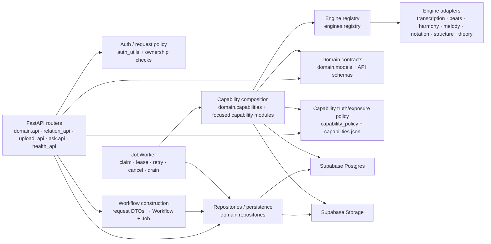

# Backend components

This is a component-level view inside the FastAPI/worker Python runtime. It intentionally reflects current ownership, including known hotspots.

## API presentation and policy

`backend/main.py` owns process composition, not domain behavior. It wires routers, HTTP middleware, shared outbound HTTP client, telemetry and rate limiting.

Routers should ideally do four things:

1. parse/validate the HTTP contract;
2. authenticate and authorize the caller;
3. invoke a domain/query/workflow operation;
4. translate the result into the response contract.

Current code does not perfectly maintain that separation. `domain/api.py` remains a large mixed API module, and some request handling constructs workflows directly. Refactor should improve seams incrementally rather than create a parallel service layer with no concrete ownership benefit.

## Authentication / authorization

Current API requests use the caller's Supabase bearer token for identity. The backend itself uses service-role Supabase access, so user ownership is re-established through explicit repository/domain checks before privileged reads, signed URLs or mutations.

Two separate service-role client factories have historically existed in auth and repository code; #556 tracks consolidation after auth/provider failure semantics are made precise.

The architecture invariant is:

> possession of service-role database/storage authority does not replace per-request user authorization.

## Domain models

`domain/models.py` currently defines the central persisted/application concepts:

- `Project`, `Work`;
- `Artifact`, `Version` and `ArtifactKind`;
- `Entity`, `Insight`, `Alignment` and temporal/span types;
- `Workflow`, `Job`, `Capability` and lifecycle types.

Models are frozen Pydantic values in application code. The physical database authority remains Supabase migrations rather than these Pydantic classes alone.

Known truthfulness debt: `Alignment.confidence` currently defaults to `1.0`; #640 owns determining whether confidence should be optional or replaced by explicit domain-specific scores.

## Repositories / persistence

Repository code maps between Supabase rows and domain models and centralizes ownership-aware access patterns. The desired direction is that row codecs and specialized graph reads are explicit reusable contracts rather than one repository reaching into another repository's private conversion helper.

The Work-bundle path is particularly important because it hydrates the browser's durable view of a Work: Artifact/Version lineage, active workflows/jobs and signed resources should come from one authorization-rooted read rather than repeated N+1 ownership traversals.

## Workflow construction

`Workflow` is durable user/system intent; `Job` is one durable executable unit associated with a capability.

Dedicated routes exist for product workflows such as understand/variation/compare. A generic create-workflow route also exists on current main; #632 owns making sure arbitrary internally registered capabilities cannot become public simply because their name can be submitted over HTTP.

Public workflow exposure and internal capability registration are separate contracts.

## Durable JobWorker

`domain/job_worker.py` is the execution state machine. Its responsibilities include:

- capacity-aware atomic next-job claim;
- lease ownership and renewal;
- cancellation checks before/during/after execution;
- cache/idempotency check only after ownership is established;
- transition `claimed → running → succeeded/failed/requeued`;
- exponential retry delay up to `max_retries`;
- process/job heartbeat;
- orphan recovery;
- graceful draining during shutdown.

Execution is at-least-once shaped: capabilities must therefore avoid unsafe overwrite/side effects or use attempt-specific/fenced persistence contracts.

## Capability composition

`domain/capabilities.py` is currently the largest backend orchestration hotspot. It contains several logically distinct concerns:

- job input/output and Storage helpers;
- progress adaptation;
- production/legacy/fallback DSP logic;
- composite `understand` sequencing;
- many individual job handlers;
- registration/composition.

That concentration is documented as debt, not endorsed as the target architecture. The preferred decomposition in #417 is by stable responsibilities that can be tested independently, not by arbitrary LOC/file-size thresholds.

Focused capability modules already exist beside the god-module (for example perceptual capability, correction entity sync and performance instrumentation), showing a viable incremental path.

## Engine protocols and adapters

`engines/base.py` defines capability-oriented engine interfaces. `engines/registry.py` selects concrete adapters based on explicit parameters/profiles and environment defaults.

Current adapter families include:

- transcription: Basic Pitch, Transkun;
- beat tracking: librosa, optional Beat This;
- harmony: music21, lv-chordia;
- melody: LStoM, evaluation-only skyline path;
- notation: music21;
- structure: AllIn1;
- theory interpretation: repository theory engine.

This list is descriptive only. Capability/product maturity is governed by `backend/config/capabilities.json`; evaluation candidates may exist without being production-safe.

## Capability exposure and evidence policy

`backend/config/capabilities.json` is the machine-readable product truthfulness registry for analysis evidence. It distinguishes states such as production, experimental, evaluation-only and withheld and separately declares Inspector/annotation/Ask exposure.

It is **not** automatically the public workflow-action registry. Conflating "analysis evidence may be shown" with "worker handler may be invoked by API" would create a second boundary bug.

## Evaluation boundary

Production adapters may be imported by evaluation code to measure the exact shipped baseline. The reverse dependency is forbidden in the target package architecture: request-serving API/worker code should not require `backend/evaluation/` merely to run production.

#287/#636/#639 collectively own making that boundary explicit through dependency groups, result schemas and later import-linter contracts.