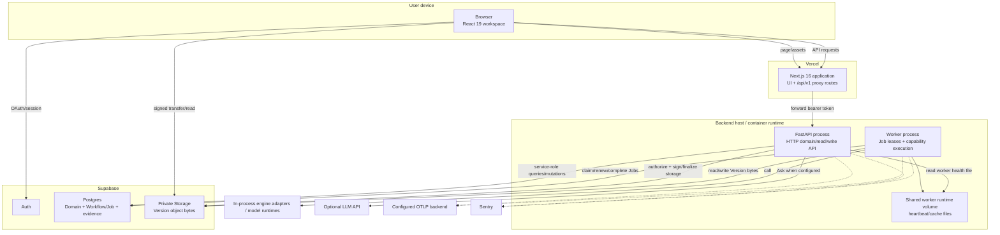

# Runtime containers

This view describes deployable/runtime units, not source-code modules.



## Browser / React workspace

**Technology:** React 19 in the Next.js application.

**Responsibilities:**

- authentication/session UX;
- library/work selection;
- import intent and signed byte upload;
- polling/reopening durable job state;
- synchronized waveform/Piano Roll/Score/analysis views;
- client-side playback/transport and cached decoded/derived presentation data;
- Breakdown, relation views and Ask interactions.

**Not authoritative for:**

- durable artifact/evidence truth;
- ownership decisions;
- worker capability availability;
- production engine maturity;
- musical facts not present in persisted/generated evidence.

## Next.js application / proxy

**Technology:** Next.js 16, TypeScript, Vercel.

The same deployable application serves the UI and repository-owned `/api/v1/*` proxy routes. Proxy families currently cover projects, Works, Versions, Workflows, Jobs and Ask.

The generated OpenAPI TypeScript contract lives in `lib/api-types.ts`; handwritten application/domain state is separate. #285 owns tightening the generated-wire → validated-application boundary.

## FastAPI process

**Entrypoint:** `backend/main.py`.

It registers routers for:

- core domain APIs;
- relation APIs;
- upload/finalization APIs;
- Ask;
- health/readiness.

At process startup it creates a shared `httpx.AsyncClient`, configures structured logging, OpenTelemetry and Sentry, and instruments FastAPI. Request middleware assigns an `x-request-id`, records route-template HTTP metrics, logs outcome/duration, and returns the request ID to the caller.

This process does **not** perform the long-lived music pipeline synchronously. It persists durable workflow/job intent for the worker.

## Worker process

**Entrypoint:** `backend/worker.py`.

Before publishing readiness/claiming work, the worker currently attempts process-local prewarm for Basic Pitch and librosa beat tracking. It then:

1. constructs `JobWorker` with configured concurrency;
2. installs understand-stage performance instrumentation;
3. registers the broad capability set from `domain.capabilities`;
4. registers corrected-MIDI entity synchronization;
5. registers perceptual evidence capability;
6. starts the durable polling/claim/lease loop.

`JobWorker` owns claim fencing, cancellation checks, cache/idempotency handling, transition to running, per-job heartbeat/lease renewal, retry/exhaustion and graceful drain.

## API and worker image relationship

Production-shaped `backend/docker-compose.yml` currently runs **API and worker from the same backend image** but as separate processes. The two services have different commands, health semantics and environment intent.

This does not mean they should share every Python dependency forever. #287 explicitly targets one lockfile with separate core/API, worker/ML, dev/test and evaluation dependency ownership so an API image/runtime does not carry TensorFlow/Torch/model dependencies unless code boundaries require them.

## Supabase Postgres

Postgres is the durable coordination and domain store. It contains:

- Project/Work/Artifact/Version metadata and lineage;
- Entity/Insight/Alignment evidence;
- Workflow/Job durable execution state;
- worker heartbeat/queue-related operational state;
- authorization/RLS policy defined by version-controlled migrations.

The worker queue is therefore a persisted database queue rather than an in-memory/browser queue or external Celery/Redis control plane.

## Supabase private Storage

Version bytes are stored outside Postgres. `Version.storage_bucket` + `storage_key` locate the immutable object, while domain lineage/provenance establishes why the object belongs to a Work.

Browser access uses short-lived signed operations. Backend/worker privileged Storage operations must verify the authoritative ownership/locator contract rather than treating a mutable-looking row value as authorization by itself (#571/#593).

## Engine runtimes

The `backend/engines/` package defines capability-oriented protocols/adapters for transcription, beat tracking, harmony, melody, notation, structure and theory. Concrete engines are created by `engines/registry.py`.

Effective production routing is a composition of:

```text
capability handler
  → registry selection
  → explicit profile/argument if present
  → deployment environment override if present
  → registry default
```

Do not copy a single effective-engine table into architecture docs as a new source of truth; use the registry, deployment config and persisted job/evidence provenance.

## Telemetry sinks

OpenTelemetry export is optional when no OTLP endpoint is configured. Sentry is similarly configuration-driven. The repository treats instrumentation contracts as code-owned and vendor export as replaceable infrastructure. #637 owns end-to-end propagation and SLO semantics.