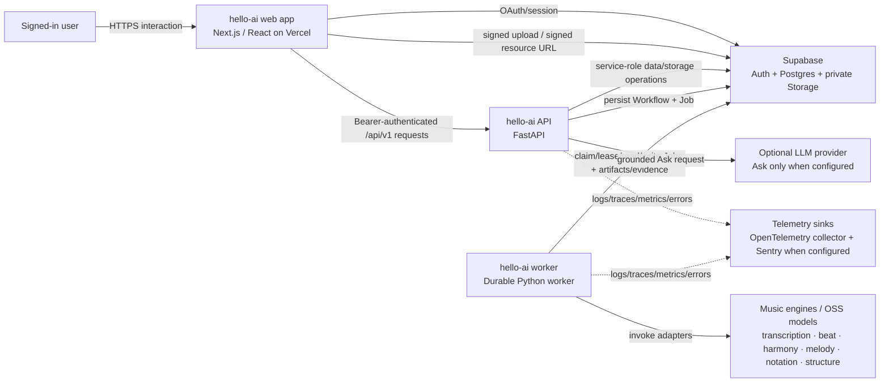

# System context

## Product boundary

hello-ai is a persistent music-understanding workspace. A signed-in user imports recordings, reopens saved Works, listens to source/derived representations, inspects evidence-backed analysis, and starts durable processing workflows.

## Trust boundaries

### Browser

The browser is an untrusted client from the server's perspective.

It owns:

- the Supabase user session/token;
- local interaction state, transport state and representation UI state;
- direct byte transfer only after the server has authorized a signed upload/resource operation.

It must not receive the Supabase service-role key, deployment credentials or worker host credentials.

### Next.js/Vercel

The application exposes `/api/v1/*` proxy routes so browser API requests can be forwarded to the backend without exposing backend topology as a product contract. The user's bearer token remains the caller identity.

Next.js is not the durable music-processing runtime. Closing the page must not cancel ordinary server-side processing merely because the browser disappeared.

### FastAPI

FastAPI is the user-facing domain authority for the current application data plane. It:

- authenticates the bearer token against Supabase Auth;
- checks ownership at repository/domain boundaries;
- constructs Work/Artifact/Version/workflow intent;
- issues signed Storage operations after authorization;
- persists durable Workflows/Jobs;
- reads persisted evidence for Breakdown/relations/Ask.

The backend uses service-role access to Supabase, so **authorization must be established in backend code/database policy before privileged operations**. Legacy browser-write authority is being removed separately; RLS alone is not treated as proof that arbitrary persisted Storage locators are safe.

### Durable worker

The worker is a privileged asynchronous executor. It polls/claims Jobs from Postgres, maintains leases/heartbeats, runs registered capabilities, persists immutable output Versions and evidence, handles retry/cancellation, and records execution telemetry.

Worker registration is an internal execution concern. It must not automatically imply public API exposure (#632).

### Supabase

Supabase currently provides three distinct platform roles:

1. **Auth** — browser sign-in/session identity;
2. **Postgres** — authoritative persistent domain/workflow/evidence state;
3. **private Storage** — bytes for original and derived Versions.

A Postgres backup and a Storage-byte recovery plan are therefore separate disaster-recovery concerns (#633).

### Music engines

Engines are adapters behind domain capabilities, not independent public services. Engine names belong at adapter/registry/provenance boundaries; callers should normally depend on a music capability rather than a vendor/model class.

The registry contains library defaults, while deployment may intentionally override them through environment variables. For example, `get_harmony_engine()` defaults to `music21`, while the production-shaped backend/worker Compose configuration sets `HARMONY_ENGINE=lv_chordia`. Therefore **engine registry + deployment configuration**, not either one alone, describes effective runtime routing.

### Evaluation boundary

Evaluation/research code may execute production adapters and compare candidates, but it is not part of the request-serving runtime merely because it lives in the same repository. Production must not grow a dependency on evaluation modules. The evidence/result architecture is tracked in #636.

## External-system failure semantics

Provider failures are not interchangeable:

- invalid/expired user credentials are an authentication outcome;
- Supabase Auth transport/provider failure is an availability dependency;
- Storage signing/upload failure is a data-plane failure;
- worker/model failure is an asynchronous processing failure;
- optional LLM provider failure should not invalidate already-persisted musical evidence.

The observability program (#637) owns proving that these classes are distinguishable in production signals.