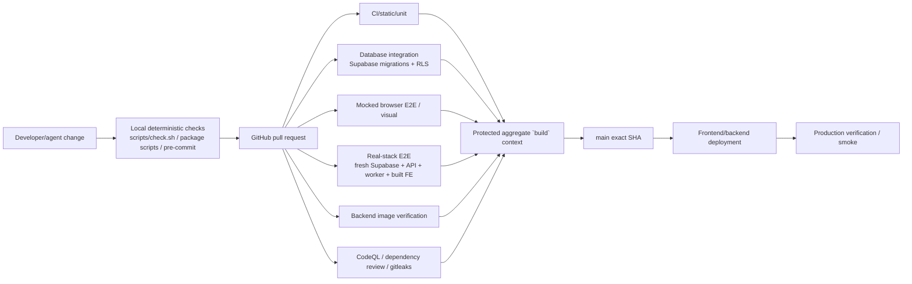

# Control plane: local checks → CI → release → production proof

This view describes how repository changes become admissible and how production identity is supposed to relate to tested source.



Not every change requires every expensive lane, but risk selection must be deterministic and fail closed for the contracts a change can affect.

## Local entry points

`package.json` and `scripts/check.sh` provide the current canonical local checks:

- frontend build/lint/typecheck/Vitest;
- backend locked `uv` environment, Ruff and pytest;
- generated OpenAPI drift;
- Playwright E2E;
- optional live backend health.

Current `scripts/check.sh` modes are `full`, `fast`, `frontend`, `backend`, and `e2e`. #283 owns making conceptual CI tiers easier to reproduce locally, including integration/real-stack semantics without building a new task-runner framework.

The important contract is **same meaning locally and in CI**, not a particular command name.

## Wire-contract generation

FastAPI OpenAPI is exported to a checked-in schema and converted by `openapi-typescript` into `lib/api-types.ts`.

The control plane fails generated-contract drift rather than trusting contributors to remember to regenerate after backend response/request changes.

This protects synchronization, while #285 separately owns semantic correctness at the wire → application-domain boundary.

## CI/static/unit tier

Routine deterministic checks catch packaging and code-level failures cheaply:

- production Next.js build;
- ESLint + strict TypeScript;
- frontend unit tests;
- Ruff format/lint;
- backend unit tests;
- generated API contract drift.

The backend environment is currently heavier than this tier logically requires because API and worker/ML dependencies share one default install graph. #287 owns splitting dependency intent while preserving one locked environment authority.

## Database integration tier

Database integration exists because unit tests cannot prove:

- migrations apply cleanly from a fresh database;
- grants/RLS match intended authorization;
- generated/query assumptions match real Postgres behavior;
- security invariants survive schema evolution.

Security-sensitive changes to migrations, policies, domain ownership or Storage metadata must not claim completion from mocked repositories alone.

## Mocked browser E2E

Playwright with controlled/mocked backend behavior verifies deterministic application UX/state contracts without paying for the complete ML/backend stack.

Good use cases:

- selection and transport behavior;
- library/reopen interaction;
- loading/empty/error/cancel UI;
- representation/source switching;
- stable visual states and responsive regressions.

It cannot prove real model imports/checkpoints, worker availability, RLS or private Storage integration.

## Real-stack E2E

The real-stack lane boots a production-shaped local system using a fresh Supabase stack, real backend/worker and built frontend, then drives a canonical licensed audio journey.

It is the primary cross-boundary evidence for changes that could break:

```text
import
→ persistence
→ workflow/job queue
→ worker execution
→ artifact/evidence creation
→ browser hydration/playback/score/analysis
→ reload/delete
```

Structural invariants are preferred over brittle exact ML outputs. Heavy corpus accuracy belongs in the evaluation system, not every PR.

A known fidelity gap is tracked in #585: the real-stack worker historically did not always select the exact production harmony routing configured by deployment. The architecture treats this as evidence-quality debt rather than silently calling every local full-stack run "production equivalent."

## Backend image

API and worker currently share the backend image, so image verification must prove production worker engines import/run in the image even if later dependency grouping lets an API-only runtime become smaller.

A dependency split must never make CI faster by simply omitting tests that require worker/ML dependencies; jobs should request the group they genuinely execute.

## Security lanes

The repository uses dedicated security evidence such as:

- CodeQL;
- dependency review;
- Gitleaks;
- database/security tests.

#639 proposes adding narrow deterministic workflow analyzers (`actionlint`, `zizmor`) after current findings are cleaned. These complement—not replace—runtime/security tests.

## Protected aggregate Build

`main` is protected by a stable `build` status context. Internal workflow decomposition may evolve, but changing required-check identity accidentally is itself a control-plane regression.

The protected control plane increasingly distinguishes:

- proposed-head logic;
- protected-base policy used to judge whether the proposed head weakened its own evidence requirements.

This is especially important for autonomous agents modifying workflow/policy code.

## Release identity

Passing CI for a commit and deploying that exact commit are different propositions.

The intended release chain is:

```text
PR head evidence
→ merged main SHA
→ deploy artifact/image from identified SHA
→ runtime exposes release identity
→ production smoke asserts deployed identity
```

Production success must not be inferred solely from "main was green" or a branch name. #283 owns the exact-release handoff contract; frontend Vercel main-only deployment constraints are tracked separately.

## Evaluation is orthogonal

Heavy music-quality benchmarks are not another required PR tier by default. They are manually/scheduled run evidence with durable result artifacts. A PR that changes a registered evaluated capability must name the relevant benchmark evidence, but routine frontend/docs changes should not download models/corpora.

The evaluation architecture is tracked in #288/#636.

## Multi-agent integration

Parallel agents should perform development and local validation concurrently in isolated worktrees/branches. Only final integration against the exact protected base needs serialization where GitHub's current merge mechanics make multiple stale candidates invalidate each other.

Repository policy, CI and branch protection—not conversational claims like "another agent said this is fine"—decide admissibility. #606 owns the current worktree/integration control-plane implementation.