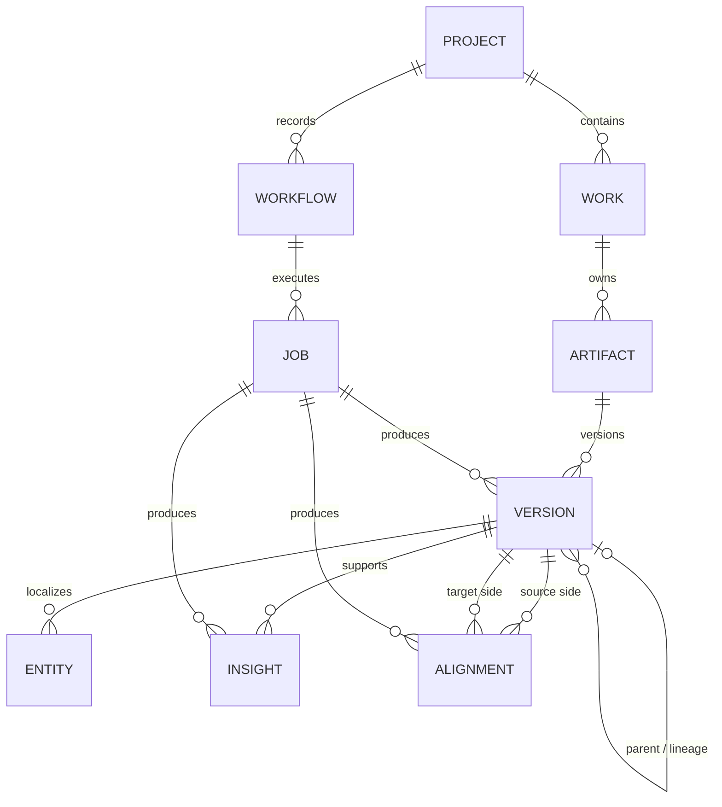
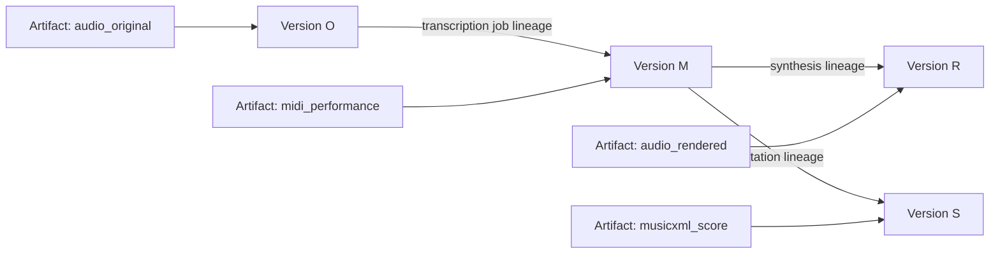
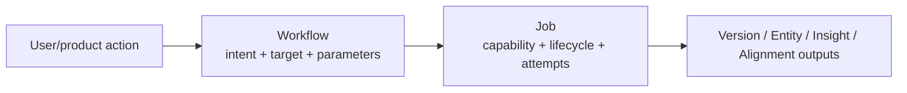

# Data model and lineage

This is the conceptual domain model implemented by current Pydantic models plus Supabase persistence. The database schema itself remains authoritative in `supabase/migrations/`.



## Project

A Project is the current top-level user-owned grouping:

```text
Project
- id
- owner_id
- name / description
- created / updated / archived timestamps
```

Ownership is a security boundary, not display metadata. Backend operations that use the service role must re-establish that the caller owns the relevant Project/Work graph.

## Work

A Work represents the persistent musical object the user opens in the Library/workspace.

```text
Project
  └─ Work
```

A Work does not store one canonical audio/MIDI/score blob. Instead, it owns typed Artifacts and immutable Versions so multiple representations and derivations can coexist.

## Artifact and Version

Artifact answers **what kind of representation is this?** Version answers **which immutable realization of it, with what lineage/provenance?**

Current Artifact kinds include original/enhanced/rendered audio, performance/corrected MIDI, MusicXML/rendered score, stems and analysis reports.



A Version currently records:

- parent Version ID and lineage list;
- private Storage bucket/key;
- optional size/hash;
- creator and producing Job;
- label + extensible metadata.

### Authority warning: ArtifactKind is not always a semantic role

`midi_corrected` currently covers multiple producer intents: an edited performance, creative variation/continuation, and notation-normalized MIDI can all use the same kind. Therefore consumers must not infer "newest corrected MIDI is canonical" from kind + recency alone. #613 owns an explicit representation-role/authority contract.

## Entity

Entity stores localized machine evidence attached to an exact Version. Current typed entity concepts include notes, chords, beats, measures, phrases, sections, cadences and motifs.

Examples:

```text
Version M
  ├─ NoteEntity pitch=64, 12.31s→12.57s
  ├─ NoteEntity pitch=67, 12.35s→12.90s
  └─ ...

Version A
  └─ ChordEntity C:maj, 12.0s→14.0s
```

An Entity should not silently migrate to a different Version because a newer representation exists. Exact Version identity is part of evidence provenance.

## Insight

Insight is a persisted claim/derived measurement linked to one Version, optional localized span, support Entity IDs, arbitrary structured evidence and provenance.

`confidence` is optional by design: deterministic execution success is not automatically epistemic confidence.

Capability maturity/exposure is **not encoded solely by the presence of an Insight row**. Product presentation is gated by `backend/config/capabilities.json` and associated policy.

## Alignment

Alignment maps between two Version/timeline domains. It can represent timeline/version/performance mapping and records source/target units plus mapping data.

The model currently defaults `confidence=1.0`; this is under truthfulness review in #640 because a default numeric certainty may not have a universal defensible meaning.

Alignment does not make all coordinates interchangeable. Score position, beats, seconds, ticks and samples are distinct timeline units; a consumer needs an explicit mapping/projection.

## Workflow and Job

Workflow and Job intentionally separate **intent** from **execution**.



### Workflow

Records:

- Project;
- workflow kind (`understand`, `correct`, `compare`, `create`, `export`);
- optional target Version;
- parameters;
- creation time.

### Job

Records:

- owning Workflow;
- Capability name/version;
- input/output Version IDs;
- lifecycle state/progress;
- retry count / max retries / lease expiry;
- cache key;
- error/error details;
- provenance and creator.

Lifecycle states are currently:

```text
queued → claimed → running → succeeded
                    ├────────→ failed
                    └────────→ cancelled
```

Retries can requeue a failed execution attempt before terminal failure.

## Immutability and mutability

### Intended immutable/history-bearing data

- Version bytes and lineage;
- produced evidence tied to an exact Version/Job;
- evaluation result artifacts;
- accepted architecture decisions/ADRs (superseded rather than rewritten invisibly).

### Mutable coordination/application state

- Work/Project display metadata;
- Job lifecycle/progress/lease/retry state;
- worker heartbeat state;
- current browser selection/playhead/cache;
- capability/deployment policy in version-controlled configuration.

This distinction matters for retry/idempotency design: immutable outputs should use attempt/fenced keys or deduplication rather than overwrite-by-convention.

## Evidence Graph relationship

The repository's V3 Evidence Graph is a conceptual/target contract, not a justification to replace this physical model with a graph database. Current Entity/Insight/Alignment + Version lineage remain the shipped persistence model until a concrete product query cannot be represented truthfully or efficiently.

Future relation/observation abstractions should therefore extend the domain deliberately instead of creating new tables merely to mirror a conceptual diagram.