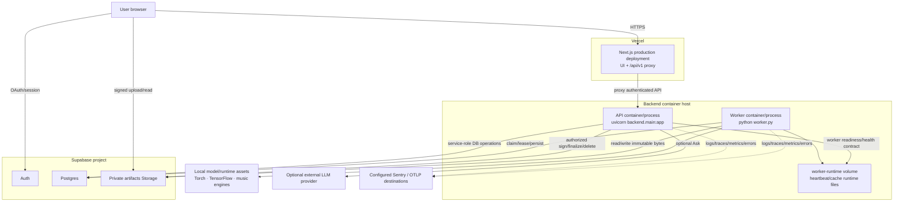

# Deployment topology

This view describes where the shipped runtime executes and which configuration layer determines effective behavior. It deliberately separates **source architecture** from **provider/runtime configuration**.



## Frontend deployment

The frontend is built as a production Next.js application and deployed on Vercel.

The deployment contains two related surfaces:

1. browser application assets/UI;
2. Next.js `/api/v1/*` proxy routes that forward authenticated product requests to the FastAPI backend.

The proxy is an ingress/topology abstraction, not a second implementation of the domain API. FastAPI/OpenAPI remains the HTTP contract authority.

The repository has historically had Vercel preview/deploy-policy constraints. Deployment configuration that determines exactly which Git SHA Vercel serves is therefore an operational authority alongside repository source. #283/#413 own making the tested-main-SHA → deployed-frontend-SHA handoff explicit rather than inferring it from branch state.

## Backend image and processes

`backend/docker-compose.yml` currently defines separate API and worker services from the same backend image/build context.

Conceptually:

```text
one backend source/image family
        ├─ API command    → Uvicorn / FastAPI
        └─ worker command → durable JobWorker
```

Sharing an image does **not** imply that API and worker are one process or one scaling/failure boundary.

They differ in:

- command/entrypoint;
- health/readiness semantics;
- long-running workload profile;
- effective engine/model requirements;
- environment configuration;
- horizontal capacity concerns.

#287 may later allow a smaller API dependency/image footprint while retaining one repository/modular monolith. A dependency/image split is not itself a reason to create network microservices between domain modules.

## API process

The API process starts `backend.main:app` under Uvicorn.

Runtime responsibilities include:

- request authentication/authorization;
- Work/Artifact/Version reads and writes;
- upload intent/finalization and signed resource operations;
- durable Workflow/Job creation;
- relation/evidence queries;
- Ask;
- health/readiness;
- HTTP telemetry.

The API should remain useful for durable reads even when no worker currently has capacity; queue/worker health is a separate readiness dimension rather than a reason for every API request to become unavailable.

## Worker process

The worker executes the durable processing queue and therefore carries the heavy music/ML runtime.

Startup includes process-local model/runtime preparation and capability registration before processing becomes ready. Job execution then uses Postgres claim/lease semantics rather than container liveness as its ownership mechanism.

Worker capacity is configurable and represented through durable heartbeat/capability state. A healthy container that cannot import/register the expected production engines is not a healthy music-processing worker.

## Shared runtime volume

Current production-shaped Compose includes a worker runtime volume used for local runtime/heartbeat/cache coordination between worker and API health behavior.

This volume is **operational state**, not the authoritative Job queue or user data. Losing it must not erase Work/Version lineage or queued Jobs; those remain in Supabase/Postgres/Storage.

A future refactor may remove or change this mechanism if durable heartbeat state becomes the sole health authority. Architecture docs should describe the contract rather than preserve the volume for historical compatibility.

## Supabase deployment boundary

Supabase is a managed external platform but contains first-class product state:

- Auth identity/session service;
- Postgres durable domain and execution graph;
- private Storage bytes.

Application source controls expected DB schema/security through version-controlled migrations, while the live provider project is the authority for what is actually deployed. Migration identity and production inspection must therefore be available when debugging source-vs-live drift.

Database and Storage recovery are separate concerns (#633).

## Environment-driven effective routing

Environment variables are runtime policy where the registry intentionally supports configurable engines/profiles.

A key example on the verified baseline:

```text
engines.registry.get_harmony_engine()
  default → music21

backend/docker-compose.yml worker environment
  HARMONY_ENGINE=lv_chordia

therefore production-shaped worker
  effective harmony engine → lv_chordia
```

This distinction generalizes:

```text
source adapter availability ≠ registry default ≠ deployment selection ≠ persisted producer provenance
```

Production debugging should prefer persisted Job/evidence provenance and explicit deployment configuration over assumptions based on a library default.

## Secrets and privilege

### Browser-visible

Only public/client-safe configuration belongs in the frontend. The browser may hold:

- Supabase public URL/anon client configuration;
- its own user session/token;
- short-lived signed Storage operations returned after authorization.

### API/worker privileged

Service-role Supabase credentials, provider secrets, Sentry admin/deploy credentials and similar privileges must remain server-side and scoped to the process that genuinely needs them.

Autonomous development containers should not receive all production/admin secrets or host Docker control by default; the least-privilege dev/agent boundary is tracked separately (#630/#631).

## Health and readiness

Deployment health has several levels:

1. **process live** — process/container has not crashed;
2. **API ready** — request-serving dependencies/configuration needed for API operation are usable;
3. **worker ready** — expected capability handlers/models can claim and execute work;
4. **queue healthy** — queued age/capable-worker state is within operating expectations;
5. **product path healthy** — production-shaped smoke completes a canonical user journey.

These are not interchangeable. A green HTTP `/health/live` does not prove Basic Pitch/Beat This/lv-chordia can execute, and a worker heartbeat does not prove the deployed frontend points at the intended backend release.

## Release identity

The desired deployment contract is exact-SHA/release based:

```text
source SHA proven by required CI
        ↓
build artifact / image associated with that source
        ↓
deploy exact artifact/release
        ↓
runtime exposes its release identity
        ↓
Production Smoke verifies the identity it exercised
```

A production smoke against an unknown or older deployment is not evidence for the just-merged change. #283 owns closing this handoff for both backend and frontend provider constraints.

## Rollback boundaries

Application rollback and durable-data rollback are different operations.

- frontend/backend release rollback can restore previously working code;
- it does not undo a destructive migration or restore deleted Storage bytes;
- migrations should therefore be designed with explicit compatibility/recovery assumptions;
- data backup/restore is a separately tested operational contract (#633).

## Evaluation deployment

Evaluation/research runs may need heavyweight models/corpora or temporary hardware not present in production. They should not silently alter production container topology merely to run a benchmark.

A candidate's deployment feasibility is part of its promotion evidence; until promoted, evaluation infrastructure remains an orthogonal execution environment rather than another production service.