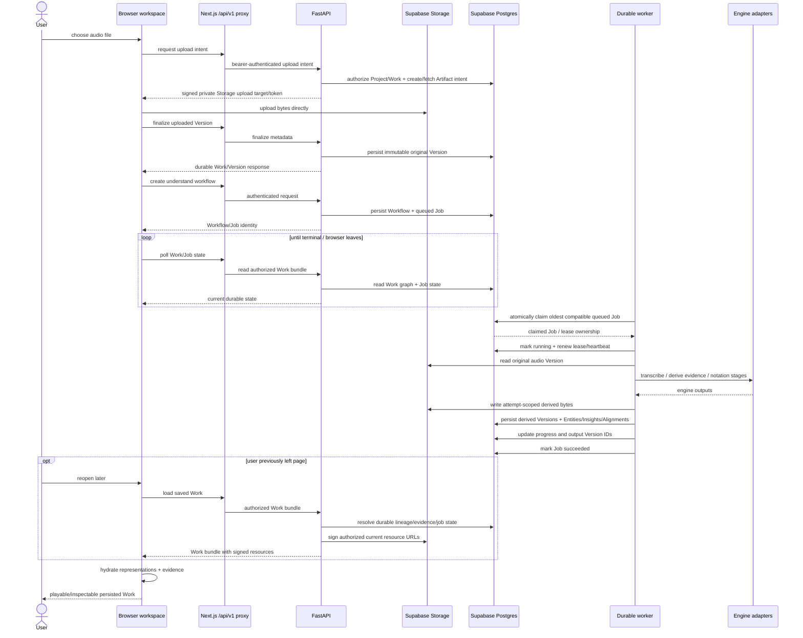

# Dynamic flow: Import → Understand → Persist → Reopen

This is the most important cross-boundary product path because it exercises browser, API, Storage, Postgres, worker, engines and later workspace hydration.



## 1. Import intent and byte transfer

The current normal path separates **authorization/metadata intent** from bulk byte transfer:

1. browser asks the backend for an upload intent;
2. backend checks the caller's Project/Work authority;
3. backend issues a short-lived signed Storage operation;
4. browser transfers the bytes directly to private Supabase Storage;
5. browser calls finalize so a durable Artifact/Version can be published in the domain graph.

A signed upload operation authorizes a specific transfer; it does not make the browser a general domain-table writer.

## 2. Durable original Version

The original recording becomes useful domain state only when the authoritative Version metadata has been persisted. Storage bytes and Postgres metadata therefore form one logical object but have different failure/recovery semantics.

A permanently uploaded but never-finalized byte object is a lifecycle/GC concern, while a Version pointing to a missing/untrusted Storage locator is an integrity concern.

## 3. Workflow creation

Understand is asynchronous by design. The API persists Workflow intent and a queued Job rather than holding the HTTP request open while transcription/analysis/notation execute.

That gives the product these properties:

- browser reload/disconnect does not destroy work;
- queue wait and execution duration can be observed separately;
- a worker can retry with durable state;
- production can recover orphaned leases;
- the UI can reveal partial durable outputs progressively.

## 4. Claim, lease and execution

The worker only runs a Job after acquiring ownership through the persisted claim/lease path. Its execution sequence checks cancellation and idempotency after ownership is established, then transitions to running.

A per-job heartbeat thread renews the lease during handler execution. The worker process also publishes process-level liveness/heartbeats.

### At-least-once implications

A worker can fail after creating external side effects but before recording terminal success. Capability persistence must therefore be retry-safe. Current worker-output Storage paths use attempt-specific semantics in important paths so retries do not overwrite prior attempt bytes.

The invariant is not "handler runs exactly once". It is:

> repeated/partially failed execution cannot silently corrupt the authoritative Work graph.

## 5. Composite understand stages

`understand` is currently composed inside the worker capability layer rather than modeled as a DAG of independently queued Jobs. Stage-level performance instrumentation exists even though the durable execution object is one composite Job.

The product should distinguish:

- time to durable original;
- queue wait;
- time to useful transcription/Piano Roll;
- time to first usable evidence;
- time to Score;
- total terminal enrichment time.

A slow optional downstream stage should not be mistaken for "nothing was usable until the whole Job ended." #482/#495 own this performance/readiness model.

## 6. Engine routing and provenance

Handlers request capability-oriented engines through `engines.registry`. Effective selection can depend on explicit parameters/profiles and deployment environment variables.

Every important persisted output should retain enough provenance to answer which engine/profile/model/version produced it. UI labels should read persisted provenance instead of hard-coding "Basic Pitch", "music21", etc.

## 7. Progressive persistence

Derived outputs are persisted during processing rather than existing only inside the browser. This makes progressive UI possible, but the frontend must be clear about what is genuinely durable/ready versus merely a running Job percentage.

Capability exposure policy controls whether evidence is product-visible; the mere fact that an evaluation-only handler produced something does not make it a trusted finding.

## 8. Reopen/hydration

When the user reopens a saved Work, the browser does not need the original processing conversation. It reconstructs state from the durable Work graph:

```text
Work
  → Artifacts
  → current/selected Versions
  → signed private resources
  → Entities / Insights / Alignments
  → active/recent Workflows + Jobs
```

This durable rehydration contract is the key reason autonomous/background processing can remain simple: the source of truth is persisted state, not an in-memory agent/browser session.

## 9. Failure classes

A useful architecture distinguishes failures by boundary:

| Failure | Durable state expectation |
|---|---|
| signed upload fails | no finalized original Version; retry upload/finalize |
| finalize fails after bytes upload | bytes may require retention/GC handling; no fake Version |
| workflow creation fails | original Work remains usable; no queued processing claim |
| worker unavailable | Job stays queued; queue/heartbeat health exposes lack of capacity |
| handler fails retryably | Job requeues with retry count/error details |
| handler exhausts retries | terminal failed Job; already durable outputs must remain lineage-safe |
| browser closes | no server cancellation implied; reopen reads durable state |
| signed resource URL expires | Version remains valid; re-sign authorized resource |

#637 owns proving the operator can observe these distinctions end-to-end.