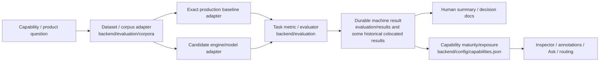

# Evaluation architecture

Evaluation is not part of the request-serving runtime, but it is part of the product's **truth architecture**: production capabilities should be explainable by reproducible evidence rather than model reputation or PR narrative.

Current main already contains the main pieces, but they are split across several repository areas.



The target tracked by #636 is that every arrow above becomes programmatically traceable and duplicated handwritten methodology/results are reduced.

## Current repository boundaries

### `backend/evaluation/`

This is the executable evaluation/research side. Current main contains, among other things:

- task metrics/evaluators such as beat, chord, notation and analysis metrics;
- shared benchmark scaffolding;
- corpus adapters under `backend/evaluation/corpora/`;
- Analysis V3 and other research subtrees;
- tests/fixtures and some historical result JSON colocated with evaluator code.

The directory is intentionally allowed to import production adapters so the shipped path can be measured exactly.

Production request/worker code should not depend back on evaluation modules.

### `evaluation/results/`

This is the intended durable evidence/output side: machine-readable result artifacts that can survive beyond the branch/workflow that produced them.

### `evaluation/platform_queue/`

This holds platform/execution queue artifacts for research runs. Platform-specific wrappers should not become permanent architecture when durable result evidence is enough.

### Capability registry

`backend/config/capabilities.json` converts evaluation evidence into current product maturity/exposure policy. It currently contains some dataset/metric/value snippets directly; #636 owns making those references point to durable result IDs/manifests rather than growing into a parallel evaluation notebook.

## Baseline rule

A benchmark must compare against the **actual production code path** whenever the decision is about replacing or improving production.

Bad pattern:

```text
"baseline" = simplified reimplementation that happens to use the same library
```

Required pattern:

```text
baseline = import/call the exact production seam
          + exact preprocessing/configuration
          + persisted provenance of repo SHA/runtime/model identity
```

This matters because small preprocessing differences can dominate MIR results. Beat evaluation work has already had to correct this kind of ambiguity.

## Dataset rule

A result is not meaningful without the corpus/split/license context.

A canonical dataset manifest should eventually answer:

- exact dataset/version/source;
- task labels actually available;
- split/sample IDs;
- train/test leakage concerns;
- audio/annotation/code license separately where relevant;
- automatic vs manual acquisition;
- checksum/version identity;
- known style/domain coverage and bias.

The repository should not claim broad generalization from a narrow in-domain or training-overlap corpus.

## Metric rule

Metrics must be task-specific and configured explicitly.

Examples of distinct questions that should not be collapsed:

- beat F-measure vs tempo error vs downbeat/meter quality;
- transcription onset F1 vs onset+offset F1 vs spurious/missed notes;
- notation parse validity vs event preservation vs quantization movement/readability;
- separation SI-SDR vs downstream beat/transcription utility;
- retrieval R@K/MRR vs semantic factual accuracy.

A metric implementation/version/tolerance belongs in the result provenance, not only in prose.

## Result artifact

The target durable result schema in #636 includes at minimum:

```text
run schema/version
exact git SHA
engine/model/checkpoint identity
runtime/hardware
preprocessing/config
Dataset + split IDs
metric definitions
per-example outcomes
aggregate metrics
failures/exclusions
license/provenance pointers
supersedes / superseded-by lineage
```

This is deliberately richer than a single aggregate number.

## Decision / promotion

A successful benchmark does not automatically switch production routing.

A candidate decision should distinguish states such as:

- `production` / adopted;
- `experimental`;
- `evaluation_only`;
- `withheld`;
- rejected/revisit/research.

Promotion should consider four independent gates:

1. **quality** — task metric and failure distribution;
2. **domain validity** — where the evidence was actually tested;
3. **operational fit** — latency, memory, image/model size, hardware/container support;
4. **license/deployment** — code, model weights and dataset restrictions.

Downstream product value can be a fifth gate where an upstream metric improvement may not matter to users (for example source separation that does not improve beat/transcription evidence).

## Product invariant

A future agent may not claim "model X is better" as sufficient production evidence.

For a registered task, the minimum decision statement is conceptually:

```text
candidate X@checkpoint
vs production baseline Y@SHA
on dataset/split D
using metric/config M
produced result R
with these per-domain failures and operational constraints
therefore decision = ...
```

## Heavy evaluation vs PR CI

Heavy corpus/model evaluation should generally be manual/scheduled and durable, not executed on every PR.

PR CI instead validates:

- evaluator schema/code correctness;
- deterministic metric edge cases;
- smoke fixtures;
- result-manifest validity;
- capability policy references point to existing valid evidence.

When a production algorithm/routing change depends on a heavyweight benchmark, the PR must reference the already-produced exact result artifact.

## Current architecture debt

The map intentionally exposes several transitional states:

- result JSON exists both under top-level `evaluation/results/` and historically beside evaluator code;
- result schemas are not yet one consistent family;
- capability metadata copies some methodology/numbers directly;
- historical branch-pinned evaluation workflows remain on main and are tracked for retirement/generalization (#557);
- evaluation-only dependencies are not yet a separate locked install intent (#287);
- not every current production/experimental capability is traceable through a single durable result ID without PR/doc archaeology.

These are the concrete cleanup targets for #636, not reasons to create another benchmark framework.