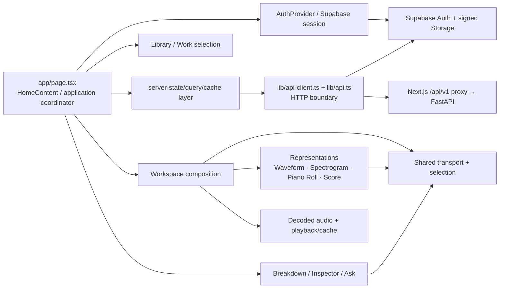

# Frontend components

The frontend is a persistent-work workspace rather than a collection of independent pages. This view names the main responsibilities without pretending current source ownership is cleaner than it is.



## Root application coordinator

`app/page.tsx` currently owns more than page rendering. Its responsibilities include substantial application orchestration such as:

- loading/reopening saved Works;
- race cancellation and selection recovery;
- observing processing Jobs and reconnecting after reload;
- upload validation and starting processing;
- assembling available representations from persisted Versions;
- transport/timeline updates;
- operation/error state and product actions.

That makes the page a high-contention coordinator for parallel changes. #417 owns incremental extraction of **durable Work hydration** and then **processing-job lifecycle** into tested application hooks/services while preserving visible behavior.

The target is not "every hook in its own file". A new seam is justified when it gives one durable responsibility an independent state machine/test boundary.

## Auth/session

The browser talks directly to Supabase for authentication/session operations. The bearer token is then used for backend domain API calls.

Direct Supabase domain-table mutation is not the desired application architecture. Domain changes are routed through FastAPI; signed Storage transfer is the intentional direct byte path after backend authorization.

## HTTP/API boundary

`lib/api.ts` is the authenticated request wrapper and `lib/api-client.ts` provides higher-level product calls and application-domain normalization.

`lib/api-types.ts` is generated from FastAPI OpenAPI. The generated schema owns the **wire contract**, but current handwritten application types may be stricter than generated reusable Pydantic schemas. #285 owns moving high-risk client methods toward generated operation types plus an explicit validated normalization seam rather than either:

- duplicating the wire schema by hand; or
- weakening the entire frontend by blindly accepting generated optionality.

Next.js proxy routes under `app/api/v1/` are transport plumbing; they are not a second domain API implementation.

## Server state and caches

The application maintains caches around immutable/durable resources to make saved-Work revisits cheaper. Current code includes caching for decoded audio and other server-derived state; performance work (#482) explicitly distinguishes cold open, warm A→B→A revisit and signed-URL rotation.

The architectural distinction is:

- **server truth**: Work/Version/Job/evidence graph from the backend;
- **browser cache**: replaceable optimization keyed by stable immutable identity where possible;
- **interaction state**: current selected Work/representation/span/playhead/source.

A cache miss must not change musical truth or ownership semantics.

## Library / Work selection

The Library is the persistent entry into saved Works. Selecting a Work hydrates durable server state and resolves the latest relevant Versions for available representations.

Representation authority must not be inferred solely by "newest ArtifactKind" when one kind conflates different semantic roles. #613 tracks this specifically for `midi_corrected`, which can currently mean correction, creative take or notation-normalized MIDI depending on provenance.

## Workspace composition

The workspace combines representations and evidence around one shared musical-time/selection contract. Representation choice and listening source are intentionally distinct:

- the user may view Score while listening to Original;
- the user may view Piano Roll while listening to transcription/rendered output;
- selection/playhead should remain synchronized where an explicit alignment/projection exists.

A representation should never silently switch its authoritative Version because a newer unrelated derived take exists.

## Transport / selection

Transport is cross-cutting UI state, not server truth. It coordinates:

- current playback position;
- play/pause/seek;
- active audio source;
- selected seconds/beat/measure range where available;
- representation highlighting/follow.

The application should preserve the same current position across compatible source/representation changes instead of treating every view switch as a new piece of music.

## Representation renderers

### Waveform / audio

Waveform is a direct time-domain view of an audio Version and shares browser playback time.

### Spectrogram

Spectrogram is a derived visual representation. Its FFT/render cache is an optimization and should be keyed by immutable source identity rather than signed URL strings where possible.

### Piano Roll

Piano Roll visualizes canonical note-event evidence for an exact MIDI Version. It should not be cosmetically quantized to match Score if that would hide performance/transcription errors.

### Score

Score consumes MusicXML/notation-domain artifacts and is rendered with OpenSheetMusicDisplay. It is a derived interpretation with notation timing, not guaranteed ground truth for expressive performance timing.

## Breakdown / Inspector

Inspector presentation consumes persisted capability-gated evidence and composes a compact set of useful localized findings. Ranking/presentation may decide what to show first but must not upgrade evidence maturity or manufacture truth.

Current product direction increasingly favors:

```text
localized evidence
  → relation/context
  → grounded finding
  → hear / focus / inspect / compare
```

rather than a fixed dashboard of every detector output.

## Ask

Ask is downstream of the evidence boundary. It may use configured LLM infrastructure to explain or compose grounded information, but precise musical facts remain owned by evaluated evidence/capability contracts. Provider failure should degrade Ask, not rewrite or invalidate persisted evidence.

## Styling boundary

Root layout currently imports a stack of historical/versioned global stylesheets. #523 owns collapsing those into stable responsibility layers with visual-regression proof.

Until that lands, import order is part of current rendering behavior and should not be casually rearranged in unrelated product PRs.