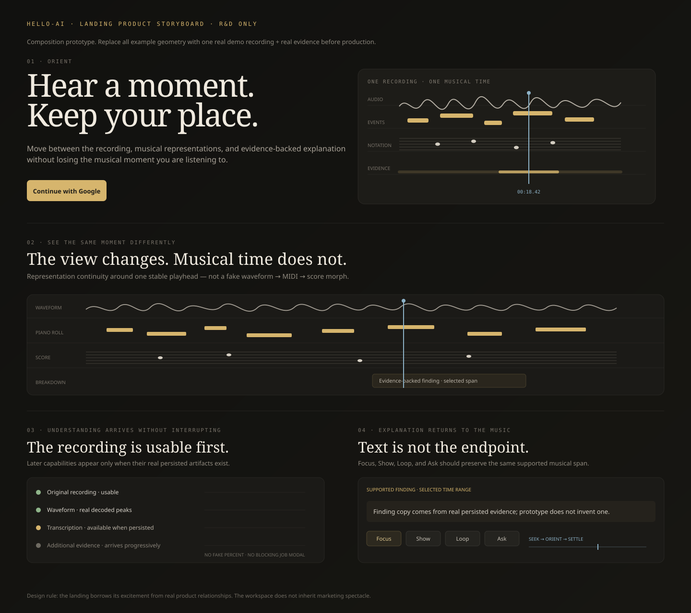

# Visual / Interaction R&D Source of Truth

> **Status:** active, revisable R&D for PR #405. Keep #405 draft; it is not a production merge lane.

## Thesis

Make hello-ai feel unusually considered and contemporary **without maximizing visual effects**.

> **Shared musical time, representation continuity, and evidence-linked interaction are the product identity.**

The signed-out edge may be expressive. The signed-in workspace remains a calm creative instrument.

A visual treatment earns its place only when it explains the product, communicates real state, improves manipulation/orientation, establishes identity without competing with music, or reduces uncertainty.

## Shipped design ledger

| Area | Status | Production work |
|---|---|---|
| Baseline craft / legibility | **SHIPPED** | #446 |
| Actionable Breakdown | **SHIPPED** | #439 |
| Evidence-grounded Ask starters | **SHIPPED** | #448 |
| Multi-evidence provenance | **SHIPPED** | #449 |
| Focus / Show destination orientation | **SHIPPED** | #450 |
| Truthful waveform decode continuity | **SHIPPED** | #464 |
| Progressive evidence arrival | **SHIPPED** | #463 |
| Shared Transport tooltip craft | **SHIPPED** | #479 |

Historical design lanes #401, #433, #437, #438, #440, and #478 stay closed/superseded.

## Product grammar

1. **One recording becomes the object.** Import places a durable recording into the workspace; it is not a theatrical job submission.
2. **Everything refers to the same musical time.** Waveform, notes, score where alignment supports it, selection, loop, Breakdown, Ask, and playback should preserve orientation.
3. **Representations are related, not equivalent.** Never imply `waveform == MIDI == score`; preserve uncertainty, information loss, and timing-domain differences.
4. **Explanation returns to evidence and action.** Useful findings lead to Focus, Show, Loop, Ask, and later Compare only when capability truth supports it.
5. **Idle is quiet; real state changes are clear.** Signed-in motion should communicate state or orientation rather than decorate chrome.

## Expression budget

| Surface | Ambient | State-linked |
|---|---:|---:|
| Hero | 7 | 2 |
| Import / first-use | 1 | 5 |
| Processing | 1 | 5 |
| Workspace idle | 1 | 1 |
| Workspace interaction | 1 | 4 |
| Breakdown jump | 0 | 4 |
| Playback | 0 | 3 |

## Active production design lane

### #489 — product-native empty workspace

Replace generic staff + `♪ / ♫` decoration with a **static neutral shared-time scaffold**.

The empty canvas may show capability lanes such as `Audio / Notes / Notation / Evidence` aligned to one coordinate, but it must not invent:

- waveform peaks;
- note events;
- findings or confidence;
- processing percentage;
- section labels;
- active playback or selection state.

Semantic color stays quiet until real state exists. No ambient animation.

## Current visual hypotheses

### Full landing product storyboard

Preferred signed-out story:

**Hear a moment → see the same moment differently → understanding arrives without interrupting → explanation returns to the music.**

Production must replace illustrative geometry with one known recording and real decoded/derived evidence.

### Shared Time / Evidence Ribbon — **PROTOTYPE NEXT**

Concept:

**one musical moment → multiple representations → one shared time → one evidence-backed explanation**

The stable object is musical time / supported span, not a literal waveform→MIDI→score morph.

Hard test: remove logo and marketing copy. The visual should still plausibly read as recorded music, multiple musical representations, shared time, and grounded understanding.

### Signal Landscape — **SECONDARY TEXTURE ONLY**

Keep possible topology, negative space, graphite restraint, and one-object composition. Do not treat it as identity: without copy it still reads as generic premium data visualization.

### Brand / favicon — **UNRESOLVED**

Do not force a replacement. A future mark must work at 16×16 monochrome, avoid waveform/note/sparkle clichés, and be materially better than the current production mark.

Interaction identity remains higher priority.

## Interaction contracts

### Upload → waveform

Truthful sequence:

`file → durable Work → neutral decode frame → real waveform → later evidence`

Never add fake peaks or fabricated decode percentage.

### Processing

Post-durability processing stays non-blocking. New capabilities appear only when real artifacts/evidence exist and never steal the user's active representation or playback source.

### Evidence orientation

1. select/seek the supported span;
2. Focus preserves representation/source;
3. Show may explicitly switch representation while preserving time/source/selection;
4. briefly emphasize the real destination;
5. settle back to quiet.

### Color semantics

- **blue** = current playback/time relationships;
- **brass** = identity, evidence, selection emphasis;
- **neutral graphite/white** = unavailable/empty structural scaffolding.

Do not use blue/brass to imply state that does not exist.

## Reference roles

Product precedents:

- **Sonic Visualiser** — aligned analytical layers on one time axis;
- **Hooktheory TheoryTab** — explanation synchronized with playback/evidence;
- **Moises** — analysis becomes immediate musical action;
- **Ableton Arrangement View** — stable time orientation and music as a continuous object.

Construction references only:

- selected **21st.dev** components for SVG/motion construction;
- **Motion Primitives** for specific interaction primitives;
- **Mobbin** for shipped-product hierarchy and interaction patterns.

Do not turn reference research into component shopping.

## Anti-slop gate

Reject by default:

- generic aurora / AI blobs;
- neural/particle fields;
- glass stacks;
- border-beam everything;
- magnetic buttons;
- core-copy typewriter/scramble;
- marquees;
- primary dock navigation;
- persistent parallax / cursor spotlights;
- heavy 3D galleries;
- forced smooth scrolling;
- autoplay media;
- multiple ambient animations in one viewport;
- visual claims stronger than the evidence available.

### One-effect rule

A composition should normally have **one dominant visual idea**, supported by typography, spacing, and meaningful state feedback.

## Motion / craft contract

- one moving focal region at a time;
- user-triggered motion beats ambient motion;
- signed-in motion normally communicates state/orientation;
- ordinary control motion ~100–180ms;
- no animation is required to discover a control;
- reduced-motion stays fully understandable;
- mobile may remove decorative motion;
- do not add Motion/GSAP/Three for effects CSS/SVG can already express well.

Preserve the #446 baseline: editor-scale typography, compact but readable geometry, ~44px mobile action targets, warm graphite workspace, paper score surface, minimal card count, and music as the largest object.

## Next order of work

1. Finish and merge **#489** on exact-head + visual evidence.
2. Audit ambiguous icon-only and terse mode-help interactions; do **not** blanket-add tooltips to visible-text controls.
3. Refine the **landing product storyboard**, not another hero-only effect.
4. Build a real-data Shared Time prototype only when one canonical demo excerpt can truthfully support every visible layer.
5. Keep logo/favicon unchanged while interaction identity matures.
6. Keep CSS-layer consolidation as a separate refactor with regression evidence.

For every major recommendation use **KEEP / MODIFY / REPLACE / DELETE / PROTOTYPE / BUILD / SHIPPED** and update this file after material decisions so the repository does not accumulate parallel design truths.
