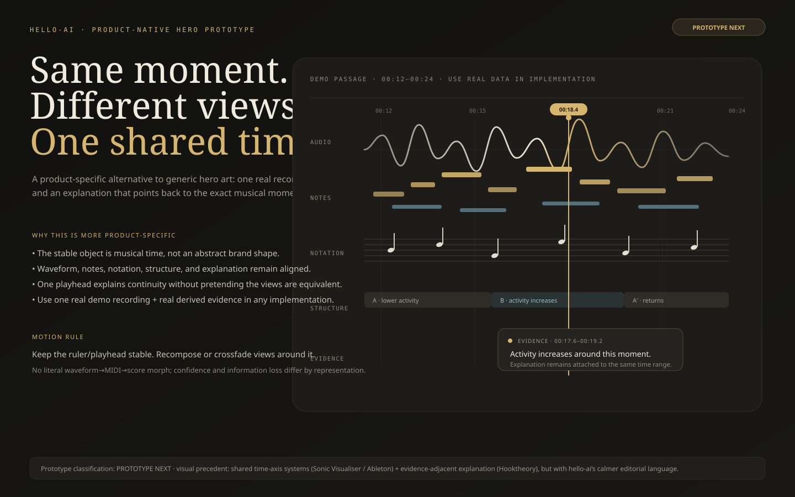

# Current Visual / Interaction R&D Source of Truth

> **Status:** active, revisable R&D for PR #405. Keep #405 draft; it is not a production UI lane.
>
> This file is the current consolidated design source for visual enhancement, interaction identity, references, guardrails, and unresolved hypotheses. Older #405 experiments and closed design-spec PRs are historical evidence, not parallel sources of truth.

## 1. Objective

Make hello-ai feel unusually considered, contemporary, and memorable **without maximizing visual effects** or drifting into generic AI/startup chrome.

The current thesis is:

> **Make shared musical time, representation continuity, and evidence-linked interaction the visual identity of hello-ai.**

The signed-out edge may be art-directed. The signed-in workspace remains a calm, precise creative instrument.

A visual treatment earns its place when it does at least one of these:

1. explains the product faster;
2. communicates real state;
3. improves manipulation or orientation;
4. makes relationships between representations clearer;
5. establishes memorable identity without competing with the recording;
6. reduces uncertainty while processing.

If it only looks impressive in a component gallery, it is not enough.

## 2. Implementation ledger

These ideas are **already shipped** and must no longer be treated as speculative design.

| Area | Status | Production work |
|---|---|---|
| Baseline craft / legibility | **SHIPPED** | #446 |
| Actionable Breakdown | **SHIPPED** | #439 |
| Evidence-grounded Ask starters | **SHIPPED** | #448 |
| Multi-evidence Breakdown provenance | **SHIPPED** | #449 |
| Focus / Show destination orientation | **SHIPPED** | #450 |
| Truthful waveform decode continuity | **SHIPPED** | #464 |
| Progressive evidence arrival after source durability | **SHIPPED** | #463 |

### What that means in the product

- a durable uploaded recording can become the usable Work before understanding finishes;
- source audio remains available while persisted representations/evidence arrive;
- later Piano Roll / Score / Breakdown availability does not steal the current representation or playback source;
- a new source never shows the previous recording's waveform peaks while decoding;
- real waveform peaks appear only after that exact source decodes;
- Breakdown Focus / Show preserve the real shared selection and use a short orientation cue;
- Ask entry points are capability/evidence-gated rather than generic AI affordances.

### Superseded design lanes

These PRs should remain closed/historical:

- #401 — replayed and shipped through #446;
- #433 — evidence-orientation prototype, shipped through #450;
- #437 — progressive-evidence design spec, shipped through #463;
- #438 — upload/waveform continuity spec, truth-critical behavior shipped through #464 + #463;
- #440 — hero comparison experiment absorbed into this SOT.

Do not reopen them as competing design lanes.

## 3. Current product-specific visual grammar

The product should increasingly communicate five invariants.

### 3.1 One recording becomes the object

Import should feel like placing a recording into the workspace, not submitting a job and waiting for a new app state.

Stable anchors:

- Work title / filename;
- Library row;
- Canvas region;
- Original playback source;
- real waveform once decoded.

### 3.2 Everything refers to the same musical time

Waveform, Piano Roll, Score where alignment supports it, selection, loop, Breakdown findings, Ask citations, and playback should feel related through one temporal model.

This is a stronger product identity than an abstract marketing motif.

### 3.3 Representations are related but not equivalent

Do not visually imply:

`waveform == MIDI == score`

Different representations have different confidence, information loss, and timing domains.

The stable object is **musical time / selected span**, not a literal shape morph.

When switching representations:

- preserve the playhead when supported;
- preserve the selected musical span;
- preserve playback source unless the user changes it;
- recompose/crossfade the view rather than pretending one representation transforms losslessly into another.

### 3.4 Explanation points back to evidence and action

A finding should not end as a text card.

Useful actions include:

- Focus;
- Show;
- Loop;
- Ask;
- later Compare only when capability truth supports it.

The visual response should make the target evidence obvious and then become quiet again.

### 3.5 Quiet idle state, clear state-linked response

Avoid interpreting “calm workspace” as “visually inert workspace.”

| Surface | Ambient expression | State-linked expression |
|---|---:|---:|
| Hero | 7–8 | 2 |
| Import | 1 | 5 |
| Processing | 1 | 5 |
| Workspace idle | 1 | 1 |
| Workspace interaction | 1 | 4 |
| Breakdown jump | 0 | 4 |
| Playback | 0 | 3 |

The workspace stays quiet until something meaningful happens, then responds clearly.

## 4. Current R&D hypotheses

### 4.1 Shared Time / Evidence Ribbon — **PROTOTYPE NEXT**

Visual artifact:

Conceptual payload:

> **one musical moment → multiple representations → one shared time → one explanation grounded in evidence**

This is the strongest current landing/system hypothesis because it remains product-specific without becoming a miniature dashboard.

Production requirements:

- use one real known demo recording;
- use real decoded waveform evidence;
- use real detected events / transcription only when available;
- use notation only where the demo's supported alignment is honest;
- use a real evidence-backed finding;
- preserve uncertainty/provenance rather than inventing polished labels.

Hard specificity test:

> If the logo and copy were removed, would a viewer plausibly infer recorded music, multiple musical representations, shared musical time, and evidence-backed understanding?

If not, modify or replace the direction.

### 4.2 Signal Landscape — **SECONDARY PROTOTYPE / TEXTURE**

Visual artifact:

Keep:

- topographic layering;
- warm graphite / restrained brass;
- negative space;
- low-gloss rendering;
- one-object composition.

Do not treat the abstract landscape as the product identity. Without copy it can still plausibly belong to generic AI, data, climate, finance, or analytics products.

Potential future use:

- quiet landing texture;
- data-derived secondary visualization grammar;
- sparse section transition;
- never a persistent animated workspace background.

Current implementation is intentionally reduced from the earlier experiment: fewer layers, group-level drift, short trace reveal, static evidence points.

### 4.3 Brand / favicon — **UNRESOLVED**

Visual artifact:

Do not force a replacement.

Rejected / sketch-only directions:

- Contour Fold — still compresses toward generic waveform/squiggle;
- Playhead Notch — generic media/control iconography;
- Continuous → Discrete — conceptually interesting but poor favicon compression target.

A future mark must:

1. work at 16×16 in pure monochrome;
2. have a recognizable silhouette without internal micro-detail;
3. not read primarily as waveform, equalizer, music note, or AI sparkle;
4. not depend on gradients or animation;
5. fit both expressive landing and restrained app chrome;
6. be materially better than leaving the current production mark alone.

Interaction identity is higher priority than logo redesign.

## 5. Current active implementation lane

### #479 — shared Transport tooltip craft

Status: active production-design PR.

Goal:

- replace browser-native Transport `title` bubbles with one consistent shared tooltip primitive;
- show supplementary help on pointer hover and keyboard focus;
- preserve accessible names and use `aria-describedby`;
- keep motion short/reduced-motion-safe;
- add no UI library and no new global CSS layer;
- do not change playback or transport semantics.

This is the kind of modernization to prefer: a small reusable primitive that improves clarity and craft without making the workspace louder.

## 6. Interaction details worth preserving

### Upload → waveform

Current truth model:

`file → durable Work → neutral decode frame → real waveform → later evidence`

Do not add:

- fake waveform bars;
- fabricated percent complete;
- particle/morph theater;
- silent source switching after transcription arrives.

Any additional polish must preserve the already-shipped truth boundary.

### Processing / evidence arrival

State transitions come from the pipeline, not from an animation storyboard.

Useful states may include:

- recording saved;
- source usable;
- transcription available;
- notation available;
- Breakdown evidence available;
- recovery needed.

Animation may clarify a real transition. Never invent a transition to accommodate an animation.

### Evidence-linked orientation

Target behavior remains:

1. action selects/seeks the supported musical span;
2. Show may explicitly switch representation;
3. destination becomes visible;
4. brief emphasis establishes orientation;
5. emphasis ends.

Avoid persistent glow or “AI highlighting.”

### Shared time

Blue remains appropriate for current playback/time relationships.
Brass remains appropriate for identity, evidence, and selection emphasis.

Do not force exact score/performance-time equivalence where mapping is approximate.

## 7. Landing direction

The landing body matters more than another isolated hero effect.

Preferred editorial story:

1. **Bring in a recording.**
2. **See the same moment differently.**
3. **Understand what changed.**
4. **Act on / ask about the evidence.**

Prefer 2–4 large editorial product moments using real product behavior over a generic 8-card feature bento.

The landing should explain the actual product model, not create a separate marketing metaphor that disappears after sign-in.

A merely very-good landing page + unusually excellent signed-in interactions beats an extraordinary hero attached to a normal-feeling app.

## 8. Reference matrix

References are construction material, not aesthetic authority. `DESIGN.md` remains authoritative.

### Product-domain precedents

| Reference | Borrow | Do not borrow |
|---|---|---|
| Sonic Visualiser | analytical layers aligned to one time axis; one object through multiple lenses | dense legacy desktop styling |
| Hooktheory TheoryTab | explanation synchronized with musical playback/evidence | universal tonal/theory assumptions |
| Moises | analysis becomes immediate musical action (selection/looping/etc.) | consumer-app aesthetic wholesale |
| Ableton Arrangement View | stable time orientation; music as continuous manipulable object | DAW complexity / chrome |

### Visual / implementation precedents

| Reference | Role | Borrow | Avoid |
|---|---|---|---|
| 21st.dev / Kokonut Background Paths | implementation reference | SVG path construction, masking, easing, layering | stock gradient-startup identity |
| 21st.dev / Entropy | motion reference | organic order→structure feeling | permanent busy full-screen effect |
| Halide Topo | aesthetic reference | topology, grain, technical depth | persistent parallax / 3D theater |
| Liquid Metal Hero | composition reference | one focal object + negative space | literal shader identity |
| Motion Primitives | primitive pool | selected high-quality state/microinteraction patterns | applying motion everywhere |
| Magic UI / similar OSS pools | prototype pool | specific component only when materially better | assembling a template from trendy parts |
| Mobbin | shipped-product pattern reference | hierarchy / interaction precedents | visual cloning |

### OSS rule

Do not add a component simply because it looks good in a gallery.

A third-party component enters production only when:

1. it solves a concrete product interaction better than the local implementation;
2. its source/upstream license is verified;
3. its visual language can be normalized to local tokens;
4. accessibility/mobile/reduced-motion behavior meets product requirements;
5. it does not pull a large dependency for a trivial effect.

## 9. Anti-slop gate

Reject by default unless a concrete product need overturns the decision:

- generic aurora / AI blobs;
- neural-network / particle backgrounds;
- glass-card stacks;
- border beams / shiny borders everywhere;
- magnetic buttons;
- typewriter/text scramble for core copy;
- marquee content;
- primary dock navigation;
- persistent cursor-follow spotlight;
- persistent parallax;
- heavy 3D galleries;
- forced smooth scrolling / scroll hijacking;
- autoplay media;
- multiple ambient animations in one viewport;
- visual claims that imply evidence the system does not actually have.

### One-effect rule

Do not stack shader + blur + glass + border beam + cursor spotlight + floating animation.

A polished composition should normally have **one dominant visual idea**, supported by typography, spacing, and meaningful state feedback.

## 10. Motion contract

- one moving focal region at a time;
- user-triggered motion beats ambient motion;
- signed-in motion should usually communicate state or orientation;
- entrance motion is one-shot;
- ordinary control motion should generally stay around 100–180ms;
- no animation is necessary to discover a control;
- reduced-motion must remain fully understandable;
- mobile may remove decorative motion rather than preserve desktop spectacle;
- continuous animation must justify continuous CPU usage.

## 11. Baseline craft contract

Preserve the merged #446 direction:

- controls/body roughly editor-scale rather than sub-10px generated UI;
- metadata generally 11–12px where practical;
- mobile action targets around 44px where applicable;
- compact geometry without cramped labels;
- warm graphite workspace;
- paper-like score surface;
- restrained brass identity;
- blue reserved for time/playback relationships where useful;
- minimal card count;
- music representation remains the largest object.

## 12. Next design work

Current order:

1. **Finish #479** and verify desktop/mobile/focus/reduced-motion behavior.
2. Audit remaining native-title / microinteraction inconsistencies; migrate only high-value cases.
3. Audit the **landing body** against the product-native four-part story.
4. Prototype Shared Time with one real demo excerpt and real evidence.
5. Keep logo/favicon unchanged while interaction identity matures.
6. Treat CSS-layer consolidation as a separate refactor with regression evidence, not a visual-polish patch.

## 13. Review protocol

For every major recommendation classify it as:

**KEEP / MODIFY / REPLACE / DELETE / PROTOTYPE / BUILD / SHIPPED**

For anything marked REPLACE or PROTOTYPE, provide a specific precedent, OSS implementation reference, or concrete artifact rather than prose-only taste commentary.

Challenge specifically:

1. Is Shared Time genuinely product-specific or still too diagrammatic?
2. Does the persistent time ruler feel musical and editorial rather than DAW-like?
3. What remaining signed-in interaction feels generic or under-crafted?
4. Which visual effect in this document is still hype and should be removed?
5. Can landing → workspace continuity improve without importing marketing motion into the editor?
6. Is there a specific OSS primitive materially better than our current implementation for a concrete interaction?
7. Is any proposed visual treatment making stronger evidence claims than the product can support?

Update #405 / this file after a material decision so the repo does not accumulate competing design documents.

## 14. Change log

- Initial #405 mini-workspace hero: **REJECTED** as literal/generic.
- Initial waveform/staff favicon revision: **REVERTED / REJECTED**.
- Signal Landscape: **DEMOTED** from leading identity to secondary prototype/texture.
- Shared Time / Evidence Ribbon: **PROMOTED** to next product-native visual hypothesis.
- Progressive evidence arrival: **SHIPPED #463**.
- Truthful waveform decode continuity: **SHIPPED #464**.
- Evidence destination orientation: **SHIPPED #450**.
- Baseline craft: **SHIPPED #446**.
- Current implementation lane: **#479 Transport tooltip craft**.
