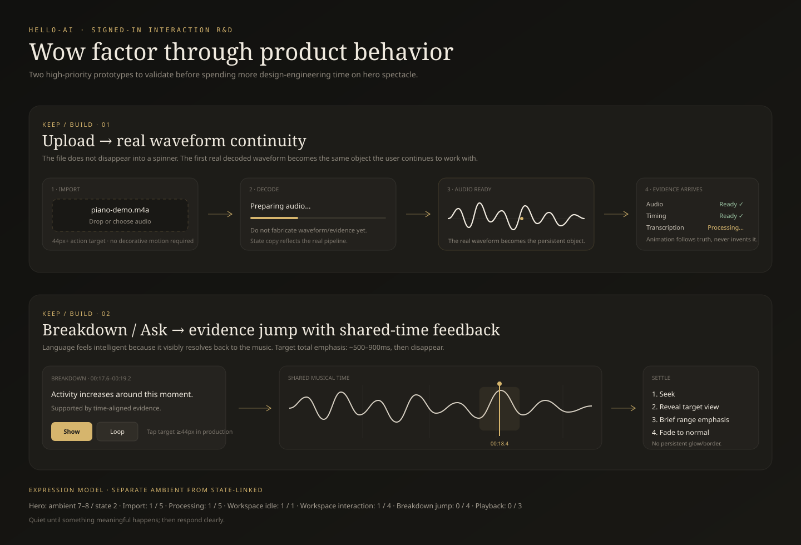

# Current Visual Enhancement / Identity R&D Source of Truth

> **Status:** active, revisable R&D for PR #405. **NEEDS WORK — keep the PR draft.**
>
> This document is the current consolidated source for visual enhancement proposals, references, classifications, guardrails, and review questions. It is intentionally revisable; future review may overturn any current hypothesis.
>
> #405 is now a genuine R&D/SOT PR: production landing wiring has been removed. Merging this branch must not silently ship an unapproved hero hypothesis.

## 0. Objective

Make hello-ai feel unusually considered, contemporary, and memorable **without maximizing visual effects** or drifting into generic AI/startup chrome.

Core thesis:

> **Make music, state, causality, and manipulation visually interesting. Do not add visual effects merely because they are fashionable.**

The signed-out experience may be expressive. The signed-in workspace should remain calm, precise, and strongly responsive to meaningful state changes.

## 1. Priority order

The most valuable visual work is currently inside the product, not the hero.

Prioritize:

1. **Upload → real waveform continuity**
2. **Truthful processing / evidence arriving**
3. **Shared-playhead coherence across representations**
4. **Breakdown / Ask → evidence-linked jumps**
5. **Representation continuity around stable musical time**
6. **Editorial landing story using real product behavior**
7. **Hero / brand R&D**

A merely very-good landing page plus unusually excellent signed-in interaction is preferable to an extraordinary hero attached to a normal-feeling application.

## 2. Major proposal classifications

| Proposal | Classification | Current decision |
|---|---|---|
| Signal Landscape | **PROTOTYPE / MODIFY** | Demote from leading production candidate. Keep topology/palette/negative space; consider secondary texture or future data-derived grammar. |
| Shared Time / Evidence Ribbon | **PROTOTYPE NEXT** | Strongest current product-native hero/visual-system hypothesis. |
| Upload → real waveform continuity | **KEEP / BUILD** | Highest-priority signed-in design-engineering prototype. |
| Processing as evidence arriving | **KEEP / BUILD** | Must be driven by real pipeline state before animation. |
| Shared-playhead coherence | **KEEP / BUILD** | Elevate to a core visual identity principle. |
| Breakdown / Ask evidence jumps | **KEEP / BUILD** | Seek → reveal → brief emphasis → settle. |
| Literal waveform → MIDI → score morph | **MODIFY / PROTOTYPE** | Replace with representation continuity around stable musical time. |
| Editorial landing body | **KEEP / BUILD** | Use real product behavior rather than generic feature-card bento. |
| Expression-decay model | **MODIFY** | Separate ambient expression from state-linked expression. |
| Background Paths | **REFERENCE ONLY** | Borrow construction/easing/layering, not identity. |
| Signal Landscape animation | **MODIFY** | Reduce continuous work; current prototype now uses group drift + one-shot trace rather than 18 independent loops. |
| Mobile craft | **MODIFY** | Inherit #401’s scale; 44px+ mobile targets, ~11–12px metadata floor where practical. |
| Brand / favicon | **KEEP UNRESOLVED** | Leave current production mark alone. |
| Hero copy | **MODIFY** | Emphasize same moment + multiple views + evidence, not output-format inventory. |
| Production landing integration | **DELETE FOR NOW** | Removed from #405. Prototype first; production wiring belongs in a later evidence-backed implementation PR. |

## 3. Visual evidence

### 3.1 Current hero-direction board

This board now treats **Shared Time / Evidence Ribbon** as the next prototype and **Signal Landscape** as a secondary / modified hypothesis.

### 3.2 Shared Time / Evidence Ribbon prototype

Conceptual payload:

> **one musical moment → multiple representations → one shared time → one explanation grounded in evidence**

The dominant invariant is the x-axis of musical time. Waveform, notes, notation, structure, and explanation align around one playhead.

The implementation must use one real demo recording and real derived evidence. The static board is illustrative only.

### 3.3 Signed-in interaction prototypes

The board covers:

- upload → real waveform continuity;
- truthful evidence-arriving states;
- Breakdown/Ask → evidence jump;
- shared-playhead feedback;
- the ambient-vs-state-linked expression model.

### 3.4 Signal Landscape secondary prototype

Signal Landscape remains useful as a study in topology, negative space, graphite/brass color, and slow motion.

It is **not approved as product identity** because, without copy/logo, it can still plausibly belong to AI observability, finance, climate/data visualization, or a generative-design studio.

The current SVG has been simplified from 18 independently animated ridges + continuous trace/dots to:

- seven contour layers;
- one group-level ~20s low-amplitude drift;
- one short trace reveal rather than a perpetual traveling dash;
- static evidence points;
- reduced-motion static fallback.

If this survives later review, benchmark it on lower-powered laptop/mobile before production use.

### 3.5 Brand exploration

No candidate is preferred now. Contour Fold, Playhead Notch, and Continuous→Discrete are retained only as rejected/sketch evidence.

## 4. Hard product-specificity test

For any hero or visual identity proposal:

> **If the logo and copy were removed, would someone plausibly infer that this belongs to a product about recorded music, multiple musical representations, shared musical time, and evidence-backed understanding?**

A concept does not have to literally draw music notation, but the product logic should survive beyond a fashionable visual motif.

If not, modify or replace it.

## 5. Shared musical time as visual identity

The strongest emerging identity is:

> **Everything refers to the same musical time.**

Waveform, piano roll, score, selection, Breakdown finding, Ask citation, loop, and playback should reinforce that invariant.

This is stronger than making every surface visually similar. It gives the product a behavioral identity.

### 5.1 Representation continuity, not literal morphing

Do not imply:

`waveform == MIDI == score`

The representations have different confidence, information loss, and time/notation semantics.

Instead:

- keep the shared playhead stationary;
- preserve selected time ranges;
- crossfade/recompose the surrounding representation;
- keep a stable temporal ruler where useful;
- make confidence/evidence differences explicit.

The stable object is **musical time**, not visual shape.

## 6. Upload → real waveform continuity

**KEEP / BUILD.**

Desired sequence:

1. user chooses/drops audio;
2. decoding begins with truthful state copy;
3. do **not** fabricate waveform/evidence while unavailable;
4. once decoded, the first **real waveform** appears;
5. that waveform persists as the musical object;
6. transport becomes available;
7. derived evidence arrives progressively.

The visual excitement comes from object continuity, not a decorative placeholder morph.

## 7. Processing as evidence arriving

**KEEP / BUILD.**

Prototype against real pipeline state first.

Illustrative state model:

- Audio — available
- Timing — available
- Transcription — processing / available
- Notation — waiting / processing / available
- Breakdown — waiting for dependency / available

Motion may enhance transitions, but state transitions must never be invented to support the animation.

Entropy is a motion reference only; do not import it wholesale as processing UI.

## 8. Breakdown / Ask → evidence jump

**KEEP / BUILD.**

Recommended response to Show / Focus / Ask-citation / future Compare:

1. shared transport seeks;
2. target representation becomes visible;
3. target time range receives one brief emphasis;
4. playhead/selection establishes orientation;
5. emphasis fades completely.

Target emphasis duration: roughly **500–900ms**, then settle to the normal workspace.

Do not leave persistent glow/border decoration after orientation is established.

This should make the product feel intelligent because language visibly resolves back to musical evidence.

## 9. Ambient vs state-linked expression

Do not describe the active workspace simply as “1/10 expression.” The workspace should be quiet **until something meaningful happens**, then respond clearly.

| Surface | Ambient | State-linked |
|---|---:|---:|
| Hero | 7–8 | 2 |
| Import | 1 | 5 |
| Processing | 1 | 5 |
| Workspace idle | 1 | 1 |
| Workspace interaction | 1 | 4 |
| Breakdown jump | 0 | 4 |
| Playback | 0 | 3 |

This replaces the older one-dimensional expression-decay model.

## 10. Landing body

**KEEP / BUILD**, but hero R&D should not monopolize effort.

Preferred editorial sequence:

1. **Bring in a recording** — upload/record → real waveform.
2. **See the same moment differently** — multiple representations aligned to one time.
3. **Understand what changed** — one evidence-backed explanation tied to a real range.
4. **Ask about it** — answer resolves back to the same evidence.

Prefer a few large product-native moments over a generic 6–12 card feature grid.

## 11. Hero copy direction

`Listen closer.` can remain a working line, but it is not sufficiently ownable by itself.

Supporting copy should emphasize:

- same musical moment;
- different representations / angles;
- persistent temporal orientation;
- evidence-backed explanation.

Prefer language conceptually closer to:

> Hear a moment, see it from different angles, and trace every explanation back to the music.

Treat this as direction, not final approved copy.

Use **Breakdown / evidence-backed explanation** rather than generic “analysis” when describing the differentiated product experience.

## 12. Reference matrix

References are **construction material**, not a shopping list and not aesthetic authority. `DESIGN.md` remains the product design contract.

### Visual / implementation references

| Reference | Classification | Borrow | Do not borrow |
|---|---|---|---|
| 21st.dev / Kokonut Background Paths | REFERENCE ONLY | SVG path construction, easing, masking, implementation simplicity | stock identity / generic gradient-startup styling |
| 21st.dev / Entropy | REFERENCE ONLY | organic order→structure motion language | busy persistent full-page behavior |
| Halide Topo | AESTHETIC REFERENCE | topology, grain, technical depth | mouse parallax / theatrical 3D entrance |
| Liquid Metal | COMPOSITION REFERENCE | one-object confidence, negative space | literal shader/liquid-metal identity |
| Motion Primitives | OSS PRIMITIVE POOL | polished micro-motion/disclosure patterns | spreading animation everywhere |
| Magic UI | OSS PATTERN POOL | selected reveals/background techniques | template-assembly aesthetic |
| React Bits | PROTOTYPE POOL | unusual visual prototypes when materially useful | broad dependency adoption; preserve license restrictions |
| Mobbin | SHIPPED-PATTERN REFERENCE | proven hierarchy/interactions | visual cloning |

### Product-domain precedents

| Precedent | Borrow | Do not borrow |
|---|---|---|
| Sonic Visualiser | aligned panes/layers sharing one time axis; layered evidence | dense desktop-tool styling |
| Hooktheory TheoryTab | melody/chord explanation synchronized with playback; explanation beside evidence | universalizing its tonal/theory-centric model |
| Moises | analysis becomes immediate action such as selecting/looping | copying consumer stem-app visual identity |
| Ableton Arrangement View | stable time-axis orientation; music as a continuous manipulable object | turning hello-ai into a DAW clone |

An alternative enters this SOT only when it is **materially stronger for a real product need**, not merely cooler.

### Licensing

21st.dev aggregates components from different authors/sources. Before copying source into production, verify the **specific upstream/component license**.

Current library notes retained from the R&D pass:

- Motion Primitives — MIT;
- Magic UI — MIT;
- React Bits — MIT + Commons Clause restrictions relevant to redistribution/resale of the component library.

Any implementation PR that copies third-party source should document the exact license and provenance.

## 13. Brand / favicon

**KEEP UNRESOLVED.**

Leave the current production mark alone.

Rejected directions:

- **Contour Fold** — delete as preferred starting lane; still reads as waveform/squiggle at small size.
- **Playhead Notch** — delete; too generic media/time-control.
- **Continuous → Discrete** — delete for favicon; concept may be useful elsewhere but compresses badly.

A future mark must:

1. work in pure monochrome at 16×16;
2. have a recognizable silhouette without micro-detail;
3. not primarily read as waveform/equalizer/music-note/AI sparkle/play button;
4. not depend on gradients or animation;
5. work in signed-in chrome, boot state, dark/light surfaces, 32px and 16px side-by-side.

The interaction identity should become stronger before another logo redesign receives substantial effort.

## 14. Baseline craft / mobile

#405 must inherit rather than fight #401’s baseline-craft direction.

Before production implementation:

- mobile interactive targets should generally be **44px+**;
- metadata should generally stay around **11–12px** where practical;
- no signed-out treatment should reintroduce squinty 9–10px chrome;
- mobile may remove decorative motion instead of preserving desktop spectacle.

Because production landing wiring has been removed from #405, the previous 42px CTA / 10.5px metadata conflict is no longer shipping from this branch.

## 15. Anti-slop gate

A visual treatment earns its place only if it:

- explains the product faster;
- communicates real state;
- improves manipulation/orientation;
- establishes memorable identity without competing with music; or
- reduces uncertainty while work is processing.

Do not stack effects simply because they are available.

Current reject list:

- generic aurora / AI blobs;
- neural/particle backgrounds;
- glass-card stacks;
- shiny/border-beam everything;
- magnetic buttons;
- text scramble/typewriter for core copy;
- marquee content;
- dock navigation as primary product nav;
- persistent parallax;
- heavy 3D galleries;
- forced smooth scrolling / scroll hijacking;
- autoplay media;
- multiple ambient animations in one viewport.

## 16. PR relationship / scope

### PR #401

Baseline craft / legibility lane:

- type scale;
- menu polish;
- Breakdown legibility;
- subtle control-state feedback.

### PR #405

Current visual / interaction R&D SOT:

- hypotheses and visual references;
- product-native prototype boards;
- hero/identity R&D;
- upload / processing / shared-time / evidence-jump direction;
- brand exploration status.

#405 should **not** change production landing behavior while hero hypotheses remain unapproved.

No backend, data model, analysis semantics, transport semantics, or evidence-truth rules are intentionally changed here.

## 17. Required before production promotion

Before any #405-derived visual implementation is approved for production:

1. keep current #405 production landing wiring removed;
2. review **Shared Time / Evidence Ribbon** beside Signal Landscape using the no-copy/no-logo product-specificity test;
3. prototype upload → real waveform continuity against real decoded audio;
4. prototype Breakdown/Ask → evidence jump using the shared playhead;
5. frame representation change as continuity around stable musical time, not literal morph equivalence;
6. reconcile implementation with #401’s control/type scale;
7. benchmark continuous decorative animation if any survives;
8. leave favicon/brand unchanged;
9. capture real browser evidence at:
   - 1440×900;
   - tablet;
   - 390×844;
   - reduced motion;
10. verify mobile performance and layout shift;
11. run hardened exact-head gates established by #396;
12. ship actual production wiring in a later evidence-backed implementation PR once a direction wins review.

## 18. Review protocol

For every major recommendation, classify it as:

**KEEP / MODIFY / REPLACE / DELETE / PROTOTYPE / BUILD**

For **REPLACE** or **PROTOTYPE**, provide a specific visual precedent, OSS implementation reference, or concrete prototype direction.

Do not add references because they look interesting. Add them only when they materially improve a real product interaction or identity problem.

After review, update #405 itself rather than creating another competing direction document.

## 19. Change log / superseded directions

- Initial #405 mini-workspace hero: **REJECTED** as literal/generic.
- Initial favicon/BrandMark experiment: **REVERTED**; brand remains unresolved.
- Signal Landscape: **DEMOTED to PROTOTYPE / MODIFY** after failing the product-specificity test strongly enough.
- Signal animation: **SIMPLIFIED** to fewer layers, group-level drift, one-shot trace.
- Production landing CSS/layout wiring: **REMOVED** so #405 is genuinely R&D.
- Shared Time / Evidence Ribbon: **ADDED as PROTOTYPE NEXT**.
- Upload continuity + evidence-jump boards: **ADDED as signed-in prototypes**.
- Expression scale: **REPLACED** with separate ambient and state-linked budgets.
- Product-domain precedents added: Sonic Visualiser, Hooktheory, Moises, Ableton.

The current strongest thesis is no longer “find a cooler hero.” It is:

> **Make shared musical time, representation continuity, and evidence-linked interaction the visual identity of hello-ai.**
