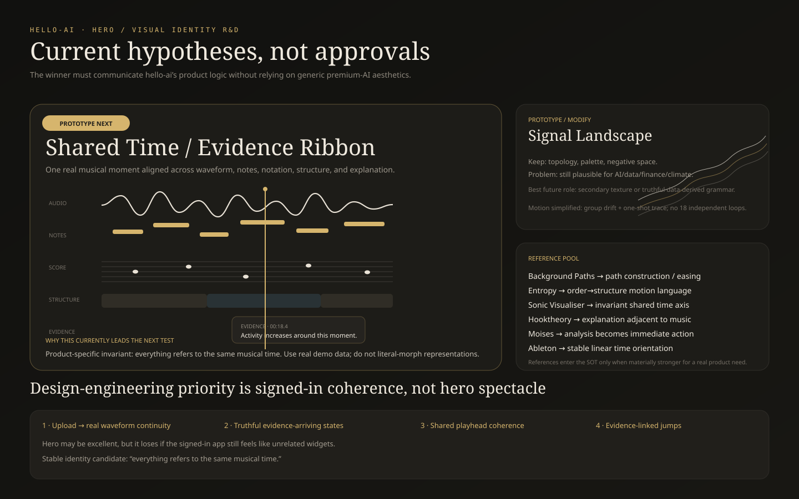
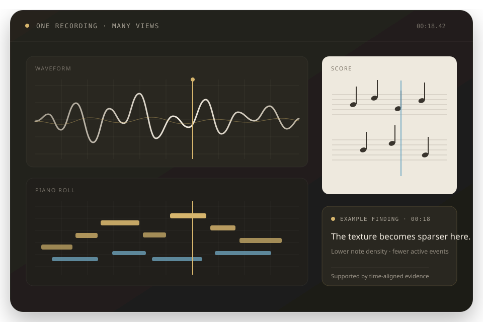
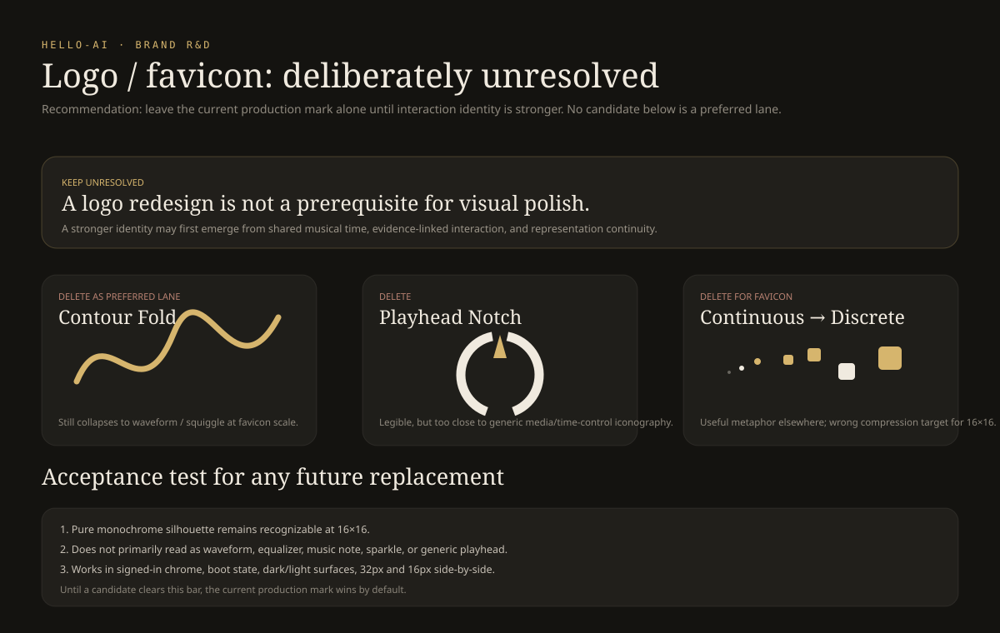

# Current Visual Enhancement / Identity R&D Source of Truth

> **Status:** active, revisable design R&D for PR #405.
>
> This document is the **current** consolidated source for visual enhancement proposals, references, decisions, guardrails, and review questions. It is intentionally not immutable: future review may overturn any conclusion here, including Signal Landscape.
>
> Older chat discussion, superseded mockups, and rejected #405 experiments should not be treated as separate competing direction documents.

## 0. Objective

Make hello-ai feel unusually considered, contemporary, and memorable **without maximizing visual effects** or drifting into generic AI/startup chrome.

The design thesis remains:

> **Make music, state, causality, and manipulation visually interesting. Do not add visual effects merely because they are fashionable.**

The signed-out experience may be expressive. The signed-in workspace should remain a calm, precise creative instrument.

## 1. Product-first priority

The highest-value visual enhancements are not necessarily the landing hero.

Prioritize these first when evaluating where design effort should go:

1. **Upload → real waveform continuity**
   - the imported recording visibly becomes the object in the workspace;
   - avoid dropping the user into unrelated generic progress UI.

2. **Truthful processing / evidence arriving**
   - show actual pipeline outputs becoming available;
   - do not animate or imply musical evidence before it exists.

3. **Shared-playhead coherence**
   - waveform, piano roll, score, and temporal evidence should feel like multiple views of one musical time;
   - representation/source changes should preserve orientation.

4. **Breakdown / Ask evidence-linked jumps**
   - when language points to a time range, make the real destination visually obvious;
   - the emphasis should be brief and stop after orientation is restored.

5. **Representation transitions**
   - use selective motion to communicate that waveform, notes, score, and analysis describe the same musical object;
   - avoid cinematic transitions that become their own attraction.

A merely very-good landing page plus unusually excellent signed-in transitions is preferable to an extraordinary hero attached to a normal-feeling app.

## 2. Current hero hypothesis: Signal Landscape

**Classification: PROTOTYPE / MODIFY. Not approved as production identity.**

Signal Landscape is currently the strongest hero hypothesis because it provides:

- one dominant object instead of card soup;
- strong negative space;
- a possible visual relationship to signal, spectral energy, topology, density, structure, and time;
- a visual grammar that can become much quieter once the user enters the application.

### Hard product-specificity test

> If the logo and copy were removed, would someone plausibly infer that the visual belongs to a product about recorded music, musical representations, and evidence-backed understanding?

If not, the direction must become more product-specific or lose.

### Visual evidence

#### Hero direction board

#### Current animated Signal Landscape prototype

Current prototype characteristics:

- SVG/CSS only;
- 18 contour ridges;
- ~16–24 second low-amplitude drift;
- one slow brass trace;
- three subtle evidence points;
- no pointer parallax;
- no JavaScript frame loop;
- no canvas/WebGL/shader dependency;
- `prefers-reduced-motion` freezes the complete composition.

Target feeling: **slow musical respiration**, not an animated screensaver.

### Future product coupling

The art-directed version should not pretend to encode precise musical data if it does not.

A stronger future prototype may truthfully derive parts of the landscape from real musical evidence such as:

- waveform envelope;
- spectral energy / centroid;
- onset density;
- note density;
- structural novelty / self-similarity;
- section boundaries;
- stem activity.

Do not fake a precise mapping before it exists.

## 3. Expression should decrease as the user enters the tool

| Surface | Expression budget | Intended treatment |
|---|---:|---|
| Signed-out hero | 8/10 | one strong art-directed visual |
| Landing body | 4/10 | sparse visual grammar + real product media |
| Upload/import | 4/10 | signal → real waveform continuity |
| Processing | 4/10 | truthful structure/evidence arriving |
| Empty workspace | 1–2/10 | quiet static identity only |
| Active workspace | 1/10 | no ambient spectacle; state-linked feedback |
| Breakdown / Ask | 1/10 | brief evidence-jump emphasis only |
| Brand/favicons | static | simple monochrome glyph |

The marketing edge gets art direction. The working surface gets precision.

## 4. Highest-value enhancements beyond the hero

### 4.1 Upload → waveform continuity

**Classification: KEEP / BUILD.**

When audio is dropped or selected, the import surface should transition into the first real waveform when decoding is available.

Why:

- object continuity;
- clearer progress;
- stronger sense that the uploaded recording is now the thing being manipulated;
- wow factor tied to meaning rather than decoration.

### 4.2 Processing as evidence arriving

**Classification: KEEP / BUILD.**

Prefer truthful stages such as:

- audio available;
- timing evidence available;
- transcription available;
- notation available;
- analysis available.

An Entropy-like order→structure metaphor may be useful here **only when it maps to real progress**.

Do not animate notes, chords, sections, or findings that have not actually been computed.

### 4.3 Evidence-linked jumps

**Classification: KEEP / BUILD.**

When Breakdown or Ask points to a region:

- seek the shared transport;
- briefly emphasize the destination in the active representation;
- optionally reuse one short contour/trace cue;
- stop after orientation is restored.

### 4.4 Shared playhead feedback

**Classification: KEEP / BUILD.**

The playhead and jump behavior should feel coherent across waveform, piano roll, score, and temporal evidence.

### 4.5 Landing body as an editorial product story

**Classification: KEEP / MODIFY.**

Prefer 2–4 large sections centered on real behaviors:

1. **Bring in a recording** — import/record → waveform.
2. **See the same moment differently** — waveform / piano roll / score around one playhead.
3. **Understand what changed** — one evidence-backed finding tied to a real time range.
4. **Ask about it** — one answer pointing back to the same evidence.

Avoid a generic 6–12 card feature bento unless hierarchy genuinely benefits from it.

### 4.6 Selective OSS microinteraction primitives

**Classification: KEEP / EVALUATE CASE-BY-CASE.**

High-quality OSS implementations may be preferable for:

- tooltips;
- disclosures;
- menus;
- segmented controls;
- short state transitions;
- focused background/path effects.

Use them when execution is plainly better than bespoke code. Do not import an entire visual language just because one component is polished.

### 4.7 One controlled representation morph

**Classification: PROTOTYPE.**

Possible transition:

abstract signal → waveform → discrete notes → notation.

Only pursue if it is:

- one-shot;
- short;
- understandable without motion;
- mobile-safe;
- optional;
- free of forced scroll choreography.

### 4.8 Real music-reactive hero

**Classification: PROTOTYPE LATER.**

Only worth testing if:

- audio is user-initiated;
- the visual reacts to real data;
- performance is acceptable;
- static/reduced-motion states remain complete;
- it materially improves comprehension or identity.

## 5. Reference pool — construction material, not a shopping list

Add or adopt a reference only when it is **materially stronger for this product**, not merely cooler.

| Reference | Current role | Borrow | Avoid |
|---|---|---|---|
| [21st.dev / Kokonut Background Paths](https://21st.dev/@kokonutd/components/background-paths) | implementation reference | polished animated SVG paths, timing, lightweight construction | stock gradient/startup aesthetic |
| [21st.dev / Entropy](https://21st.dev/@xubohuah/components/entropy) | motion/art-direction reference | organic flow, order→structure metaphor | persistent busyness / too many simultaneous elements |
| [21st.dev / Halide Topo Hero](https://21st.dev/@shivendra9795kumar/components/halide-topo-hero) | aesthetic reference | monochrome topology, technical depth, grain | mouse-chasing parallax, theatrical 3D entrance |
| [21st.dev / Liquid Metal Hero](https://21st.dev/@chowlol202/components/liquid-metal-hero) | composition reference | one confident focal object, negative space | literal liquid-metal identity by default |
| [Motion Primitives](https://github.com/ibelick/motion-primitives) | OSS primitive pool | focused high-quality micro-motion/disclosure | applying motion primitives everywhere |
| [Magic UI](https://github.com/magicuidesign/magicui) | OSS pattern pool | selected backgrounds/reveals/polish | assembling a generic animated template |
| [React Bits](https://github.com/DavidHDev/react-bits) | prototype/reference pool | unusual visual experiments | broad dependency adoption without a validated use case |
| Mobbin | shipped-product pattern reference | proven interaction hierarchy | copying unrelated product identity |

### Reference admission rule

A new reference enters the SOT only if it provides at least one of:

- a clearly stronger implementation for an already-identified product need;
- a visual precedent that makes the product more specific rather than more generic;
- a useful interaction pattern that can be adapted without adding disproportionate complexity.

Do not add references merely because they are visually impressive.

### Licensing rule

21st.dev aggregates components from different authors and sources. Before copying implementation code, verify the **specific upstream component/package license**. Do not infer production permission merely from inclusion in an aggregator.

## 6. Anti-slop gate

A visual treatment earns its place only if it does at least one of these:

1. explains the product faster;
2. communicates real state;
3. improves manipulation or orientation;
4. establishes memorable identity without competing with the music;
5. reduces uncertainty while work is processing.

### Current reject list

- generic aurora / AI blobs as identity;
- generic neural-network / particle backgrounds;
- glass-card stacks;
- border-beam / shiny-border everything;
- magnetic buttons;
- text scramble/typewriter for core copy;
- marquee content;
- dock nav as primary navigation;
- persistent parallax;
- heavy 3D galleries;
- forced smooth scrolling / scroll hijacking;
- autoplay media;
- multiple ambient animations in one viewport;
- full-screen shaders simply because they look impressive.

### One-effect rule

Do not stack shader + blur + glass + border beam + cursor spotlight + floating animation.

A polished composition should normally have **one dominant visual idea**, supported by typography, spacing, and restrained state feedback.

## 7. Brand / favicon SOT

**Classification: UNRESOLVED. Do not force a replacement.**

The rejected #405 favicon and BrandMark experiment was reverted. The existing production mark stays until a replacement passes explicit validation.

### Brand exploration board

### Requirements for any replacement

The next mark must:

1. work at 16×16 in pure monochrome;
2. have a recognizable silhouette without micro-detail;
3. not read primarily as a waveform, equalizer, music note, or AI sparkle;
4. not depend on gradient or animation;
5. fit both expressive landing surfaces and restrained signed-in chrome;
6. be validated side-by-side at favicon, header, and boot sizes.

The Contour Fold lane is a hypothesis only. It may still collapse into a generic wave and should be deleted if it cannot survive 16×16 simplification.

## 8. Typography / color / texture guardrails

Keep:

- warm graphite / dark neutral core environment;
- paper-like notation surface;
- restrained brass identity/accent;
- blue for playback/time relationships where useful;
- editorial display typography at the marketing edge;
- compact sans/mono typography in the tool;
- low gloss;
- limited radius vocabulary;
- minimal card count;
- the music representation as the largest product object.

Avoid:

- purple simply because a reference uses it;
- gradient text as default branding;
- excessive serif inside the tool;
- grain that harms legibility;
- huge hero copy that crowds out the actual product/visual object.

## 9. Motion budget

Global rules:

- one moving focal region at a time;
- user-triggered motion beats ambient motion;
- ambient motion belongs mostly to signed-out surfaces;
- entrance motion is one-shot;
- menu/popover motion should be short and functional;
- no animation is required to discover a control;
- reduced-motion is fully useful;
- avoid Motion/GSAP/Three unless CSS/SVG cannot achieve a validated behavior;
- mobile may simplify or remove decorative motion rather than preserving desktop spectacle.

## 10. Relationship to other design work

### PR #401

#401 is the conservative baseline-craft / legibility lane:

- type scale;
- menu polish;
- Breakdown legibility;
- subtle control-state feedback.

It is complementary to #405.

### PR #405

#405 remains the current visual/interaction R&D lane for:

- expressive landing direction;
- visual-reference evaluation;
- product-specific motion hypotheses;
- meaningful upload/processing/playhead/evidence polish;
- marketing-to-workspace visual continuity;
- logo/favicon exploration.

Do not use #405 as a reason for another information-architecture rewrite or to weaken Breakdown evidence truth.

## 11. Design-agent review protocol

Review #405 as the **current visual-enhancement / identity R&D source of truth**.

Do not simply approve or polish it. Treat every current conclusion — including Signal Landscape — as a hypothesis that can be overturned.

### Required questions

1. Is Signal Landscape genuinely product-specific, or still generic premium AI/data-viz?
2. Is hero R&D receiving too much attention relative to signed-in upload, processing, playhead, evidence-jump, and representation-transition polish?
3. Would Background Paths used more directly produce a more polished result than the bespoke SVG?
4. Which parts of Entropy are useful without importing its busyness?
5. Does the landscape grammar naturally extend into real product states, or are we forcing a metaphor?
6. Does the landing feel like the same product as the signed-in workspace after expression drops?
7. Which OSS component or pattern is materially better than the bespoke alternative?
8. Which current proposal is hype, generic, over-designed, or unlikely to improve the product?
9. Should Contour Fold survive as a favicon lane after 16×16 testing?
10. Which stronger visual precedents outside the current pool should be considered?

### Required classification

For every major proposal classify it as:

**KEEP / MODIFY / REPLACE / DELETE / PROTOTYPE**

For anything marked **REPLACE** or **PROTOTYPE**, provide a specific visual precedent, OSS implementation reference, or concrete prototype direction rather than prose-only taste commentary.

Optimize for a product that feels unusually considered and contemporary, **not for maximum visual effects**.

After review, update #405 / this SOT rather than creating a competing design document.

## 12. Acceptance / sequencing

PR #396 has merged. #405 should be rebased on current `main` before implementation/merge validation.

After design review settles the next direction:

1. update this SOT first;
2. rebase #405 onto current `main`;
3. verify third-party source/license before adopting implementation code;
4. prototype the highest-value signed-in enhancements, not only the hero;
5. capture real browser evidence at desktop, tablet, 390×844, and reduced-motion;
6. verify performance, layout shift, and mobile behavior;
7. confirm no persistent ambient spectacle was added to the signed-in workspace;
8. leave brand/favicon unchanged unless a replacement passes the explicit small-size test;
9. run hardened exact-head merge gates;
10. only then decide what earns production merge.

## 13. Superseded directions

- **Initial #405:** miniature waveform + piano roll + score + evidence hero. **REJECTED** as too literal/generic.
- **Initial favicon/BrandMark simplification:** **REJECTED and reverted.**
- **Cinematic generative/sculptural mockups:** useful for taste discovery, but several remained too close to the dark + serif + abstract glowing-object AI formula.
- **Current state:** Signal Landscape is the leading prototype hypothesis, while product-state interaction polish is explicitly higher priority than hero spectacle.

Update this document whenever the decision changes so #405 remains consolidated rather than accumulating contradictory artifacts.
