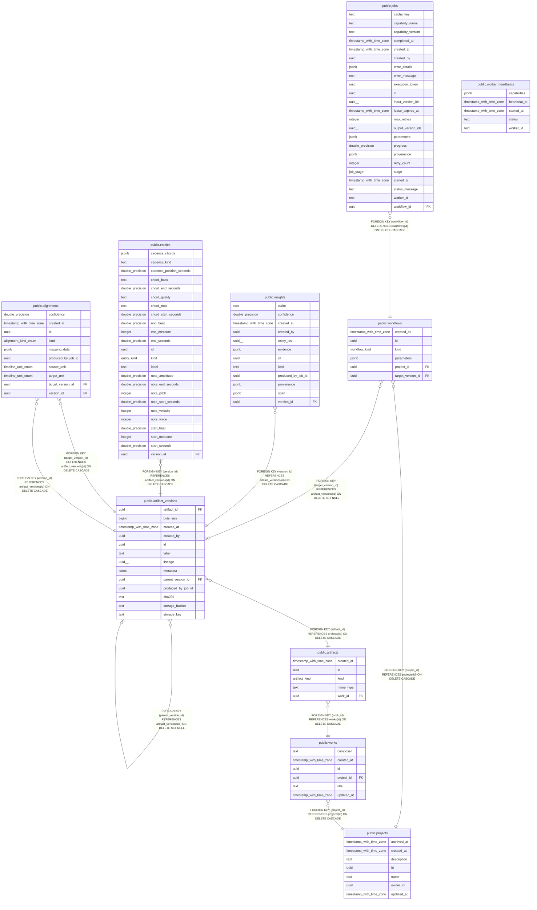

# Listen Closer application database

## Description

Generated from the fresh local Supabase/Postgres schema. Migrations are authoritative.

## Tables

| Name | Columns | Comment | Type |
| ---- | ------- | ------- | ---- |
| [public.alignments](public.alignments.md) | 10 |  | BASE TABLE |
| [public.artifact_versions](public.artifact_versions.md) | 13 |  | BASE TABLE |
| [public.artifacts](public.artifacts.md) | 5 |  | BASE TABLE |
| [public.entities](public.entities.md) | 24 |  | BASE TABLE |
| [public.insights](public.insights.md) | 12 |  | BASE TABLE |
| [public.jobs](public.jobs.md) | 23 |  | BASE TABLE |
| [public.projects](public.projects.md) | 7 |  | BASE TABLE |
| [public.worker_heartbeats](public.worker_heartbeats.md) | 5 | Service-role worker liveness records used by the aggregate queue health endpoint. | BASE TABLE |
| [public.workflows](public.workflows.md) | 6 |  | BASE TABLE |
| [public.works](public.works.md) | 6 |  | BASE TABLE |

## Stored procedures and functions

| Name | ReturnType | Arguments | Type |
| ---- | ------- | ------- | ---- |
| public.claim_next_job | jobs | p_worker_id text, p_lease_seconds double precision DEFAULT 30.0 | FUNCTION |
| public.enqueue_job_delivery | trigger |  | FUNCTION |
| public.extend_job_delivery | bool | p_job_id uuid, p_execution_token uuid, p_msg_id bigint, p_visibility_seconds integer | FUNCTION |
| public.fenced_job_delete | int4 | p_job_id uuid, p_execution_token uuid, p_table text, p_match jsonb | FUNCTION |
| public.fenced_job_insert | jsonb | p_job_id uuid, p_execution_token uuid, p_table text, p_rows jsonb | FUNCTION |
| public.fenced_job_publish_version | jsonb | p_job_id uuid, p_execution_token uuid, p_artifact jsonb, p_version jsonb | FUNCTION |
| public.fenced_job_verify_input_sha256 | text | p_job_id uuid, p_execution_token uuid, p_version_id uuid, p_sha256 text | FUNCTION |
| public.finish_job_delivery | text | p_job_id uuid, p_execution_token uuid, p_msg_id bigint, p_retry_delay_seconds integer DEFAULT 0 | FUNCTION |
| public.receive_job_delivery | jsonb | p_worker_id text, p_visibility_seconds integer, p_in_flight_job_ids uuid[] DEFAULT '{}'::uuid[] | FUNCTION |

## Enums

| Name | Values |
| ---- | ------- |
| auth.aal_level | aal1, aal2, aal3 |
| auth.code_challenge_method | plain, s256 |
| auth.factor_status | unverified, verified |
| auth.factor_type | phone, totp, webauthn |
| auth.oauth_authorization_status | approved, denied, expired, pending |
| auth.oauth_client_type | confidential, public |
| auth.oauth_registration_type | dynamic, manual |
| auth.oauth_response_type | code |
| auth.one_time_token_type | confirmation_token, email_change_token_current, email_change_token_new, phone_change_token, reauthentication_token, recovery_token |
| net.request_status | ERROR, PENDING, SUCCESS |
| public.alignment_kind_enum | performance, timeline, version |
| public.artifact_kind | analysis_report, audio_enhanced, audio_original, audio_rendered, midi_corrected, midi_performance, musicxml_score, rendered_score, stems |
| public.entity_kind | beat, cadence, chord, measure, motif, note, phrase, section |
| public.job_stage | cancelled, claimed, failed, queued, running, succeeded |
| public.timeline_unit_enum | beats, measures, samples, score_position, seconds, ticks |
| public.workflow_kind | compare, correct, create, export, understand |
| realtime.action | DELETE, ERROR, INSERT, TRUNCATE, UPDATE |
| realtime.equality_op | eq, gt, gte, ilike, imatch, in, is, isdistinct, like, lt, lte, match, neq |
| storage.buckettype | ANALYTICS, STANDARD, VECTOR |

## Relations

---

> Generated by [tbls](https://github.com/k1LoW/tbls)
