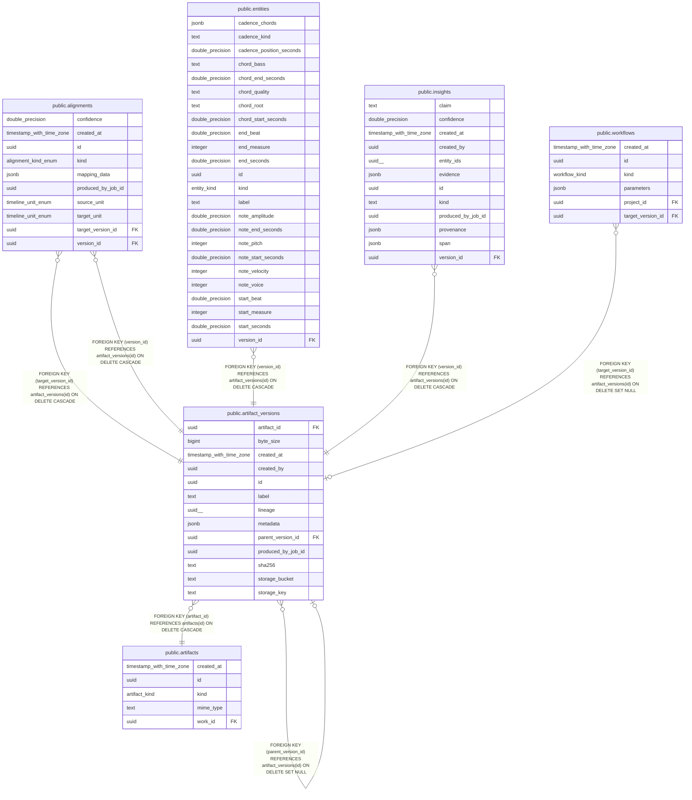

# public.artifact_versions

## Columns

| Name | Type | Default | Nullable | Children | Parents | Comment |
| ---- | ---- | ------- | -------- | -------- | ------- | ------- |
| artifact_id | uuid |  | false |  | [public.artifacts](public.artifacts.md) |  |
| byte_size | bigint |  | true |  |  |  |
| created_at | timestamp with time zone | now() | false |  |  |  |
| created_by | uuid |  | true |  |  |  |
| id | uuid | gen_random_uuid() | false | [public.alignments](public.alignments.md) [public.artifact_versions](public.artifact_versions.md) [public.entities](public.entities.md) [public.insights](public.insights.md) [public.workflows](public.workflows.md) |  |  |
| label | text | ''::text | false |  |  |  |
| lineage | uuid[] | '{}'::uuid[] | false |  |  |  |
| metadata | jsonb | '{}'::jsonb | false |  |  |  |
| parent_version_id | uuid |  | true |  | [public.artifact_versions](public.artifact_versions.md) |  |
| produced_by_job_id | uuid |  | true |  |  |  |
| sha256 | text |  | true |  |  |  |
| storage_bucket | text |  | false |  |  |  |
| storage_key | text |  | false |  |  |  |

## Constraints

| Name | Type | Definition |
| ---- | ---- | ---------- |
| artifact_versions_artifact_id_fkey | FOREIGN KEY | FOREIGN KEY (artifact_id) REFERENCES artifacts(id) ON DELETE CASCADE |
| artifact_versions_parent_version_id_fkey | FOREIGN KEY | FOREIGN KEY (parent_version_id) REFERENCES artifact_versions(id) ON DELETE SET NULL |
| artifact_versions_pkey | PRIMARY KEY | PRIMARY KEY (id) |

## Indexes

| Name | Definition |
| ---- | ---------- |
| artifact_versions_pkey | CREATE UNIQUE INDEX artifact_versions_pkey ON public.artifact_versions USING btree (id) |
| idx_versions_artifact | CREATE INDEX idx_versions_artifact ON public.artifact_versions USING btree (artifact_id) |
| idx_versions_job | CREATE INDEX idx_versions_job ON public.artifact_versions USING btree (produced_by_job_id) |
| idx_versions_parent | CREATE INDEX idx_versions_parent ON public.artifact_versions USING btree (parent_version_id) |

## Relations

---

> Generated by [tbls](https://github.com/k1LoW/tbls)
