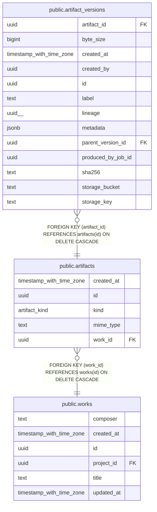

# public.artifacts

## Columns

| Name | Type | Default | Nullable | Children | Parents | Comment |
| ---- | ---- | ------- | -------- | -------- | ------- | ------- |
| created_at | timestamp with time zone | now() | false |  |  |  |
| id | uuid | gen_random_uuid() | false | [public.artifact_versions](public.artifact_versions.md) |  |  |
| kind | artifact_kind | 'audio_original'::artifact_kind | false |  |  |  |
| mime_type | text | 'application/octet-stream'::text | false |  |  |  |
| work_id | uuid |  | false |  | [public.works](public.works.md) |  |

## Constraints

| Name | Type | Definition |
| ---- | ---- | ---------- |
| artifacts_pkey | PRIMARY KEY | PRIMARY KEY (id) |
| artifacts_work_id_fkey | FOREIGN KEY | FOREIGN KEY (work_id) REFERENCES works(id) ON DELETE CASCADE |

## Indexes

| Name | Definition |
| ---- | ---------- |
| artifacts_pkey | CREATE UNIQUE INDEX artifacts_pkey ON public.artifacts USING btree (id) |
| idx_artifacts_work | CREATE INDEX idx_artifacts_work ON public.artifacts USING btree (work_id) |

## Relations

---

> Generated by [tbls](https://github.com/k1LoW/tbls)
