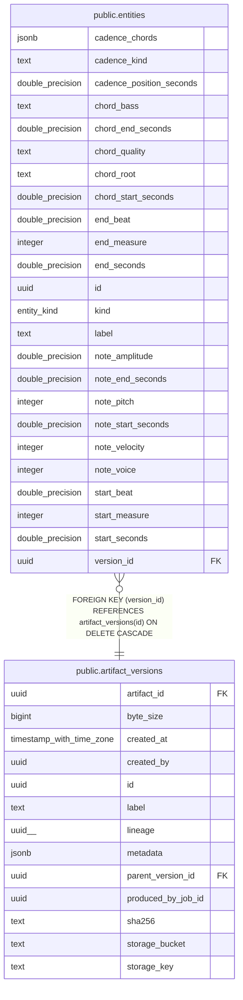

# public.entities

## Columns

| Name | Type | Default | Nullable | Children | Parents | Comment |
| ---- | ---- | ------- | -------- | -------- | ------- | ------- |
| cadence_chords | jsonb |  | true |  |  |  |
| cadence_kind | text |  | true |  |  |  |
| cadence_position_seconds | double precision |  | true |  |  |  |
| chord_bass | text |  | true |  |  |  |
| chord_end_seconds | double precision |  | true |  |  |  |
| chord_quality | text |  | true |  |  |  |
| chord_root | text |  | true |  |  |  |
| chord_start_seconds | double precision |  | true |  |  |  |
| end_beat | double precision |  | true |  |  |  |
| end_measure | integer |  | true |  |  |  |
| end_seconds | double precision |  | true |  |  |  |
| id | uuid | gen_random_uuid() | false |  |  |  |
| kind | entity_kind |  | false |  |  |  |
| label | text | ''::text | false |  |  |  |
| note_amplitude | double precision |  | true |  |  |  |
| note_end_seconds | double precision |  | true |  |  |  |
| note_pitch | integer |  | true |  |  |  |
| note_start_seconds | double precision |  | true |  |  |  |
| note_velocity | integer |  | true |  |  |  |
| note_voice | integer |  | true |  |  |  |
| start_beat | double precision |  | true |  |  |  |
| start_measure | integer |  | true |  |  |  |
| start_seconds | double precision |  | true |  |  |  |
| version_id | uuid |  | false |  | [public.artifact_versions](public.artifact_versions.md) |  |

## Constraints

| Name | Type | Definition |
| ---- | ---- | ---------- |
| entities_pkey | PRIMARY KEY | PRIMARY KEY (id) |
| entities_version_id_fkey | FOREIGN KEY | FOREIGN KEY (version_id) REFERENCES artifact_versions(id) ON DELETE CASCADE |

## Indexes

| Name | Definition |
| ---- | ---------- |
| entities_pkey | CREATE UNIQUE INDEX entities_pkey ON public.entities USING btree (id) |
| idx_entities_kind | CREATE INDEX idx_entities_kind ON public.entities USING btree (kind) |
| idx_entities_version | CREATE INDEX idx_entities_version ON public.entities USING btree (version_id) |

## Relations

---

> Generated by [tbls](https://github.com/k1LoW/tbls)
