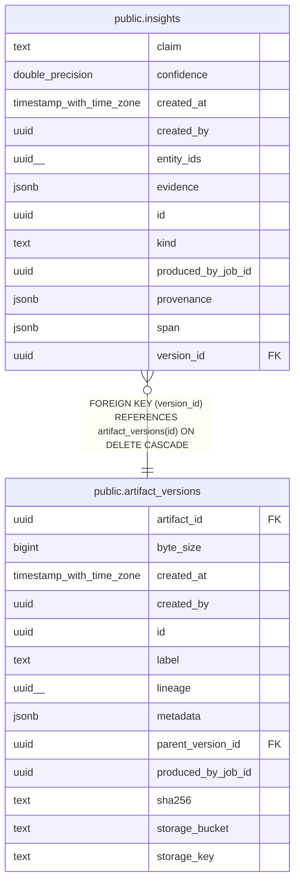

# public.insights

## Columns

| Name | Type | Default | Nullable | Children | Parents | Comment |
| ---- | ---- | ------- | -------- | -------- | ------- | ------- |
| claim | text |  | false |  |  |  |
| confidence | double precision |  | true |  |  |  |
| created_at | timestamp with time zone | now() | false |  |  |  |
| created_by | uuid |  | true |  |  |  |
| entity_ids | uuid[] | '{}'::uuid[] | false |  |  |  |
| evidence | jsonb | '{}'::jsonb | false |  |  |  |
| id | uuid | gen_random_uuid() | false |  |  |  |
| kind | text |  | false |  |  |  |
| produced_by_job_id | uuid |  | true |  |  |  |
| provenance | jsonb | '{}'::jsonb | false |  |  |  |
| span | jsonb | '{}'::jsonb | false |  |  |  |
| version_id | uuid |  | false |  | [public.artifact_versions](public.artifact_versions.md) |  |

## Constraints

| Name | Type | Definition |
| ---- | ---- | ---------- |
| insights_confidence_check | CHECK | CHECK (((confidence >= (0)::double precision) AND (confidence <= (1)::double precision))) |
| insights_pkey | PRIMARY KEY | PRIMARY KEY (id) |
| insights_version_id_fkey | FOREIGN KEY | FOREIGN KEY (version_id) REFERENCES artifact_versions(id) ON DELETE CASCADE |

## Indexes

| Name | Definition |
| ---- | ---------- |
| idx_insights_kind | CREATE INDEX idx_insights_kind ON public.insights USING btree (kind) |
| idx_insights_version | CREATE INDEX idx_insights_version ON public.insights USING btree (version_id) |
| insights_pkey | CREATE UNIQUE INDEX insights_pkey ON public.insights USING btree (id) |

## Relations

---

> Generated by [tbls](https://github.com/k1LoW/tbls)
