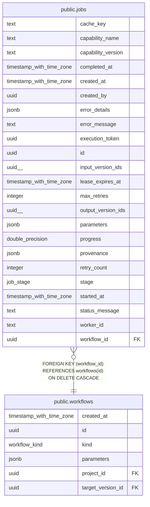

# public.jobs

## Columns

| Name | Type | Default | Nullable | Children | Parents | Comment |
| ---- | ---- | ------- | -------- | -------- | ------- | ------- |
| cache_key | text |  | true |  |  |  |
| capability_name | text |  | false |  |  |  |
| capability_version | text |  | false |  |  |  |
| completed_at | timestamp with time zone |  | true |  |  |  |
| created_at | timestamp with time zone | now() | false |  |  |  |
| created_by | uuid |  | true |  |  |  |
| error_details | jsonb | '{}'::jsonb | false |  |  |  |
| error_message | text |  | true |  |  |  |
| execution_token | uuid |  | true |  |  | Fresh per-claim generation token used to fence worker lifecycle and product-visible persistence. |
| id | uuid | gen_random_uuid() | false |  |  |  |
| input_version_ids | uuid[] | '{}'::uuid[] | false |  |  |  |
| lease_expires_at | timestamp with time zone |  | true |  |  |  |
| max_retries | integer | 3 | false |  |  |  |
| output_version_ids | uuid[] | '{}'::uuid[] | false |  |  |  |
| parameters | jsonb | '{}'::jsonb | false |  |  |  |
| progress | double precision | 0.0 | false |  |  |  |
| provenance | jsonb | '{}'::jsonb | false |  |  |  |
| retry_count | integer | 0 | false |  |  |  |
| stage | job_stage | 'queued'::job_stage | false |  |  |  |
| started_at | timestamp with time zone |  | true |  |  |  |
| status_message | text | ''::text | false |  |  |  |
| worker_id | text |  | true |  |  |  |
| workflow_id | uuid |  | false |  | [public.workflows](public.workflows.md) |  |

## Constraints

| Name | Type | Definition |
| ---- | ---- | ---------- |
| jobs_pkey | PRIMARY KEY | PRIMARY KEY (id) |
| jobs_progress_check | CHECK | CHECK (((progress >= (0)::double precision) AND (progress <= (1)::double precision))) |
| jobs_workflow_id_fkey | FOREIGN KEY | FOREIGN KEY (workflow_id) REFERENCES workflows(id) ON DELETE CASCADE |

## Indexes

| Name | Definition |
| ---- | ---------- |
| idx_jobs_cache_key | CREATE UNIQUE INDEX idx_jobs_cache_key ON public.jobs USING btree (cache_key) WHERE (cache_key IS NOT NULL) |
| idx_jobs_stage | CREATE INDEX idx_jobs_stage ON public.jobs USING btree (stage) |
| idx_jobs_worker | CREATE INDEX idx_jobs_worker ON public.jobs USING btree (worker_id) |
| idx_jobs_workflow | CREATE INDEX idx_jobs_workflow ON public.jobs USING btree (workflow_id) |
| jobs_pkey | CREATE UNIQUE INDEX jobs_pkey ON public.jobs USING btree (id) |

## Relations

---

> Generated by [tbls](https://github.com/k1LoW/tbls)
