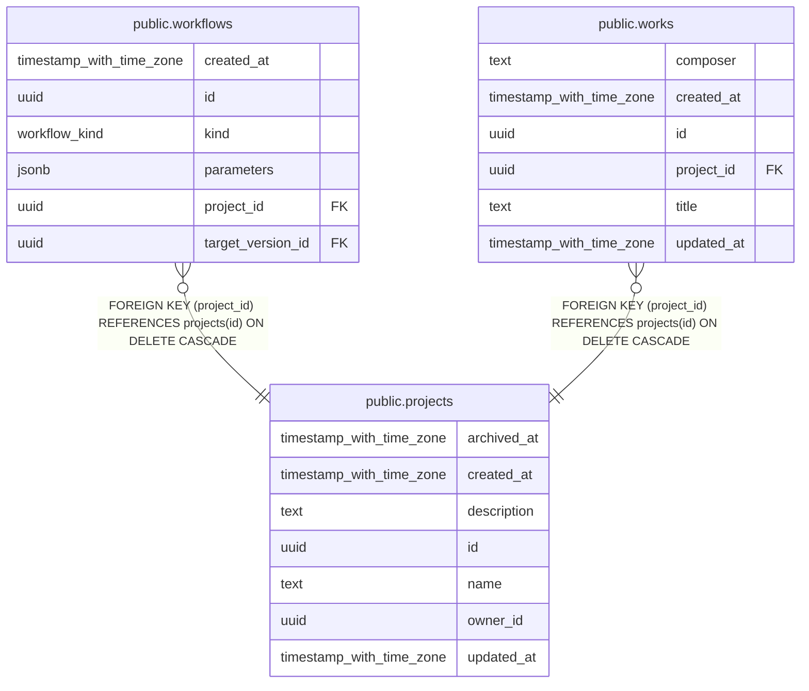

# public.projects

## Columns

| Name | Type | Default | Nullable | Children | Parents | Comment |
| ---- | ---- | ------- | -------- | -------- | ------- | ------- |
| archived_at | timestamp with time zone |  | true |  |  |  |
| created_at | timestamp with time zone | now() | false |  |  |  |
| description | text | ''::text | false |  |  |  |
| id | uuid | gen_random_uuid() | false | [public.workflows](public.workflows.md) [public.works](public.works.md) |  |  |
| name | text |  | false |  |  |  |
| owner_id | uuid |  | false |  |  |  |
| updated_at | timestamp with time zone | now() | false |  |  |  |

## Constraints

| Name | Type | Definition |
| ---- | ---- | ---------- |
| projects_pkey | PRIMARY KEY | PRIMARY KEY (id) |

## Indexes

| Name | Definition |
| ---- | ---------- |
| idx_projects_owner | CREATE INDEX idx_projects_owner ON public.projects USING btree (owner_id) |
| projects_pkey | CREATE UNIQUE INDEX projects_pkey ON public.projects USING btree (id) |

## Relations

---

> Generated by [tbls](https://github.com/k1LoW/tbls)
