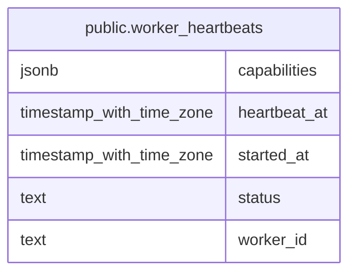

# public.worker_heartbeats

## Description

Service-role worker liveness records used by the aggregate queue health endpoint.

## Columns

| Name | Type | Default | Nullable | Children | Parents | Comment |
| ---- | ---- | ------- | -------- | -------- | ------- | ------- |
| capabilities | jsonb | '[]'::jsonb | false |  |  |  |
| heartbeat_at | timestamp with time zone | now() | false |  |  |  |
| started_at | timestamp with time zone | now() | false |  |  |  |
| status | text | 'running'::text | false |  |  |  |
| worker_id | text |  | false |  |  |  |

## Constraints

| Name | Type | Definition |
| ---- | ---- | ---------- |
| worker_heartbeats_pkey | PRIMARY KEY | PRIMARY KEY (worker_id) |
| worker_heartbeats_status_check | CHECK | CHECK ((status = ANY (ARRAY['running'::text, 'draining'::text, 'stopped'::text]))) |

## Indexes

| Name | Definition |
| ---- | ---------- |
| idx_worker_heartbeats_heartbeat | CREATE INDEX idx_worker_heartbeats_heartbeat ON public.worker_heartbeats USING btree (heartbeat_at DESC) |
| worker_heartbeats_pkey | CREATE UNIQUE INDEX worker_heartbeats_pkey ON public.worker_heartbeats USING btree (worker_id) |

## Relations

---

> Generated by [tbls](https://github.com/k1LoW/tbls)
