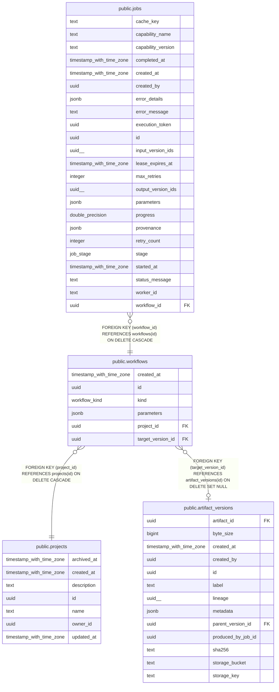

# public.workflows

## Columns

| Name | Type | Default | Nullable | Children | Parents | Comment |
| ---- | ---- | ------- | -------- | -------- | ------- | ------- |
| created_at | timestamp with time zone | now() | false |  |  |  |
| id | uuid | gen_random_uuid() | false | [public.jobs](public.jobs.md) |  |  |
| kind | workflow_kind |  | false |  |  |  |
| parameters | jsonb | '{}'::jsonb | false |  |  |  |
| project_id | uuid |  | false |  | [public.projects](public.projects.md) |  |
| target_version_id | uuid |  | true |  | [public.artifact_versions](public.artifact_versions.md) |  |

## Constraints

| Name | Type | Definition |
| ---- | ---- | ---------- |
| workflows_pkey | PRIMARY KEY | PRIMARY KEY (id) |
| workflows_project_id_fkey | FOREIGN KEY | FOREIGN KEY (project_id) REFERENCES projects(id) ON DELETE CASCADE |
| workflows_target_version_id_fkey | FOREIGN KEY | FOREIGN KEY (target_version_id) REFERENCES artifact_versions(id) ON DELETE SET NULL |

## Indexes

| Name | Definition |
| ---- | ---------- |
| idx_workflows_project | CREATE INDEX idx_workflows_project ON public.workflows USING btree (project_id) |
| idx_workflows_target_version | CREATE INDEX idx_workflows_target_version ON public.workflows USING btree (target_version_id) |
| workflows_pkey | CREATE UNIQUE INDEX workflows_pkey ON public.workflows USING btree (id) |

## Relations

---

> Generated by [tbls](https://github.com/k1LoW/tbls)
