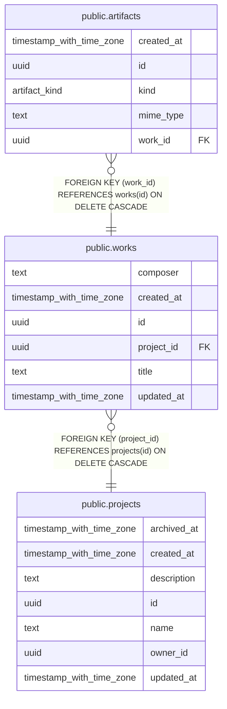

# public.works

## Columns

| Name | Type | Default | Nullable | Children | Parents | Comment |
| ---- | ---- | ------- | -------- | -------- | ------- | ------- |
| composer | text |  | true |  |  |  |
| created_at | timestamp with time zone | now() | false |  |  |  |
| id | uuid | gen_random_uuid() | false | [public.artifacts](public.artifacts.md) |  |  |
| project_id | uuid |  | false |  | [public.projects](public.projects.md) |  |
| title | text |  | false |  |  |  |
| updated_at | timestamp with time zone | now() | false |  |  |  |

## Constraints

| Name | Type | Definition |
| ---- | ---- | ---------- |
| works_pkey | PRIMARY KEY | PRIMARY KEY (id) |
| works_project_id_fkey | FOREIGN KEY | FOREIGN KEY (project_id) REFERENCES projects(id) ON DELETE CASCADE |

## Indexes

| Name | Definition |
| ---- | ---------- |
| idx_works_project | CREATE INDEX idx_works_project ON public.works USING btree (project_id) |
| works_pkey | CREATE UNIQUE INDEX works_pkey ON public.works USING btree (id) |

## Relations

---

> Generated by [tbls](https://github.com/k1LoW/tbls)
