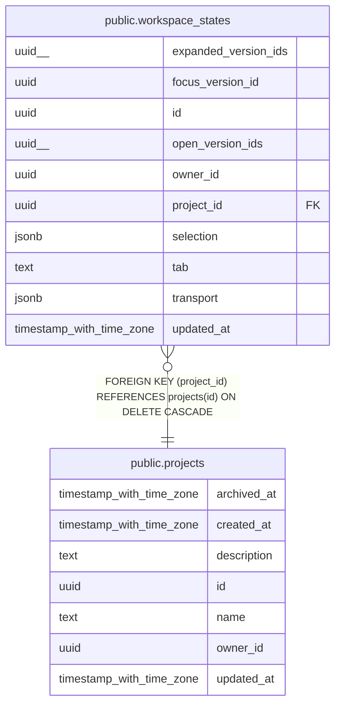

# public.workspace_states

## Columns

| Name | Type | Default | Nullable | Children | Parents | Comment |
| ---- | ---- | ------- | -------- | -------- | ------- | ------- |
| expanded_version_ids | uuid[] | '{}'::uuid[] | false |  |  |  |
| focus_version_id | uuid |  | true |  |  |  |
| id | uuid | gen_random_uuid() | false |  |  |  |
| open_version_ids | uuid[] | '{}'::uuid[] | false |  |  |  |
| owner_id | uuid |  | false |  |  |  |
| project_id | uuid |  | false |  | [public.projects](public.projects.md) |  |
| selection | jsonb | '{}'::jsonb | false |  |  |  |
| tab | text | 'explore'::text | false |  |  |  |
| transport | jsonb | '{}'::jsonb | false |  |  |  |
| updated_at | timestamp with time zone | now() | false |  |  |  |

## Constraints

| Name | Type | Definition |
| ---- | ---- | ---------- |
| workspace_states_pkey | PRIMARY KEY | PRIMARY KEY (id) |
| workspace_states_project_id_fkey | FOREIGN KEY | FOREIGN KEY (project_id) REFERENCES projects(id) ON DELETE CASCADE |

## Indexes

| Name | Definition |
| ---- | ---------- |
| idx_workspace_state_owner | CREATE UNIQUE INDEX idx_workspace_state_owner ON public.workspace_states USING btree (owner_id, project_id) |
| workspace_states_pkey | CREATE UNIQUE INDEX workspace_states_pkey ON public.workspace_states USING btree (id) |

## Relations

---

> Generated by [tbls](https://github.com/k1LoW/tbls)
