# Frontend dependency graph

> Generated by dependency-cruiser 18.2.0 with TypeScript 5.7.3 from `.dependency-cruiser.cjs`. Do not hand-edit this graph; regenerate it through the architecture check when frontend imports change.

This is an orientation view of `app/`, `components/`, and `lib/`. Deeper folders are collapsed to keep the graph reviewable. The architecture rules in `.dependency-cruiser.cjs`, not the picture alone, are the enforceable contract.

```mermaid
flowchart LR

subgraph app["app"]
  subgraph app_api["api"]
    app_api_[" "]
  end
  subgraph app_auth["auth"]
    app_auth_[" "]
  end
  app_breakdown_css["breakdown.css"]
  app_global_error_tsx["global-error.tsx"]
  app_globals_css["globals.css"]
  app_landing_product_story_css["landing-product-story.css"]
  app_layout_tsx["layout.tsx"]
  app_mobile_workspace_css["mobile-workspace.css"]
  app_page_tsx["page.tsx"]
  app_product_polish_v4_css["product-polish-v4.css"]
  app_readiness_polish_v6_css["readiness-polish-v6.css"]
  app_visual_language_css["visual-language.css"]
  app_workspace_interactions_css["workspace-interactions.css"]
  app_workspace_v3_css["workspace-v3.css"]
end
subgraph components["components"]
  components_AuthProvider_tsx["AuthProvider.tsx"]
  components_BrandMark_tsx["BrandMark.tsx"]
  components_MSWInit_tsx["MSWInit.tsx"]
  components_PianoRoll_tsx["PianoRoll.tsx"]
  components_QueryProvider_tsx["QueryProvider.tsx"]
  components_SheetMusic_tsx["SheetMusic.tsx"]
  components_Spectrogram_tsx["Spectrogram.tsx"]
  components_Waveform_tsx["Waveform.tsx"]
  subgraph components_ui["ui"]
    components_ui_[" "]
  end
  subgraph components_workspace["workspace"]
    components_workspace_[" "]
  end
end
subgraph lib["lib"]
  lib_analysis_annotations_ts["analysis-annotations.ts"]
  lib_api_client_ts["api-client.ts"]
  lib_api_types_ts["api-types.ts"]
  lib_api_ts["api.ts"]
  subgraph lib_ask["ask"]
    lib_ask_[" "]
  end
  lib_audio_buffer_cache_ts["audio-buffer-cache.ts"]
  lib_backend_ts["backend.ts"]
  lib_color_ts["color.ts"]
  lib_domain_types_ts["domain.types.ts"]
  lib_format_ts["format.ts"]
  subgraph lib_inspector["inspector"]
    lib_inspector_[" "]
  end
  lib_job_tracking_ts["job-tracking.ts"]
  lib_measure_ts["measure.ts"]
  lib_midi_ts["midi.ts"]
  lib_notes_ts["notes.ts"]
  lib_playback_sources_ts["playback-sources.ts"]
  lib_query_client_ts["query-client.ts"]
  lib_relation_api_client_ts["relation-api-client.ts"]
  lib_representation_availability_ts["representation-availability.ts"]
  lib_representations_tsx["representations.tsx"]
  lib_score_measure_geometry_ts["score-measure-geometry.ts"]
  lib_selection_ts["selection.ts"]
  lib_server_state_ts["server-state.ts"]
  lib_spectrogram_data_ts["spectrogram-data.ts"]
  lib_spectrogram_ts["spectrogram.ts"]
  subgraph lib_stores["stores"]
    lib_stores_[" "]
  end
  lib_supabase_ts["supabase.ts"]
  lib_work_selection_ts["work-selection.ts"]
end
app_api_-->lib_backend_ts
app_auth_-->lib_supabase_ts
app_layout_tsx-->app_breakdown_css
app_layout_tsx-->app_globals_css
app_layout_tsx-->app_landing_product_story_css
app_layout_tsx-->app_mobile_workspace_css
app_layout_tsx-->app_product_polish_v4_css
app_layout_tsx-->app_readiness_polish_v6_css
app_layout_tsx-->app_visual_language_css
app_layout_tsx-->app_workspace_interactions_css
app_layout_tsx-->app_workspace_v3_css
app_layout_tsx-->components_AuthProvider_tsx
app_layout_tsx-->components_MSWInit_tsx
app_layout_tsx-->components_QueryProvider_tsx
app_page_tsx-->components_AuthProvider_tsx
app_page_tsx-->components_BrandMark_tsx
app_page_tsx-->components_workspace_
app_page_tsx-->lib_api_client_ts
app_page_tsx-->lib_format_ts
app_page_tsx-->lib_job_tracking_ts
app_page_tsx-->lib_playback_sources_ts
app_page_tsx-->lib_server_state_ts
app_page_tsx-->lib_stores_
app_page_tsx-->lib_supabase_ts
components_AuthProvider_tsx-->lib_api_client_ts
components_AuthProvider_tsx-->lib_supabase_ts
components_PianoRoll_tsx-->lib_notes_ts
components_QueryProvider_tsx-->lib_query_client_ts
components_SheetMusic_tsx-->lib_analysis_annotations_ts
components_SheetMusic_tsx-->lib_measure_ts
components_SheetMusic_tsx-->lib_score_measure_geometry_ts
components_Spectrogram_tsx-->lib_color_ts
components_Spectrogram_tsx-->lib_spectrogram_ts
components_Spectrogram_tsx-->lib_spectrogram_data_ts
components_Waveform_tsx-->lib_audio_buffer_cache_ts
components_Waveform_tsx-->lib_color_ts
components_workspace_-->lib_stores_
components_workspace_-->components_ui_
components_workspace_-->lib_format_ts
components_workspace_-->lib_inspector_
components_workspace_-->lib_ask_
components_workspace_-->lib_selection_ts
components_workspace_-->lib_relation_api_client_ts
components_workspace_-->components_AuthProvider_tsx
components_workspace_-->lib_api_client_ts
components_workspace_-->lib_server_state_ts
components_workspace_-->lib_supabase_ts
components_workspace_-->lib_work_selection_ts
components_workspace_-->lib_representation_availability_ts
components_workspace_-->lib_representations_tsx
lib_analysis_annotations_ts-->lib_inspector_
lib_api_client_ts-->lib_api_ts
lib_api_client_ts-->lib_query_client_ts
lib_api_client_ts-->lib_supabase_ts
lib_api_ts-->lib_supabase_ts
lib_ask_-->lib_api_ts
lib_ask_-->lib_inspector_
lib_ask_-->lib_format_ts
lib_ask_-->lib_representations_tsx
lib_ask_-->lib_selection_ts
lib_inspector_-->lib_format_ts
lib_job_tracking_ts-->lib_api_client_ts
lib_job_tracking_ts-->lib_query_client_ts
lib_relation_api_client_ts-->lib_api_ts
lib_representations_tsx-->components_PianoRoll_tsx
lib_representations_tsx-->components_SheetMusic_tsx
lib_representations_tsx-->components_Spectrogram_tsx
lib_representations_tsx-->components_Waveform_tsx
lib_representations_tsx-->lib_analysis_annotations_ts
lib_representations_tsx-->lib_selection_ts
lib_representations_tsx-->lib_stores_
lib_server_state_ts-->lib_api_client_ts
lib_spectrogram_data_ts-->lib_audio_buffer_cache_ts
lib_spectrogram_data_ts-->lib_query_client_ts
lib_spectrogram_data_ts-->lib_spectrogram_ts
```

