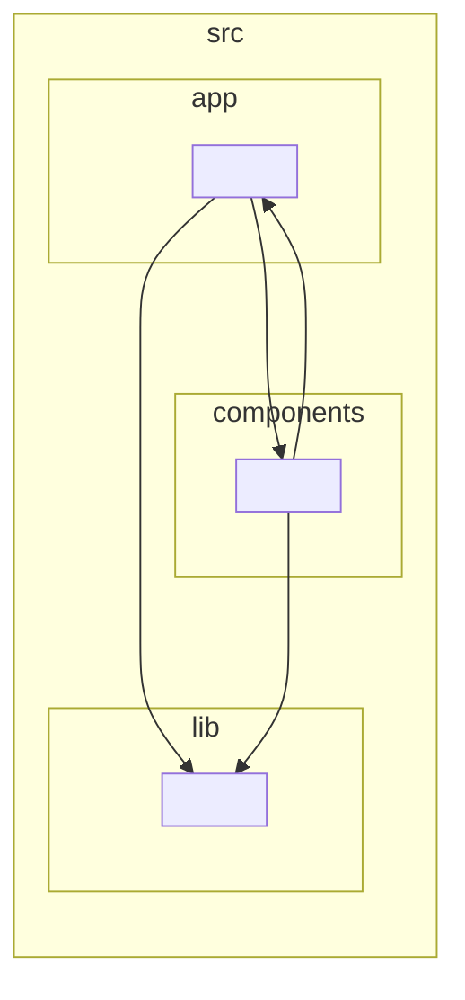

# Frontend dependency graph

> Generated by dependency-cruiser 18.2.0 with TypeScript 5.7.3 from `apps/web/.dependency-cruiser.cjs`. Do not hand-edit this graph; regenerate it through the architecture check when frontend imports change.

This is an orientation view of `apps/web/src/app/`, `apps/web/src/components/`, and `apps/web/src/lib/`. Deeper folders are collapsed to keep the graph reviewable. The architecture rules in `apps/web/.dependency-cruiser.cjs`, not the picture alone, are the enforceable contract.

